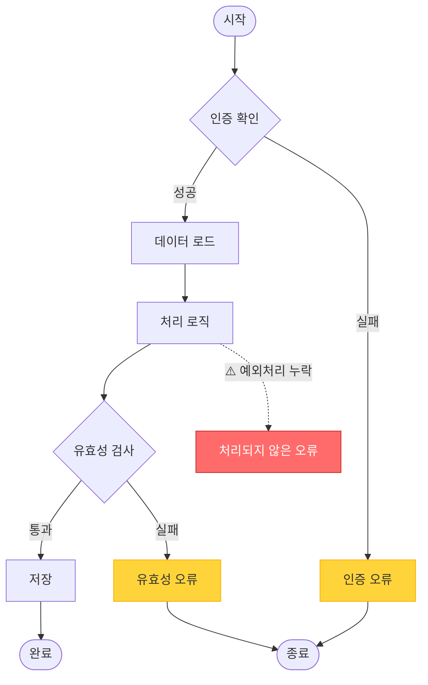
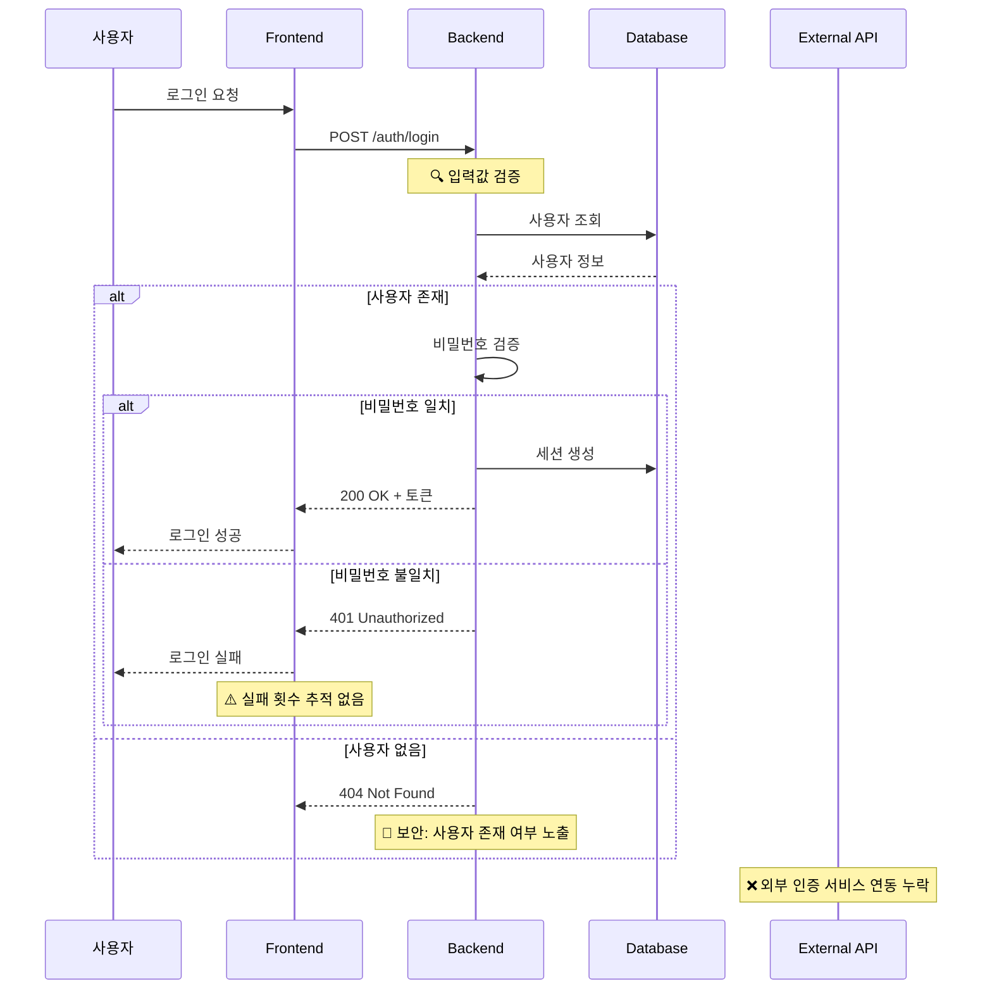

# 📊 '/flow' 또는 '/flow 로그인 및 회원가입 프로세스' 같이 코드를 분석하여 Mermaid 다이어그램 생성 및 문제점 분석

Purpose: Analyze code to generate Mermaid diagrams (flowchart/sequence) and identify potential issues in logic, flow, and error handling
Target: $ARGUMENTS (empty for entire system analysis | specific feature/process name)

**IMPORTANT**: All user-facing messages, questions, and results must be displayed in Korean (한국어).

## Step 1: Scope Analysis and Code Discovery

### 1.1 Parse Target Scope
```
DETERMINE analysis_scope:
  IF $ARGUMENTS == empty:
    scope = "전체 시스템 분석"
    analyze_entire_codebase = true
    DISPLAY: "🔍 전체 시스템을 분석하여 흐름도를 생성합니다"
  ELSE:
    scope = $ARGUMENTS
    analyze_specific_feature = true
    DISPLAY: "🔍 분석 범위: {scope}"
```

### 1.2 Code Discovery and Analysis
```
SCAN project structure:
  # Find entry points
  - Main application files (app.ts, index.ts, main.ts)
  - API routes and endpoints
  - Module exports and interfaces
  - Event handlers and listeners
  
FOR specific feature analysis:
  # Search for feature-related code
  - Find files containing feature keywords
  - Trace function calls and dependencies
  - Map data flow between components
  - Identify external service integrations
```

### 1.3 Determine Diagram Type
```
ANALYZE code patterns to select diagram type:

IF code contains:
  - Sequential API calls
  - User interactions with system responses
  - Time-based flows
  - Multiple actor interactions
THEN:
  diagram_type = "sequence"
  DISPLAY: "📈 Sequence Diagram이 적합합니다 (시간 순서 상호작용)"
  
ELSE IF code contains:
  - Conditional branches (if/else)
  - Loop structures
  - Decision points
  - Process flows
THEN:
  diagram_type = "flowchart"
  DISPLAY: "🔀 Flowchart가 적합합니다 (의사결정 흐름)"
  
ASK user: "추천된 다이어그램 타입을 사용하시겠습니까? (yes/no/both)"
```

## Step 2: Code Analysis and Flow Extraction

### 2.1 Deep Code Analysis
```
FOR each relevant file:
  EXTRACT:
  - Function definitions and their purposes
  - Conditional logic and branches
  - Error handling blocks
  - API calls and external dependencies
  - Database operations
  - State changes and side effects
  
TRACE execution flow:
  - Entry point → Processing → Exit points
  - Success paths
  - Error paths
  - Edge cases
```

### 2.2 Identify Key Components
```
CATEGORIZE components:
  # Actors (for sequence diagrams)
  - Users
  - Frontend components
  - Backend services
  - External APIs
  - Databases
  
  # Process nodes (for flowcharts)
  - Start/End points
  - Decision nodes
  - Process blocks
  - Data inputs/outputs
  - Error handlers
```

### 2.3 Logic and Error Pattern Analysis
```
IDENTIFY potential issues:
  
1. Missing Error Handling:
   - Unhandled promise rejections
   - Missing try-catch blocks
   - No fallback for external service failures
   
2. Logic Issues:
   - Infinite loops possibilities
   - Race conditions
   - Deadlock scenarios
   - Missing validation
   
3. Flow Problems:
   - Unreachable code
   - Missing return paths
   - Circular dependencies
   - Bottlenecks
   
4. Security Concerns:
   - Unvalidated inputs
   - Missing authentication checks
   - Exposed sensitive data
   - SQL injection risks
```

## Step 3: Mermaid Diagram Generation

### 3.1 Generate Flowchart


### 3.2 Generate Sequence Diagram


### 3.3 Add Problem Annotations
```
ANNOTATE diagrams with:
  - ⚠️ Warning: 잠재적 문제
  - 🚨 Critical: 심각한 문제
  - ❌ Missing: 누락된 기능
  - 🔍 Check: 검토 필요
  - 💡 Suggestion: 개선 제안
  
Use styling to highlight:
  - Red: Critical issues
  - Yellow: Warnings
  - Blue: Information
  - Green: Good practices
```

## Step 4: Problem Analysis and Feedback

### 4.1 Categorize Identified Issues
```
ORGANIZE issues by severity:

🚨 심각 (Critical):
- 보안 취약점
- 데이터 손실 가능성
- 시스템 장애 위험
- 비즈니스 로직 오류

⚠️ 경고 (Warning):
- 성능 저하 요인
- 확장성 제한
- 유지보수 어려움
- 불완전한 에러 처리

💡 개선 제안 (Suggestion):
- 코드 품질 향상
- 사용자 경험 개선
- 모니터링 추가
- 테스트 커버리지
```

### 4.2 Generate Detailed Feedback
```
FOR each identified issue:
  PROVIDE:
  - 문제 설명
  - 발생 가능한 시나리오
  - 영향 범위
  - 해결 방안
  - 예시 코드 (if applicable)
```

## Step 5: Comprehensive Report Generation

### 5.1 Create Analysis Report
```
═══════════════════════════════════════════════════
📊 Flow 다이어그램 분석 보고서
═══════════════════════════════════════════════════
분석 대상: {scope}
분석 시간: {timestamp}
다이어그램 유형: {diagram_type}

## 📈 생성된 다이어그램

[Mermaid 다이어그램 표시]

## 🔍 발견된 문제점

### 🚨 심각한 문제 ({critical_count}개)
1. [문제 이름]
   - 위치: {file}:{line}
   - 설명: {description}
   - 영향: {impact}
   - 해결방안: {solution}

### ⚠️ 경고 사항 ({warning_count}개)
[경고 목록]

### 💡 개선 제안 ({suggestion_count}개)
[제안 목록]

## 📋 권장 조치 사항

우선순위별 작업 목록:
1. [긴급] {critical_action}
2. [높음] {high_priority_action}
3. [보통] {medium_priority_action}

## 🚀 다음 단계

이 분석을 바탕으로 작업 계획을 수립하시겠습니까?
→ /plan 명령어를 사용하여 상세한 작업 계획을 생성할 수 있습니다.

예시: /plan 로그인 프로세스 보안 강화

═══════════════════════════════════════════════════
```

### 5.2 Interactive Improvement Suggestions
```
OFFER options:
1. "특정 문제에 대한 상세 분석을 원하시나요?"
2. "다른 부분의 흐름도를 확인하시겠습니까? (예: /flow 결제 프로세스)"
3. "작업 계획을 바로 생성하시겠습니까? (/plan)"
4. "코드 개선 작업을 시작하시겠습니까? (/clarify)"
```

## Step 6: Export and Documentation

### 6.1 Save Diagrams
```
SAVE generated diagrams:
- Location: docs/diagrams/{feature}-flow.md
- Format: Mermaid markdown
- Include: Timestamp and version

CREATE diagram documentation:
- Purpose and scope
- Key components
- Known issues
- Update history
```

### 6.2 Integration Recommendations
```
SUGGEST integrations:
- Add to project documentation
- Include in code reviews
- Update when code changes
- Use in onboarding materials
```

## Usage Examples

```bash
# 전체 시스템 흐름도 생성
/flow

# 특정 기능 분석
/flow 로그인 및 회원가입 프로세스
/flow 결제 시스템
/flow API 인증 흐름

# 결과:
# 1. 코드 분석을 통한 정확한 흐름도 생성
# 2. 논리적 문제점과 예외처리 누락 식별
# 3. 보안 취약점 및 성능 이슈 발견
# 4. 개선 방안과 우선순위 제시
# 5. 후속 작업 계획 수립 지원
```

## Error Handling

### No Code Found
```
ERROR: "분석할 코드를 찾을 수 없습니다."
ACTION: 
- 프로젝트 구조 확인
- 검색 키워드 조정
- 파일 경로 직접 지정 요청
```

### Complex Flow
```
WARNING: "흐름이 너무 복잡하여 단일 다이어그램으로 표현하기 어렵습니다."
ACTION:
- 서브 프로세스로 분할
- 계층적 다이어그램 생성
- 주요 흐름만 표시 옵션
```

### Parsing Error
```
ERROR: "코드 구조를 파싱할 수 없습니다."
ACTION:
- 구체적인 함수명 지정 요청
- 수동 흐름 입력 옵션
- 단순화된 분석 제공
```