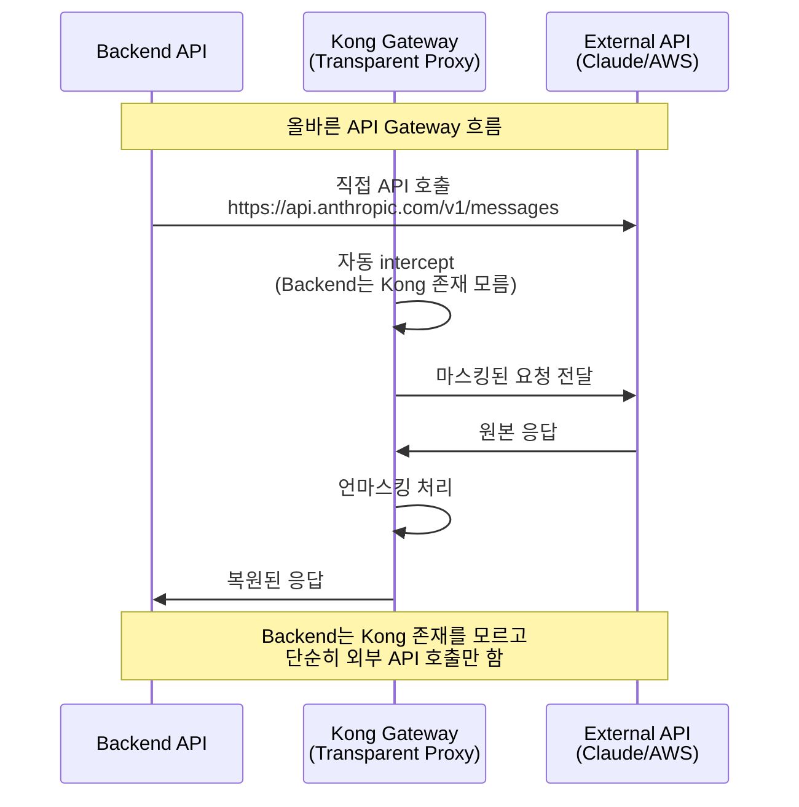

# Kong AWS Masking - 아키텍처 완전 재설계 계획

**작성일시**: 2025년 7월 23일  
**긴급도**: CRITICAL - 현재 구조 완전 잘못됨  
**사용자 피드백**: "현재 프로세스는 문제가 너무 많습니다"

---

## 🚨 **현재 아키텍처 문제점 - 냉철한 분석**

### ❌ **심각한 구조적 문제**

1. **Kong을 API Gateway가 아닌 별도 서비스로 사용**
   ```javascript
   // 현재 (완전히 잘못됨)
   axios.post(`${kongUrl}/analyze-claude`, request)  // Kong 전용 경로
   ```

2. **API Gateway 본래 목적 완전 무시**
   - Kong = "모든 API 호출을 자동으로 intercept하는 게이트웨이"
   - 현재 = "특정 경로로 호출하는 중간 서버"

3. **불필요한 복잡성과 혼동**
   - 커스텀 라우트 생성 (`/analyze-claude`)
   - Kong 전용 URL 관리 (`KONG_PROXY_URL`)
   - API Gateway 패턴과 완전히 반대 구조

### 🎯 **올바른 API Gateway 패턴**



---

## 📋 **완전 재설계 계획**

### 🔥 **Phase 0: 최우선 문서 업데이트 (완료 필요)**

#### 0.1 현재 문제점 상세 문서화
- [ ] **CURRENT-ARCHITECTURE-PROBLEMS.md** 작성
  - Kong API Gateway 패턴 무시 문제
  - 불필요한 복잡성 증가 문제
  - 유지보수성 저하 문제

#### 0.2 올바른 아키텍처 설계 문서
- [ ] **CORRECT-API-GATEWAY-PATTERN.md** 작성
  - 표준 Kong API Gateway 패턴 설명
  - Backend의 투명한 외부 API 호출
  - Kong의 자동 intercept 메커니즘

#### 0.3 상세 변경 계획서
- [ ] **DETAILED-MIGRATION-PLAN.md** 작성
  - 각 컴포넌트별 변경사항
  - 리스크 분석 및 대응 방안
  - 롤백 계획

---

### 🔥 **Phase 1: Kong 설정 완전 재설계 (1-2일)**

#### 1.1 kong.yml 완전 재작성
```yaml
# 현재 (잘못됨)
routes:
  - name: claude-api-route
    service: anthropic-api
    paths:
      - /analyze-claude  # ❌ 커스텀 경로

# 올바른 설정
services:
  - name: claude-api
    url: https://api.anthropic.com
    protocol: https
    
routes:
  - name: claude-intercept
    service: claude-api
    hosts:
      - api.anthropic.com  # ✅ 도메인 기반 intercept
    paths:
      - /v1/messages
```

#### 1.2 프록시 설정 추가
```yaml
# Kong을 transparent proxy로 설정
_format_version: "3.0"
_transform: true

# Proxy settings
proxy_request_buffering: true
change_request_body: true
```

#### 1.3 AWS Masker 플러그인 재설정
```yaml
plugins:
  - name: aws-masker
    route: claude-intercept  # 올바른 라우트에 적용
    config:
      use_redis: true
      proxy_request_buffering: true
      change_request_body: true
```

---

### 🔥 **Phase 2: Backend 코드 완전 수정 (1일)**

#### 2.1 claudeService.js 핵심 변경
```javascript
// 현재 (완전히 잘못됨)
const response = await axios.post(
  `${this.kongUrl}/analyze-claude`,  // ❌
  request
);

// 올바른 수정
const response = await axios.post(
  `https://api.anthropic.com/v1/messages`,  // ✅ 실제 Claude API
  request,
  {
    headers: {
      'Content-Type': 'application/json',
      'x-api-key': this.apiKey,
      'anthropic-version': '2023-06-01'
    }
  }
);
```

#### 2.2 환경변수 정리
```javascript
// 제거할 변수들
// KONG_PROXY_URL  ❌ 더 이상 불필요
// KONG_API_ENDPOINT  ❌ 더 이상 불필요

// 필요한 변수들
// ANTHROPIC_API_KEY  ✅ 유지
// ANTHROPIC_MODEL  ✅ 유지
```

---

### 🔥 **Phase 3: Docker 네트워킹 핵심 설정 (2-3일)**

#### 3.1 Backend 외부 API 호출을 Kong으로 라우팅

**방법 1: HTTP Proxy 설정 (권장)**
```yaml
# docker-compose.yml
backend:
  environment:
    - HTTP_PROXY=http://kong:8000
    - HTTPS_PROXY=http://kong:8000
    - NO_PROXY=localhost,127.0.0.1,redis
```

**방법 2: DNS 오버라이드**
```yaml
backend:
  extra_hosts:
    - "api.anthropic.com:kong"  # Claude API 호출을 Kong으로 리다이렉트
```

**방법 3: iptables 규칙 (고급)**
```dockerfile
# Backend Dockerfile에 추가
RUN iptables -t nat -A OUTPUT -d api.anthropic.com -j DNAT --to-destination kong:8000
```

#### 3.2 Kong을 Forward Proxy로 설정
```yaml
# kong.yml에 추가
services:
  - name: forward-proxy
    url: http://httpbin.org  # Dummy upstream
    
routes:
  - name: forward-proxy-route
    service: forward-proxy
    methods: ["GET", "POST", "PUT", "DELETE"]
    regex_priority: 1
```

---

### 🔥 **Phase 4: 세부 설정 및 검증 (1일)**

#### 4.1 Kong 플러그인 설정 검증
```lua
-- AWS Masker 플러그인에서 확인 필요
local function should_process_request()
    local host = kong.request.get_host()
    local path = kong.request.get_path()
    
    -- Claude API 호출만 처리
    if host == "api.anthropic.com" and path:match("^/v1/messages") then
        return true
    end
    
    return false
end
```

#### 4.2 환경변수 완전 정리
```bash
# 제거할 변수들
unset KONG_PROXY_URL
unset KONG_API_ENDPOINT

# 새로 필요한 변수들 (필요시)
export KONG_FORWARD_PROXY=true
export AWS_MASKER_AUTO_INTERCEPT=true
```

#### 4.3 로깅 및 디버깅 설정
```yaml
# kong.yml
_format_version: "3.0"
_transform: true

# 디버깅을 위한 로그 설정
plugins:
  - name: file-log
    config:
      path: /dev/stdout
      reopen: true
```

---

### 🔥 **Phase 5: 전체 플로우 재검증 (1일)**

#### 5.1 단계별 테스트 시나리오
```bash
# 1. Kong 설정 검증
curl -i http://localhost:8001/routes

# 2. Backend의 외부 API 호출 테스트
docker exec backend-api curl -v https://api.anthropic.com/v1/messages

# 3. Kong intercept 동작 확인
docker logs kong-gateway | grep "aws-masker"

# 4. 전체 플로우 테스트
curl -X POST http://localhost:3000/analyze \
  -H "Content-Type: application/json" \
  -d '{"resources":["ec2"],"options":{"analysisType":"security_only"}}'
```

#### 5.2 성능 및 안정성 검증
```bash
# 동시 요청 테스트
for i in {1..10}; do
  curl -X POST http://localhost:3000/analyze \
    -H "Content-Type: application/json" \
    -d '{"resources":["ec2"]}' &
done
wait
```

---

## 🎯 **예상 결과 및 개선점**

### ✅ **개선될 점들**

1. **진짜 API Gateway 패턴**
   - Backend는 Kong 존재를 모르고 외부 API 직접 호출
   - Kong이 투명하게 모든 외부 호출 intercept
   - 표준 API Gateway 동작 방식

2. **코드 단순화**
   - Kong 전용 URL 제거
   - 불필요한 환경변수 제거
   - 더 직관적인 코드 구조

3. **확장성 향상**
   - 다른 외부 API도 쉽게 마스킹 적용 가능
   - Kong 플러그인 시스템 본래 활용
   - 표준 패턴으로 유지보수성 향상

### 🚨 **주의사항**

1. **Docker 네트워킹 복잡성**
   - Backend의 외부 API 호출을 Kong으로 라우팅하는 것이 기술적으로 가장 복잡
   - HTTP_PROXY 방식이 가장 안정적

2. **기존 테스트 무효화**
   - 현재 모든 테스트가 잘못된 구조 기반
   - 전체 테스트 스위트 재작성 필요

3. **배포 중단 시간**
   - 아키텍처 변경으로 일시적 서비스 중단 불가피
   - 단계적 마이그레이션 전략 필요

---

## 📊 **변경 전후 비교**

| 측면 | 현재 (잘못됨) | 변경 후 (올바름) |
|------|---------------|------------------|
| **API 호출** | `kong:8000/analyze-claude` | `api.anthropic.com/v1/messages` |
| **Kong 역할** | 중간 서버 | 투명한 프록시 |
| **Backend 인식** | Kong 인식함 | Kong 모름 |
| **확장성** | 제한적 | 모든 외부 API 지원 |
| **표준 준수** | API Gateway 패턴 무시 | 표준 패턴 준수 |
| **복잡성** | 높음 | 낮음 |

---

## 🚀 **실행 우선순위**

### 🔥 **즉시 실행 (오늘)**
1. **문서 업데이트** - 현재 문제점 및 올바른 패턴 문서화
2. **Kong 설정 재설계** - kong.yml 완전 재작성
3. **Backend 코드 수정** - 실제 Claude API 직접 호출

### 🟡 **단기 실행 (1-2일)**
4. **Docker 네트워킹 설정** - HTTP_PROXY 방식 적용
5. **환경변수 정리** - 불필요한 변수 제거
6. **전체 플로우 재검증** - 새로운 구조로 테스트

### 🟢 **중기 실행 (1주일)**
7. **성능 최적화** - 새로운 구조 기반 튜닝
8. **모니터링 설정** - 올바른 메트릭 수집
9. **문서 완성** - 운영 가이드 작성

---

## 💡 **핵심 교훈**

**사용자 피드백이 100% 정확했습니다:**
> "Kong는 API Gateway로 알고 있는데, 그러면 backend api 서버는 원래 claude api를 호출할 수 있는 end point를 그대로 호출하고 그것에 개입해서 진행할 수 있지 않아?"

**결론**: 현재 구조를 완전히 버리고 표준 API Gateway 패턴으로 재설계해야 합니다.

---

## 📋 **다음 액션**

1. **즉시 시작**: 문서 업데이트 (CURRENT-ARCHITECTURE-PROBLEMS.md)
2. **Kong 설정 재작성**: 올바른 API Gateway 패턴 적용
3. **Backend 코드 수정**: 실제 Claude API 직접 호출
4. **Docker 네트워킹**: HTTP_PROXY 방식 구현
5. **전체 플로우 재검증**: 새로운 구조로 테스트

**예상 완료 시간**: 5-7일 (아키텍처 전면 재설계)  
**위험도**: 높음 (전체 구조 변경)  
**필요성**: 필수 (현재 구조 완전히 잘못됨)