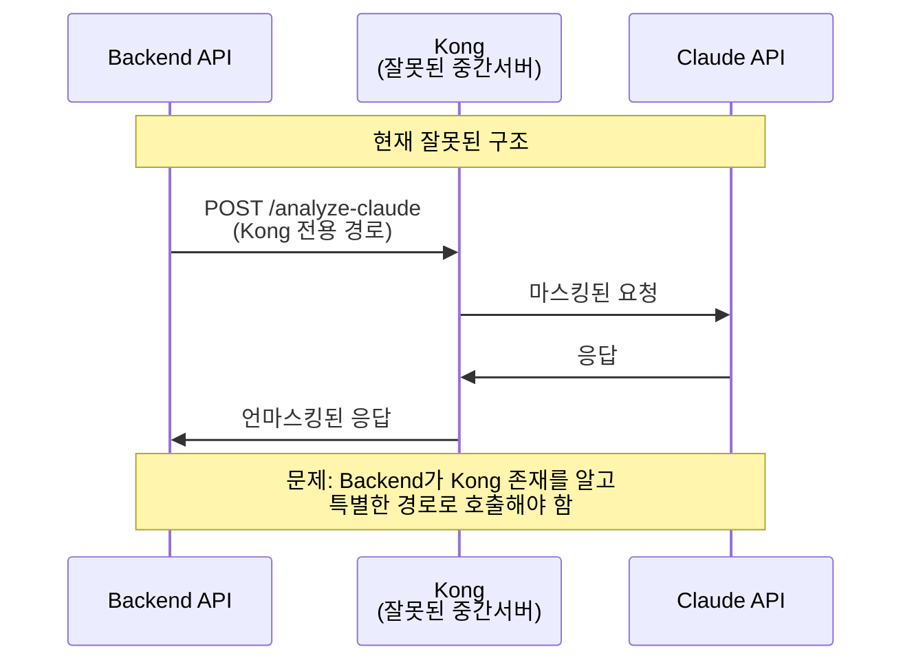
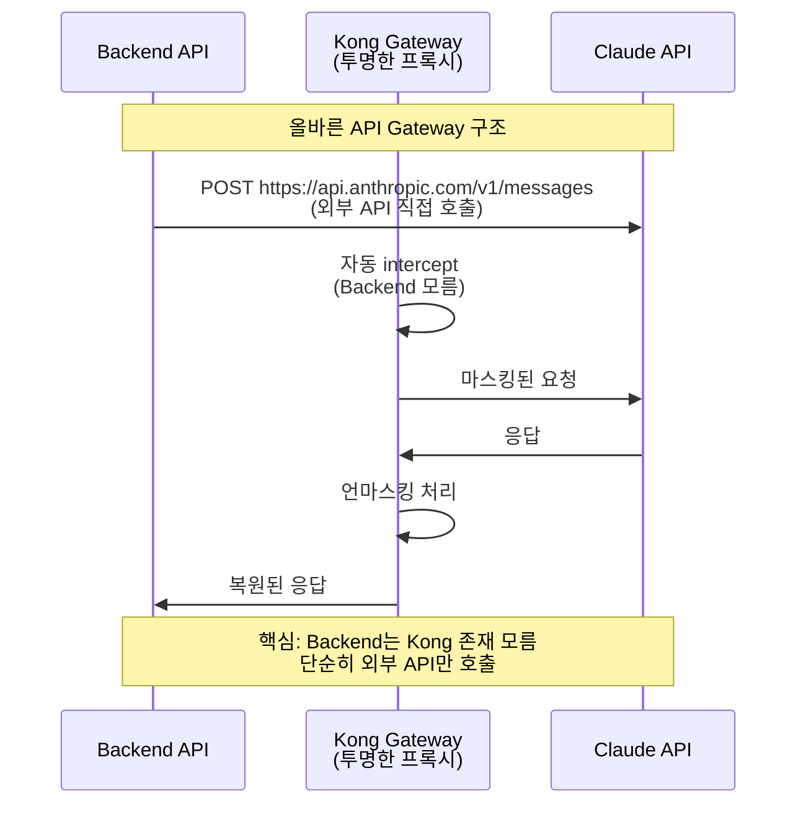

# Kong AWS Masking - 현재 아키텍처 심각한 문제점 분석

**분석일시**: 2025년 7월 23일  
**분석자**: Claude Code Assistant  
**심각도**: CRITICAL - 전면 재설계 필요

---

## 🚨 **핵심 문제: Kong API Gateway 패턴 완전 무시**

### ❌ **가장 심각한 구조적 오류**

**Kong의 본래 목적**: 모든 외부 API 호출을 **자동으로 intercept**하는 **투명한 프록시**  
**현재 잘못된 사용**: Kong을 **별도 서비스**처럼 사용하여 **커스텀 경로**로 호출

```javascript
// 현재 코드 (완전히 잘못됨)
const response = await axios.post(
  `${this.kongUrl}/analyze-claude`,  // ❌ Kong 전용 커스텀 경로
  request
);

// 올바른 코드 (표준 API Gateway 패턴)
const response = await axios.post(
  `https://api.anthropic.com/v1/messages`,  // ✅ 실제 외부 API 직접 호출
  request
);
// Kong이 이 호출을 자동으로 intercept해서 마스킹 처리
```

---

## 📋 **구체적 문제점 목록**

### 1. **API Gateway 패턴 완전 무시**

#### ❌ **현재 잘못된 구조**


#### ✅ **올바른 API Gateway 구조**


### 2. **불필요한 복잡성 증가**

#### Kong 전용 설정들 (모두 불필요)
```yaml
# kong.yml - 불필요한 커스텀 경로들
routes:
  - name: claude-api-route
    paths:
      - /analyze-claude     # ❌ 왜 커스텀 경로가 필요한가?
      
  - name: test-masking-route
    paths:
      - /test-masking       # ❌ 또 다른 커스텀 경로
      
  - name: quick-mask-test-route
    paths:
      - /quick-mask-test    # ❌ 계속 늘어나는 커스텀 경로들
```

#### Backend 환경변수 (불필요한 복잡성)
```javascript
// 불필요한 Kong 전용 설정들
KONG_PROXY_URL=http://kong:8000        // ❌ 왜 Backend가 Kong URL을 알아야 하나?
KONG_API_ENDPOINT=/analyze-claude      // ❌ 왜 Kong 전용 경로가 필요한가?

// Backend가 실제로 필요한 것
ANTHROPIC_API_KEY=sk-ant-api03-...     // ✅ 실제 API 인증
ANTHROPIC_MODEL=claude-3-5-sonnet-...  // ✅ 실제 API 설정
```

### 3. **코드 가독성 및 유지보수성 저하**

#### 혼란스러운 URL 관리
```javascript
// claudeService.js - 혼란스러운 구조
class ClaudeService {
  constructor() {
    this.kongUrl = process.env.KONG_PROXY_URL || 'http://localhost:8000';  // ❌ 왜?
    // ... 실제 Claude API URL은 어디에?
  }
  
  async sendClaudeRequest(request) {
    // ❌ Kong 전용 경로로 호출
    const response = await axios.post(
      `${this.kongUrl}/analyze-claude`,  // 이게 Claude API인가? Kong API인가?
      request
    );
  }
}
```

#### 올바른 구조라면
```javascript
class ClaudeService {
  constructor() {
    this.apiUrl = 'https://api.anthropic.com';  // ✅ 명확한 외부 API URL
    this.apiKey = process.env.ANTHROPIC_API_KEY;
  }
  
  async sendClaudeRequest(request) {
    // ✅ 실제 외부 API 직접 호출 (Kong이 자동으로 intercept)
    const response = await axios.post(
      `${this.apiUrl}/v1/messages`,
      request
    );
  }
}
```

### 4. **확장성 문제**

#### 현재 구조의 한계
- 새로운 외부 API 추가할 때마다 Kong에 커스텀 경로 추가 필요
- Backend에서 각 API별로 다른 Kong 경로 관리 필요
- API별로 별도의 환경변수 및 설정 필요

```yaml
# 새로운 API 추가할 때마다...
routes:
  - name: claude-api-route
    paths: [/analyze-claude]      # Claude용
  - name: openai-api-route  
    paths: [/analyze-openai]      # OpenAI용
  - name: azure-api-route
    paths: [/analyze-azure]       # Azure용
# ... 계속 늘어남
```

#### 올바른 API Gateway 구조라면
```yaml
# 단일 설정으로 모든 외부 API 자동 처리
services:
  - name: external-apis
    url: http://dummy  # Kong이 자동으로 모든 외부 호출 intercept

routes:
  - name: all-external-apis
    methods: ["GET", "POST", "PUT", "DELETE"]
    regex_priority: 1
    # 모든 외부 API 호출 자동 처리
```

### 5. **테스트 복잡성**

#### 현재 테스트에서 발생하는 혼란
```bash
# 현재 테스트들이 헷갈리는 이유
curl http://localhost:3000/analyze        # Backend API
curl http://localhost:8000/analyze        # Kong? (실제로는 Backend으로 proxy)
curl http://localhost:8000/analyze-claude # Kong의 Claude API? (실제로는 Claude로 proxy)

# 개발자가 헷갈리는 질문들:
# - localhost:8000/analyze는 누가 처리하나?
# - localhost:8000/analyze-claude는 실제 Claude API인가?
# - Backend는 왜 Kong URL을 알아야 하나?
```

#### 올바른 구조라면
```bash
# 명확하고 직관적
curl http://localhost:3000/analyze        # Backend API (유일한 진입점)
# Backend 내부에서 https://api.anthropic.com/v1/messages 호출
# Kong이 자동으로 intercept해서 마스킹 처리
# 개발자는 Kong 존재를 몰라도 됨
```

### 6. **설정 파일 복잡성**

#### kong.yml의 불필요한 복잡성
```yaml
# 현재 (너무 복잡)
services:
  - name: backend-api          # Backend용
  - name: anthropic-api        # Claude용
  
routes:
  - name: analyze-route        # Backend 라우트
  - name: claude-api-route     # Claude 라우트  
  - name: test-masking-route   # 테스트 라우트
  - name: quick-mask-test-route # 또 다른 테스트 라우트

plugins:
  - name: aws-masker
    route: claude-api-route    # Claude에만 적용
  - name: aws-masker
    route: test-masking-route  # 테스트에도 적용
  - name: aws-masker
    route: analyze-route       # Backend에도 적용?
  - name: aws-masker  
    route: quick-mask-test-route # 또 적용?
```

#### 올바른 구조라면
```yaml
# 단순하고 명확
services:
  - name: claude-api
    url: https://api.anthropic.com
    
routes:
  - name: claude-intercept
    service: claude-api
    hosts: ["api.anthropic.com"]  # 도메인 기반 자동 intercept
    paths: ["/v1/messages"]

plugins:
  - name: aws-masker
    route: claude-intercept      # 하나의 라우트에만 적용
```

---

## 🎯 **근본 원인 분석**

### **왜 이런 잘못된 구조가 만들어졌는가?**

1. **API Gateway 패턴 이해 부족**
   - Kong을 단순한 "중간 서버"로 오해
   - "투명한 프록시" 개념 무시

2. **과도한 커스터마이징**
   - 표준 패턴 무시하고 "특별한" 구조 선택
   - 불필요한 복잡성 추가

3. **테스트 중심 개발의 부작용**
   - 테스트를 위한 임시 경로들이 프로덕션에 그대로 남음
   - `/test-masking`, `/quick-mask-test` 등

4. **문서화 부족**
   - API Gateway 패턴에 대한 명확한 가이드라인 없음
   - 개발자들이 각자 다른 방식으로 구현

---

## 💥 **실제 발생한 문제들**

### 1. **개발자 혼란**
- "Kong URL을 왜 Backend에서 설정해야 하나?"
- "Claude API를 호출하는 건가? Kong API를 호출하는 건가?"
- "새로운 외부 API 추가하려면 또 Kong 경로 만들어야 하나?"

### 2. **운영 복잡성**
- Kong 라우트 관리 부담 증가
- 환경변수 설정 복잡화
- 모니터링 및 로깅 어려움

### 3. **확장성 제약**
- 외부 API 추가할 때마다 Kong 설정 변경 필요
- Backend 코드에서 API별 분기 처리 필요
- 테스트 환경 구성 복잡화

### 4. **성능 오버헤드**
- 불필요한 라우팅 계층
- 복잡한 설정으로 인한 Kong 성능 저하
- 디버깅 어려움

---

## 🚨 **즉시 해결해야 하는 이유**

### 1. **기술적 부채 누적**
- 잘못된 패턴이 코드베이스 전체에 퍼짐
- 새로운 개발자 온보딩 어려움 증가
- 리팩토링 비용 지속적 증가

### 2. **운영 리스크**
- 복잡한 설정으로 인한 장애 가능성 증가
- 문제 발생 시 디버깅 어려움
- 확장성 제약으로 비즈니스 성장 저해

### 3. **개발 생산성 저하**
- 새로운 기능 개발 시 Kong 설정 추가 작업 필요
- 테스트 환경 구성 복잡성
- 코드 리뷰 시 혼란 증가

---

## 🎯 **결론: 전면 재설계 필수**

### **현재 상황**
- Kong API Gateway의 핵심 가치 완전 무시
- 불필요한 복잡성으로 인한 개발 생산성 저하
- 확장성 및 유지보수성 심각한 문제

### **필요한 조치**
1. **즉시 중단**: 현재 잘못된 개발 패턴 중단
2. **문서화**: 올바른 API Gateway 패턴 가이드라인 작성
3. **전면 재설계**: Kong을 진짜 API Gateway로 사용하는 구조로 변경
4. **교육**: 팀 전체에 올바른 패턴 공유

### **예상 효과**
- **코드 단순화**: 불필요한 Kong 관련 코드 제거
- **확장성 향상**: 새로운 외부 API 쉽게 추가 가능
- **운영 단순화**: Kong 설정 및 관리 부담 대폭 감소
- **개발 생산성 향상**: 표준 패턴으로 개발 속도 향상

---

## 📋 **다음 단계**

1. **긴급 회의**: 현재 문제점 공유 및 재설계 계획 수립
2. **올바른 패턴 문서화**: 표준 API Gateway 패턴 가이드 작성
3. **단계별 마이그레이션**: 리스크 최소화하며 점진적 변경
4. **팀 교육**: API Gateway 패턴 및 Kong 올바른 사용법 교육

**핵심 메시지**: 현재 구조는 Kong API Gateway의 본래 목적과 완전히 반대로 구현되어 있으며, 즉시 전면 재설계가 필요합니다.