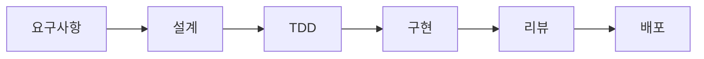

# Kong AWS Masking MVP - 프로젝트 개발 지침

## 개요
MVP 개발을 위한 실용적이고 효율적인 개발 가이드라인입니다.

## 1. 개발 프로세스

### 1.1 작업 흐름


### 1.2 일일 개발 사이클
1. **Morning Sync** (10분)
   - 어제 완료 사항
   - 오늘 계획
   - 블로커 공유

2. **Development** (집중 시간)
   - TDD 사이클 실행
   - 코드 작성
   - 자체 검증

3. **End of Day**
   - 커밋 & 푸시
   - 진행 상황 업데이트
   - 내일 계획

## 2. 개발 환경 설정

### 2.1 필수 도구
```bash
# 개발 환경 체크리스트
- [ ] Node.js 20.x LTS
- [ ] Docker Desktop
- [ ] Git
- [ ] VS Code 또는 선호 IDE
- [ ] AWS CLI v2
- [ ] curl 또는 HTTPie
```

### 2.2 프로젝트 초기 설정
```bash
# 1. 저장소 클론
git clone <repository-url>
cd kong-aws-masking-mvp

# 2. 환경 변수 설정
cp .env.example .env
# .env 파일 편집하여 실제 값 입력

# 3. 의존성 설치
npm install

# 4. 로컬 테스트 실행
npm test

# 5. Docker 빌드
docker-compose build

# 6. 시스템 시작
docker-compose up
```

### 2.3 IDE 설정 (VS Code)
```json
// .vscode/settings.json
{
  "editor.formatOnSave": true,
  "editor.codeActionsOnSave": {
    "source.fixAll.eslint": true
  },
  "files.exclude": {
    "node_modules": true,
    ".git": true
  },
  "jest.autoRun": "watch"
}
```

## 3. 브랜치 전략

### 3.1 Git Flow (간소화)
```
main
  └── develop
       ├── feature/mask-ec2-instances
       ├── feature/add-s3-patterns
       └── fix/memory-leak
```

### 3.2 브랜치 명명 규칙
- `feature/` : 새 기능 개발
- `fix/` : 버그 수정
- `refactor/` : 코드 개선
- `docs/` : 문서 작업

### 3.3 작업 흐름
```bash
# 1. 새 기능 시작
git checkout develop
git pull origin develop
git checkout -b feature/mask-rds-instances

# 2. 개발 및 커밋
git add .
git commit -m "feat: RDS 인스턴스 마스킹 추가"

# 3. 개발 브랜치에 병합
git checkout develop
git merge feature/mask-rds-instances

# 4. 원격 저장소 푸시
git push origin develop
```

## 4. 코드 작성 가이드

### 4.1 파일 생성 순서
1. **테스트 먼저** (`tests/unit/newFeature.test.js`)
2. **인터페이스 정의** (함수 시그니처)
3. **구현** (최소 코드로 테스트 통과)
4. **리팩토링** (필요시)

### 4.2 모듈 구조
```javascript
// src/services/maskingService.js

// 1. Dependencies
const { patterns } = require('../config/patterns');
const logger = require('../utils/logger');

// 2. Private functions
function generateMaskId(prefix, counter) {
  return `${prefix}${String(counter).padStart(3, '0')}`;
}

// 3. Public interface
/**
 * AWS 리소스 마스킹 서비스
 * @class
 */
class MaskingService {
  constructor() {
    /** @type {Object.<string, number>} */
    this.counter = {};
    /** @type {Map<string, string>} */
    this.mappings = new Map();
  }

  /**
   * 데이터를 마스킹합니다
   * @param {string} data - 마스킹할 데이터
   * @returns {string} 마스킹된 데이터
   */
  mask(data) {
    // Implementation
  }

  /**
   * 마스킹을 해제합니다
   * @param {string} data - 마스킹된 데이터
   * @returns {string} 원본 데이터
   */
  unmask(data) {
    // Implementation
  }
}

// 4. Export
module.exports = MaskingService;
```

### 4.3 비동기 처리
```javascript
// ✅ Good - async/await 사용
async function fetchAWSResources() {
  try {
    const [ec2, s3, rds] = await Promise.all([
      getEC2Instances(),
      getS3Buckets(),
      getRDSInstances()
    ]);
    return { ec2, s3, rds };
  } catch (error) {
    logger.error('Failed to fetch AWS resources', error);
    throw new AppError('Resource fetch failed', 500);
  }
}

// ❌ Bad - 콜백 지옥
function fetchResources(callback) {
  getEC2((err, ec2) => {
    if (err) return callback(err);
    getS3((err, s3) => {
      // ... nested callbacks
    });
  });
}
```

## 5. 테스트 작성 가이드

### 5.1 테스트 구조
```javascript
describe('MaskingService', () => {
  let service;

  beforeEach(() => {
    service = new MaskingService();
  });

  describe('mask()', () => {
    it('should mask EC2 instance IDs', () => {
      // Arrange
      const input = { instanceId: 'i-1234567890abcdef0' };
      
      // Act
      const result = service.mask(input);
      
      // Assert
      expect(result.instanceId).toBe('EC2_001');
      expect(service.mappings.get('EC2_001')).toBe('i-1234567890abcdef0');
    });
  });
});
```

### 5.2 테스트 범위
- **Unit Tests**: 개별 함수/메서드 (필수)
- **Integration Tests**: 모듈 간 상호작용 (권장)
- **E2E Tests**: 전체 플로우 (선택)

## 6. API 개발 가이드

### 6.1 RESTful 엔드포인트
```javascript
// ✅ Good - RESTful 규칙 준수
app.get('/health', healthCheck);
app.post('/analyze', analyzeResources);
app.get('/mappings/:id', getMapping);

// ❌ Bad - 동사 사용
app.get('/getMappings', getMappings);
app.post('/doAnalysis', doAnalysis);
```

### 6.2 응답 형식
```javascript
// 성공 응답
{
  "success": true,
  "data": {
    "analysis": "...",
    "maskedCount": 42
  },
  "timestamp": "2025-01-22T10:00:00Z"
}

// 에러 응답
{
  "success": false,
  "error": {
    "code": "VALIDATION_ERROR",
    "message": "Invalid instance ID format",
    "details": { "field": "instanceId" }
  },
  "timestamp": "2025-01-22T10:00:00Z"
}
```

## 7. Kong 플러그인 개발

### 7.1 플러그인 구조
```lua
-- plugins/aws-masker/handler.lua
local BasePlugin = require "kong.plugins.base_plugin"

local AwsMaskerHandler = BasePlugin:extend()

-- 생명주기 메서드
function AwsMaskerHandler:new()
  AwsMaskerHandler.super.new(self, "aws-masker")
end

function AwsMaskerHandler:access(conf)
  -- 요청 처리
end

function AwsMaskerHandler:body_filter(conf)
  -- 응답 처리
end

return AwsMaskerHandler
```

### 7.2 플러그인 테스트
```bash
# Kong 플러그인 로드 확인
docker-compose exec kong kong config parse /kong/kong.yml

# 플러그인 활성화 확인
curl http://localhost:8001/plugins
```

## 8. 디버깅 가이드

### 8.1 로컬 디버깅
```javascript
// VS Code launch.json
{
  "version": "0.2.0",
  "configurations": [
    {
      "type": "node",
      "request": "launch",
      "name": "Debug Server",
      "program": "${workspaceFolder}/src/app.js",
      "envFile": "${workspaceFolder}/.env"
    },
    {
      "type": "node",
      "request": "launch",
      "name": "Debug Tests",
      "program": "${workspaceFolder}/node_modules/.bin/jest",
      "args": ["--runInBand"],
      "console": "integratedTerminal"
    }
  ]
}
```

### 8.2 컨테이너 디버깅
```bash
# 로그 확인
docker-compose logs -f backend
docker-compose logs -f kong

# 컨테이너 내부 접속
docker-compose exec backend sh
docker-compose exec kong sh

# 실시간 로그 모니터링
docker-compose logs -f --tail=50
```

## 9. 배포 준비

### 9.1 배포 전 체크리스트
- [ ] 모든 테스트 통과
- [ ] 환경 변수 확인
- [ ] 문서 업데이트
- [ ] 버전 태그 생성
- [ ] CHANGELOG 업데이트

### 9.2 Docker 이미지 빌드
```bash
# 프로덕션 이미지 빌드
docker build -t kong-aws-masker:v1.0.0 .

# 이미지 테스트
docker run --rm -p 3000:3000 kong-aws-masker:v1.0.0

# 태그 및 푸시 (필요시)
docker tag kong-aws-masker:v1.0.0 myregistry/kong-aws-masker:v1.0.0
docker push myregistry/kong-aws-masker:v1.0.0
```

## 10. 문제 해결

### 10.1 일반적인 문제
| 문제 | 원인 | 해결 방법 |
|------|------|-----------|
| Kong 시작 실패 | 설정 파일 오류 | `kong config parse` 실행 |
| 마스킹 안됨 | 패턴 불일치 | 로그 확인, 패턴 테스트 |
| 메모리 증가 | 매핑 누적 | TTL 설정, 정리 로직 추가 |
| API 타임아웃 | Claude API 지연 | 타임아웃 증가, 재시도 로직 |

### 10.2 디버깅 팁
1. **로그 레벨 상승**: `LOG_LEVEL=debug`
2. **단계별 확인**: 각 컴포넌트 개별 테스트
3. **최소 재현**: 문제를 재현하는 최소 케이스 작성

## 11. 성능 고려사항

### 11.1 MVP 성능 목표
- 응답 시간: < 5초
- 동시 처리: 10 req/s
- 메모리 사용: < 500MB

### 11.2 모니터링
```bash
# 간단한 성능 테스트
time curl -X POST http://localhost:3000/analyze

# 부하 테스트 (선택)
ab -n 100 -c 10 http://localhost:3000/health
```

## 12. 보안 체크리스트

### 12.1 개발 시 주의사항
- [ ] API 키 하드코딩 금지
- [ ] 민감 정보 로깅 금지
- [ ] 입력 검증 필수
- [ ] HTTPS 사용 (프로덕션)
- [ ] 의존성 취약점 검사

### 12.2 보안 검사
```bash
# 의존성 취약점 검사
npm audit

# 민감 정보 검색
git grep -i "api.*key\|password\|secret"
```

## 13. 팀 협업

### 13.1 코드 리뷰
- PR 생성 시 템플릿 사용
- 최소 1명 이상 리뷰
- 테스트 통과 필수
- 건설적인 피드백

### 13.2 문서화
- README 항상 최신 유지
- API 변경 시 문서 업데이트
- 주요 결정 사항 기록
- 예제 코드 제공

## 14. MVP 완료 기준

### 14.1 기능 완료
- [ ] EC2, S3, RDS 마스킹
- [ ] Claude API 통합
- [ ] 기본 에러 처리
- [ ] 헬스 체크

### 14.2 품질 기준
- [ ] 테스트 커버리지 70%+
- [ ] 주요 시나리오 E2E 테스트
- [ ] 5초 이내 응답
- [ ] 기본 문서 완성

## 15. 결론

이 지침은 MVP 개발을 위한 실용적 가이드입니다:
- **간단함**: 복잡한 프로세스 배제
- **효율성**: 빠른 개발과 검증
- **품질**: 최소한의 품질 보장

"Done is better than perfect" - 하지만 기본은 지키자!