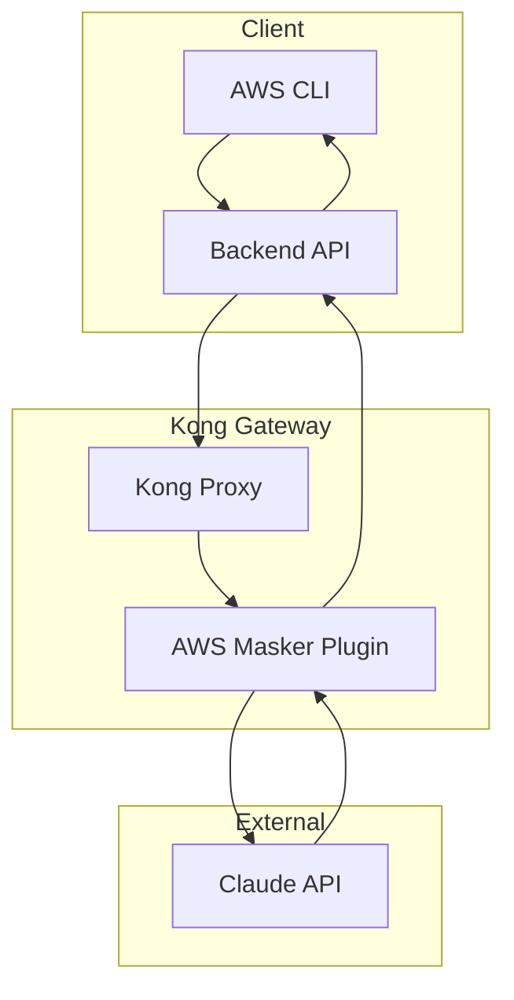
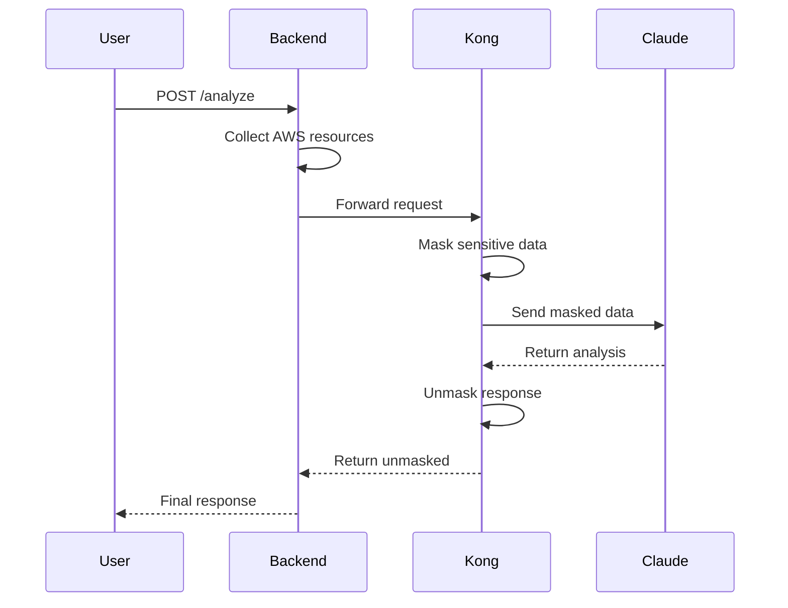

# Kong AWS Masking MVP - 문서화 표준 및 README 템플릿

## 개요
일관되고 유용한 문서 작성을 위한 표준과 템플릿입니다.

## 1. 문서화 원칙

### 1.1 핵심 원칙
- **명확성**: 전문 용어 최소화, 쉬운 설명
- **완전성**: 필요한 정보는 모두 포함
- **최신성**: 코드 변경 시 문서도 업데이트
- **실용성**: 실제 사용 예시 포함

### 1.2 문서 구조
```
프로젝트/
├── README.md              # 프로젝트 개요
├── CONTRIBUTING.md        # 기여 가이드
├── CHANGELOG.md          # 변경 이력
├── LICENSE               # 라이선스
├── docs/
│   ├── getting-started.md    # 시작 가이드
│   ├── api-reference.md       # API 문서
│   ├── architecture.md        # 아키텍처 설명
│   ├── deployment.md          # 배포 가이드
│   └── troubleshooting.md     # 문제 해결
└── examples/              # 사용 예시
```

## 2. README.md 템플릿

```markdown
# Kong AWS Masking MVP

[](https://github.com/org/repo/actions)
[](https://codecov.io/gh/org/repo)
[](LICENSE)

AWS 리소스 정보를 안전하게 마스킹하여 Claude API로 전송하는 Kong 기반 보안 게이트웨이입니다.

## 📋 목차

- [주요 기능](#주요-기능)
- [빠른 시작](#빠른-시작)
- [설치](#설치)
- [사용법](#사용법)
- [설정](#설정)
- [API 문서](#api-문서)
- [개발](#개발)
- [테스트](#테스트)
- [배포](#배포)
- [문제 해결](#문제-해결)
- [기여하기](#기여하기)
- [라이선스](#라이선스)

## 🚀 주요 기능

- ✅ AWS 리소스 ID 자동 마스킹 (EC2, S3, RDS)
- ✅ Claude API 통합으로 보안 분석
- ✅ Kong DB-less 모드로 간단한 구성
- ✅ Docker Compose로 원클릭 실행
- ✅ 실시간 마스킹/언마스킹

## 🏃 빠른 시작

```bash
# 1. 저장소 클론
git clone https://github.com/org/kong-aws-masking-mvp
cd kong-aws-masking-mvp

# 2. 환경 변수 설정
cp .env.example .env
# .env 파일에 ANTHROPIC_API_KEY 설정

# 3. 실행
docker-compose up -d

# 4. 테스트
curl http://localhost:3000/health
```

## 📦 설치

### 시스템 요구사항

- Docker 20.10+
- Docker Compose 3.8+
- 4GB RAM (권장)
- AWS CLI 설정 완료

### 상세 설치

1. **의존성 확인**
   ```bash
   docker --version
   docker-compose --version
   aws sts get-caller-identity
   ```

2. **프로젝트 설정**
   ```bash
   # 필수 환경 변수
   export ANTHROPIC_API_KEY="sk-ant-api03-..."
   export AWS_REGION="us-east-1"
   ```

3. **서비스 시작**
   ```bash
   docker-compose up -d
   ```

## 💻 사용법

### 기본 사용

```bash
# AWS 리소스 분석 요청
curl -X POST http://localhost:3000/analyze \
  -H "Content-Type: application/json" \
  -d '{
    "action": "analyze",
    "resources": ["ec2", "s3", "rds"]
  }'
```

### 응답 예시

```json
{
  "success": true,
  "data": {
    "analysis": "발견된 보안 이슈...",
    "maskedCount": 42,
    "timestamp": "2025-01-22T10:00:00Z"
  }
}
```

## ⚙️ 설정

### 환경 변수

| 변수명 | 설명 | 기본값 | 필수 |
|--------|------|--------|------|
| `ANTHROPIC_API_KEY` | Claude API 키 | - | ✅ |
| `AWS_REGION` | AWS 리전 | us-east-1 | ❌ |
| `LOG_LEVEL` | 로그 레벨 | info | ❌ |
| `PORT` | 서버 포트 | 3000 | ❌ |

### Kong 설정

Kong 설정은 `kong/kong.yml`에서 관리됩니다:

```yaml
_format_version: "3.0"
services:
  - name: claude-service
    url: https://api.anthropic.com
```

## 📚 API 문서

### 엔드포인트

#### `GET /health`
서비스 상태 확인

**응답:**
```json
{
  "status": "healthy",
  "version": "1.0.0",
  "timestamp": "2025-01-22T10:00:00Z"
}
```

#### `POST /analyze`
AWS 리소스 분석

**요청:**
```json
{
  "action": "analyze",
  "resources": ["ec2", "s3"]
}
```

**응답:**
```json
{
  "success": true,
  "data": {
    "analysis": "...",
    "maskedCount": 10
  }
}
```

[전체 API 문서 →](docs/api-reference.md)

## 🛠️ 개발

### 로컬 개발 환경

```bash
# 의존성 설치
npm install

# 개발 서버 실행
npm run dev

# 테스트 감시 모드
npm run test:watch
```

### 프로젝트 구조

```
├── src/
│   ├── app.js           # Express 앱
│   ├── services/        # 비즈니스 로직
│   ├── middleware/      # Express 미들웨어
│   └── utils/           # 유틸리티
├── kong/
│   ├── kong.yml         # Kong 설정
│   └── plugins/         # 커스텀 플러그인
└── tests/               # 테스트 파일
```

## 🧪 테스트

```bash
# 모든 테스트 실행
npm test

# 커버리지 포함
npm run test:coverage

# 특정 테스트만
npm test -- --grep "masking"
```

### 테스트 유형

- **단위 테스트**: `tests/unit/`
- **통합 테스트**: `tests/integration/`
- **E2E 테스트**: `tests/e2e/`

## 🚀 배포

### Docker 배포

```bash
# 프로덕션 이미지 빌드
docker build -t kong-aws-masking:prod .

# 실행
docker run -d \
  -p 3000:3000 \
  -e ANTHROPIC_API_KEY=$ANTHROPIC_API_KEY \
  kong-aws-masking:prod
```

### Kubernetes 배포

```bash
kubectl apply -f k8s/
```

[상세 배포 가이드 →](docs/deployment.md)

## 🐛 문제 해결

### 일반적인 문제

**Kong이 시작되지 않음**
```bash
# Kong 로그 확인
docker-compose logs kong

# 설정 검증
docker run --rm -v $(pwd)/kong:/kong \
  kong:3.9.0.1 kong config parse /kong/kong.yml
```

**마스킹이 작동하지 않음**
```bash
# 플러그인 로드 확인
curl http://localhost:8001/plugins
```

[전체 문제 해결 가이드 →](docs/troubleshooting.md)

## 🤝 기여하기

기여를 환영합니다! [CONTRIBUTING.md](CONTRIBUTING.md)를 참고해주세요.

### 개발 프로세스

1. 이슈 생성 또는 선택
2. 포크 및 브랜치 생성
3. 변경사항 구현
4. 테스트 작성 및 실행
5. PR 제출

## 📄 라이선스

이 프로젝트는 [MIT License](LICENSE)를 따릅니다.

---

**문의사항**: [이슈 트래커](https://github.com/org/repo/issues)
**보안 문제**: security@example.com
```

## 3. API 문서 표준

### 3.1 OpenAPI 명세
```yaml
# openapi.yml
openapi: 3.0.0
info:
  title: Kong AWS Masking API
  version: 1.0.0
  description: AWS 리소스 마스킹 서비스 API

servers:
  - url: http://localhost:3000
    description: Local development
  - url: https://api.example.com
    description: Production

paths:
  /health:
    get:
      summary: 헬스 체크
      tags:
        - System
      responses:
        '200':
          description: 서비스 정상
          content:
            application/json:
              schema:
                $ref: '#/components/schemas/HealthResponse'
              example:
                status: healthy
                version: 1.0.0

  /analyze:
    post:
      summary: AWS 리소스 분석
      tags:
        - Analysis
      requestBody:
        required: true
        content:
          application/json:
            schema:
              $ref: '#/components/schemas/AnalyzeRequest'
      responses:
        '200':
          description: 분석 완료
          content:
            application/json:
              schema:
                $ref: '#/components/schemas/AnalyzeResponse'
        '400':
          description: 잘못된 요청
        '500':
          description: 서버 오류

components:
  schemas:
    HealthResponse:
      type: object
      properties:
        status:
          type: string
          enum: [healthy, unhealthy]
        version:
          type: string
        timestamp:
          type: string
          format: date-time

    AnalyzeRequest:
      type: object
      required:
        - action
      properties:
        action:
          type: string
          enum: [analyze]
        resources:
          type: array
          items:
            type: string
            enum: [ec2, s3, rds]

    AnalyzeResponse:
      type: object
      properties:
        success:
          type: boolean
        data:
          type: object
          properties:
            analysis:
              type: string
            maskedCount:
              type: integer
```

### 3.2 코드 문서화
```javascript
/**
 * @api {post} /analyze AWS 리소스 분석
 * @apiName AnalyzeResources
 * @apiGroup Analysis
 * @apiVersion 1.0.0
 * 
 * @apiDescription AWS 리소스를 수집하고 마스킹하여 Claude API로 분석합니다.
 * 
 * @apiParam {String} action 실행할 작업 (analyze)
 * @apiParam {String[]} [resources] 분석할 리소스 타입 (기본: 모두)
 * 
 * @apiSuccess {Boolean} success 성공 여부
 * @apiSuccess {Object} data 응답 데이터
 * @apiSuccess {String} data.analysis 분석 결과
 * @apiSuccess {Number} data.maskedCount 마스킹된 항목 수
 * 
 * @apiExample {curl} 요청 예시:
 *     curl -X POST http://localhost:3000/analyze \
 *       -H "Content-Type: application/json" \
 *       -d '{"action": "analyze", "resources": ["ec2"]}'
 * 
 * @apiSuccessExample {json} 성공 응답:
 *     HTTP/1.1 200 OK
 *     {
 *       "success": true,
 *       "data": {
 *         "analysis": "EC2 인스턴스 10개 발견...",
 *         "maskedCount": 15
 *       }
 *     }
 * 
 * @apiError {String} error 에러 메시지
 * @apiErrorExample {json} 에러 응답:
 *     HTTP/1.1 400 Bad Request
 *     {
 *       "success": false,
 *       "error": "Invalid action"
 *     }
 */
app.post('/analyze', analyzeController);
```

## 4. 변경 이력 관리

### 4.1 CHANGELOG.md 템플릿
```markdown
# 변경 이력

이 프로젝트의 모든 주요 변경사항이 기록됩니다.
형식은 [Keep a Changelog](https://keepachangelog.com/ko/1.0.0/)를 따릅니다.

## [Unreleased]

### 추가
- S3 버킷 정책 분석 기능

### 변경
- Claude API 모델을 3.5 Sonnet으로 업그레이드

### 수정
- 메모리 누수 문제 해결

## [1.0.0] - 2025-01-22

### 추가
- EC2, S3, RDS 리소스 마스킹
- Claude API 통합
- Kong DB-less 모드 지원
- Docker Compose 설정

### 보안
- API 키 환경 변수 처리
- 읽기 전용 AWS 자격증명 마운트

[Unreleased]: https://github.com/org/repo/compare/v1.0.0...HEAD
[1.0.0]: https://github.com/org/repo/releases/tag/v1.0.0
```

## 5. 기여 가이드

### 5.1 CONTRIBUTING.md 템플릿
```markdown
# 기여 가이드

Kong AWS Masking 프로젝트에 기여해주셔서 감사합니다!

## 행동 규범

이 프로젝트는 [Contributor Covenant](https://www.contributor-covenant.org/) 행동 규범을 따릅니다.

## 기여 방법

### 1. 이슈 확인
- 기존 이슈를 확인하세요
- 새로운 기능이나 버그는 먼저 이슈로 등록하세요

### 2. 개발 환경 설정
```bash
# 포크 및 클론
git clone https://github.com/YOUR_USERNAME/kong-aws-masking-mvp
cd kong-aws-masking-mvp

# 의존성 설치
npm install

# 개발 브랜치 생성
git checkout -b feature/your-feature
```

### 3. 코드 작성
- 코딩 스타일 가이드를 따르세요
- 테스트를 작성하세요
- 문서를 업데이트하세요

### 4. 커밋
```bash
# 스테이징
git add .

# 커밋 (컨벤션 따르기)
git commit -m "feat: 새로운 마스킹 패턴 추가"
```

### 5. 푸시 및 PR
```bash
git push origin feature/your-feature
```

GitHub에서 Pull Request를 생성하세요.

## 커밋 메시지 규칙

- `feat`: 새로운 기능
- `fix`: 버그 수정
- `docs`: 문서 변경
- `style`: 코드 스타일 변경
- `refactor`: 리팩토링
- `test`: 테스트 추가/수정
- `chore`: 빌드 프로세스 등

예시:
```
feat: S3 버킷 이름 마스킹 지원

- 정규식 패턴으로 버킷 이름 감지
- 순차 번호로 마스킹
- 테스트 케이스 추가

Closes #123
```

## 코드 리뷰 프로세스

1. 모든 PR은 최소 1명의 리뷰어 승인 필요
2. CI 테스트 통과 필수
3. 문서 업데이트 확인
4. 브랜치 보호 규칙 준수

## 테스트

```bash
# 로컬 테스트
npm test

# 린트
npm run lint

# 타입 체크
npm run type-check
```

## 질문하기

- GitHub Issues 사용
- 디스코드: [링크]
- 이메일: dev@example.com

감사합니다! 🙏
```

## 6. 코드 주석 표준

### 6.1 함수 문서화
```javascript
/**
 * AWS 리소스 ID를 마스킹합니다
 * 
 * @description
 * EC2 인스턴스 ID, Private IP, S3 버킷명 등을 안전한 형식으로 변환합니다.
 * 마스킹된 값은 메모리에 저장되어 나중에 복원 가능합니다.
 * 
 * @param {string} text - 마스킹할 텍스트
 * @param {Object} options - 마스킹 옵션
 * @param {boolean} [options.preserveStructure=false] - JSON 구조 유지 여부
 * @param {string[]} [options.patterns] - 사용할 패턴 목록
 * 
 * @returns {Object} 마스킹 결과
 * @returns {string} returns.masked - 마스킹된 텍스트
 * @returns {Map} returns.mappings - 원본-마스킹 매핑
 * @returns {number} returns.count - 마스킹된 항목 수
 * 
 * @throws {ValidationError} 입력이 유효하지 않을 때
 * @throws {PatternError} 패턴 매칭 실패 시
 * 
 * @example
 * const result = maskAwsResources('Instance i-1234567890abcdef0 at 10.0.1.100');
 * console.log(result.masked); // 'Instance EC2_001 at PRIVATE_IP_001'
 * 
 * @since 1.0.0
 * @see {@link unmaskAwsResources} - 마스킹 해제
 */
function maskAwsResources(text, options = {}) {
  // Implementation
}
```

### 6.2 클래스 문서화
```javascript
/**
 * AWS 리소스 마스킹을 처리하는 서비스 클래스
 * 
 * @class MaskingService
 * @implements {IMaskingService}
 * 
 * @example
 * const service = new MaskingService({
 *   patterns: customPatterns,
 *   maxCacheSize: 10000
 * });
 */
class MaskingService {
  /**
   * MaskingService 인스턴스를 생성합니다
   * 
   * @constructor
   * @param {Object} config - 설정 객체
   * @param {Pattern[]} [config.patterns] - 사용할 패턴 목록
   * @param {number} [config.maxCacheSize=5000] - 최대 캐시 크기
   */
  constructor(config = {}) {
    /**
     * @private
     * @type {Map<string, string>}
     */
    this.mappings = new Map();
    
    /**
     * @public
     * @readonly
     * @type {number}
     */
    this.maxCacheSize = config.maxCacheSize || 5000;
  }
}
```

## 7. 다이어그램 표준

### 7.1 아키텍처 다이어그램
```markdown
## 시스템 아키텍처


```

### 7.2 시퀀스 다이어그램
```markdown
## 요청 처리 흐름


```

## 8. 문서 체크리스트

### 8.1 프로젝트 문서
- [ ] README.md - 프로젝트 개요
- [ ] CONTRIBUTING.md - 기여 가이드
- [ ] CHANGELOG.md - 변경 이력
- [ ] LICENSE - 라이선스
- [ ] SECURITY.md - 보안 정책

### 8.2 기술 문서
- [ ] API 레퍼런스
- [ ] 아키텍처 문서
- [ ] 배포 가이드
- [ ] 설정 가이드
- [ ] 문제 해결 가이드

### 8.3 개발 문서
- [ ] 개발 환경 설정
- [ ] 코딩 스타일 가이드
- [ ] 테스트 가이드
- [ ] 릴리즈 프로세스

## 9. 문서 관리

### 9.1 문서 업데이트 규칙
1. **코드 변경 = 문서 업데이트**
2. **PR에 문서 변경 포함**
3. **버전별 문서 태그**
4. **정기적 문서 리뷰**

### 9.2 문서 품질 검사
```bash
# 마크다운 린트
npm run lint:md

# 링크 검사
npm run check:links

# 맞춤법 검사
npm run spell:check
```

## 10. 결론

효과적인 문서화:
- **명확성**: 누구나 이해 가능
- **완전성**: 필요한 정보 모두 포함
- **최신성**: 항상 현재 상태 반영
- **접근성**: 쉽게 찾고 사용 가능

"코드는 어떻게를 설명하고, 문서는 왜를 설명한다."