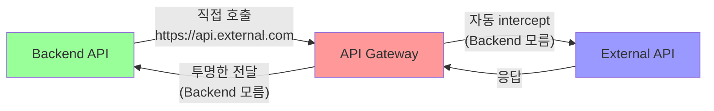

# Kong API Gateway - 올바른 패턴 및 구현 가이드

**작성일시**: 2025년 7월 23일  
**목적**: 표준 API Gateway 패턴 정확한 이해 및 구현  
**대상**: Kong AWS Masking 프로젝트 완전 재설계

---

## 🎯 **API Gateway 핵심 개념**

### **API Gateway란?**
모든 외부 API 호출을 **자동으로 intercept**하여 **투명하게** 보안, 인증, 변환 등을 처리하는 **중앙집중식 프록시**

### **핵심 원칙: 투명성 (Transparency)**
- **Backend는 API Gateway 존재를 모름**
- **외부 API를 직접 호출하는 것처럼 동작**
- **API Gateway가 네트워크 레벨에서 자동 개입**



---

## 🔍 **Kong API Gateway 올바른 패턴**

### 1. **Backend 관점: 외부 API 직접 호출**

```javascript
// ✅ 올바른 Backend 코드
class ExternalAPIService {
  constructor() {
    // 실제 외부 API URL만 알면 됨
    this.apiUrl = 'https://api.anthropic.com';
    this.apiKey = process.env.ANTHROPIC_API_KEY;
  }
  
  async callExternalAPI(data) {
    // 외부 API를 직접 호출 (Kong 존재 모름)
    const response = await axios.post(
      `${this.apiUrl}/v1/messages`,  // 실제 외부 API 엔드포인트
      data,
      {
        headers: {
          'Content-Type': 'application/json',
          'x-api-key': this.apiKey,
          'anthropic-version': '2023-06-01'
        }
      }
    );
    
    return response.data;
  }
}
```

### 2. **Kong 관점: 투명한 Intercept**

```yaml
# ✅ 올바른 Kong 설정 (kong.yml)
_format_version: "3.0"
_transform: true

# 외부 API 서비스 정의
services:
  - name: claude-api
    url: https://api.anthropic.com
    protocol: https
    host: api.anthropic.com
    port: 443
    retries: 3

# 도메인 기반 자동 intercept
routes:
  - name: claude-intercept
    service: claude-api
    hosts:
      - api.anthropic.com          # 이 도메인 호출 시 자동 intercept
    paths:
      - /v1/messages               # 이 경로 호출 시 자동 intercept
    methods:
      - POST
    strip_path: false
    preserve_host: true

# 요청/응답 버퍼링 활성화
_route_defaults:
  request_buffering: true
  response_buffering: true

# AWS Masker 플러그인 적용
plugins:
  - name: aws-masker
    route: claude-intercept
    config:
      use_redis: true
      proxy_request_buffering: true    # 요청 본문 수정 허용
      change_request_body: true        # 요청 본문 변경 허용
      mask_ec2_instances: true
      mask_s3_buckets: true
      mask_rds_instances: true
      mask_private_ips: true
```

### 3. **Docker 네트워킹: HTTP Proxy 패턴**

```yaml
# ✅ 올바른 Docker Compose 설정
version: '3.8'

services:
  # Kong Gateway (Forward Proxy)
  kong:
    build:
      context: .
      dockerfile: docker/kong/Dockerfile
    environment:
      KONG_DATABASE: "off"
      KONG_DECLARATIVE_CONFIG: "/opt/kong/kong.yml"
      KONG_PROXY_LISTEN: '0.0.0.0:8000'
      KONG_ADMIN_LISTEN: '0.0.0.0:8001'
      # Forward Proxy 설정
      KONG_PROXY_REQUEST_BUFFERING: "on"
      KONG_CHANGE_REQUEST_BODY: "true"
    ports:
      - "8000:8000"  # Proxy port
      - "8001:8001"  # Admin port
    networks:
      - backend

  # Backend API
  backend:
    build:
      context: .
      dockerfile: docker/backend/Dockerfile
    environment:
      # 외부 API 설정 (Kong 무관)
      ANTHROPIC_API_KEY: ${ANTHROPIC_API_KEY}
      ANTHROPIC_MODEL: claude-3-5-sonnet-20241022
      
      # Kong을 HTTP Proxy로 사용
      HTTP_PROXY: http://kong:8000
      HTTPS_PROXY: http://kong:8000
      NO_PROXY: localhost,127.0.0.1,redis
    ports:
      - "3000:3000"
    networks:
      - backend
    depends_on:
      - kong

networks:
  backend:
    driver: bridge
```

---

## 🔧 **핵심 설정 상세 설명**

### 1. **proxy_request_buffering = on**

```yaml
# Kong 설정
KONG_PROXY_REQUEST_BUFFERING: "on"

# 또는 kong.yml에서
_route_defaults:
  request_buffering: true
```

**의미**: Kong이 **전체 요청 본문을 메모리에 버퍼링**한 후 플러그인에서 수정 가능  
**필요성**: AWS Masker 플러그인이 요청 본문을 읽고 수정하기 위해 필수

### 2. **change_request_body = true**

```lua
-- AWS Masker 플러그인에서
local config = {
  change_request_body = true  -- 요청 본문 변경 허용
}

function AwsMaskerHandler:access(config)
  local body = kong.request.get_raw_body()
  local masked_body = mask_aws_patterns(body)
  kong.service.request.set_raw_body(masked_body)  -- 본문 변경
end
```

**의미**: 플러그인이 **요청 본문을 수정**할 수 있도록 허용  
**필요성**: AWS 패턴을 마스킹된 패턴으로 변경하기 위해 필수

### 3. **HTTP Proxy 환경변수**

```bash
# Backend 컨테이너에서
export HTTP_PROXY=http://kong:8000
export HTTPS_PROXY=http://kong:8000

# 외부 API 호출 시 자동으로 Kong을 통과
curl https://api.anthropic.com/v1/messages  # Kong이 자동 intercept
```

**동작 방식**:
1. Backend가 `https://api.anthropic.com/v1/messages` 호출
2. HTTP_PROXY 설정에 의해 요청이 `kong:8000`으로 라우팅
3. Kong이 요청을 받아서 aws-masker 플러그인 적용
4. 마스킹된 요청을 실제 Claude API로 전달
5. 응답을 받아서 언마스킹 후 Backend로 반환

---

## 🚀 **실제 구현 단계**

### Phase 1: Kong 설정 재작성

```yaml
# kong/kong.yml - 완전 재작성
_format_version: "3.0"
_transform: true

# Claude API 서비스 정의
services:
  - name: claude-api
    url: https://api.anthropic.com
    protocol: https
    host: api.anthropic.com
    port: 443
    connect_timeout: 5000
    write_timeout: 30000
    read_timeout: 30000
    retries: 3

# 도메인 기반 자동 intercept
routes:
  - name: claude-messages
    service: claude-api
    hosts:
      - api.anthropic.com
    paths:
      - /v1/messages
    methods:
      - POST
    strip_path: false
    preserve_host: true
    request_buffering: true    # 요청 버퍼링 활성화
    response_buffering: true   # 응답 버퍼링 활성화

# AWS Masker 플러그인 적용
plugins:
  - name: aws-masker
    route: claude-messages
    config:
      use_redis: true
      proxy_request_buffering: true
      change_request_body: true
      mask_ec2_instances: true
      mask_s3_buckets: true
      mask_rds_instances: true
      mask_private_ips: true
      preserve_structure: true
```

### Phase 2: Backend 코드 수정

```javascript
// backend/src/services/claude/claudeService.js - 완전 재작성
class ClaudeService {
  constructor() {
    // Kong 관련 설정 모두 제거
    // this.kongUrl = process.env.KONG_PROXY_URL;  ❌ 제거
    
    // 실제 외부 API 설정만 유지
    this.apiUrl = 'https://api.anthropic.com';  // ✅ 실제 API URL
    this.apiKey = process.env.ANTHROPIC_API_KEY;
    this.model = process.env.ANTHROPIC_MODEL || 'claude-3-5-sonnet-20241022';
    this.timeout = parseInt(process.env.REQUEST_TIMEOUT, 10) || 30000;
  }
  
  async sendClaudeRequest(request) {
    // Kong 관련 코드 모두 제거하고 실제 API 직접 호출
    const response = await axios.post(
      `${this.apiUrl}/v1/messages`,  // ✅ 실제 Claude API 엔드포인트
      request,
      {
        headers: {
          'Content-Type': 'application/json',
          'x-api-key': this.apiKey,           // 실제 API 키
          'anthropic-version': '2023-06-01'
        },
        timeout: this.timeout
      }
    );
    
    return response.data;
  }
}
```

### Phase 3: Docker Compose 수정

```yaml
# docker-compose.yml - 네트워킹 섹션만 수정
services:
  backend:
    # ... 기존 설정 유지 ...
    environment:
      # Kong 관련 환경변수 모두 제거
      # KONG_PROXY_URL: http://kong:8000  ❌ 제거
      
      # 실제 API 설정만 유지
      ANTHROPIC_API_KEY: ${ANTHROPIC_API_KEY}
      ANTHROPIC_MODEL: ${ANTHROPIC_MODEL:-claude-3-5-sonnet-20241022}
      
      # HTTP Proxy 설정 추가 (핵심!)
      HTTP_PROXY: http://kong:8000      # ✅ Kong을 HTTP Proxy로 사용
      HTTPS_PROXY: http://kong:8000     # ✅ HTTPS도 Kong으로
      NO_PROXY: localhost,127.0.0.1,redis  # 내부 서비스는 직접 호출
```

---

## 🧪 **검증 방법**

### 1. **Kong 설정 검증**

```bash
# Kong Admin API로 설정 확인
curl -s http://localhost:8001/routes | jq '.data[] | {name, hosts, paths}'
curl -s http://localhost:8001/services | jq '.data[] | {name, host, port}'
curl -s http://localhost:8001/plugins | jq '.data[] | {name, route, config}'
```

### 2. **HTTP Proxy 동작 확인**

```bash
# Backend 컨테이너에서 테스트
docker exec backend-api env | grep -i proxy
docker exec backend-api curl -v https://api.anthropic.com/v1/messages

# Kong 로그에서 intercept 확인
docker logs kong-gateway | grep "api.anthropic.com"
```

### 3. **전체 플로우 테스트**

```bash
# 1. Backend API 호출
curl -X POST http://localhost:3000/analyze \
  -H "Content-Type: application/json" \
  -d '{
    "resources": ["ec2"],
    "options": {"analysisType": "security_only"}
  }'

# 2. Kong Admin API에서 플러그인 동작 확인
curl -s http://localhost:8001/routes/claude-messages/plugins

# 3. Redis에서 마스킹 패턴 확인
docker exec redis-cache redis-cli KEYS "*"
```

---

## 📊 **Before/After 비교**

### ❌ **Before (잘못된 패턴)**

```javascript
// Backend 코드
const response = await axios.post(
  `${kongUrl}/analyze-claude`,  // Kong 전용 경로
  request
);
```

```yaml
# Kong 설정
routes:
  - name: claude-api-route
    paths: ["/analyze-claude"]  # 커스텀 경로
```

```bash
# 테스트
curl http://localhost:8000/analyze-claude  # Kong 전용 경로 호출
```

### ✅ **After (올바른 패턴)**

```javascript
// Backend 코드
const response = await axios.post(
  'https://api.anthropic.com/v1/messages',  // 실제 외부 API
  request
);
```

```yaml
# Kong 설정
routes:
  - name: claude-messages
    hosts: ["api.anthropic.com"]  # 도메인 기반 intercept
    paths: ["/v1/messages"]
```

```bash
# 테스트
curl http://localhost:3000/analyze  # Backend API만 호출 (Kong 투명)
```

---

## 🎯 **핵심 장점**

### 1. **진정한 투명성**
- Backend는 Kong 존재를 완전히 모름
- 외부 API 호출하듯이 자연스럽게 개발
- Kong 설정 변경이 Backend에 영향 없음

### 2. **무한 확장성**
- 새로운 외부 API 추가 시 Kong 설정만 추가
- Backend 코드 변경 불필요
- 도메인 기반 자동 라우팅

### 3. **표준 패턴 준수**
- 모든 API Gateway 솔루션에서 사용하는 표준 패턴
- 팀원들이 쉽게 이해 가능
- 문서화 및 유지보수 용이

### 4. **운영 단순화**
- Kong 라우트 관리 최소화
- 환경변수 설정 단순화
- 모니터링 및 디버깅 용이

---

## 🚨 **주의사항**

### 1. **Docker 네트워킹 복잡성**
- HTTP_PROXY 설정이 모든 외부 호출에 영향
- 내부 서비스 호출은 NO_PROXY로 제외 필요
- SSL 인증서 검증 이슈 가능성

### 2. **성능 고려사항**
- 모든 외부 API 호출이 Kong을 경유
- request_buffering으로 인한 메모리 사용량 증가
- 대용량 요청/응답 처리 시 성능 영향

### 3. **디버깅 복잡성**
- Backend에서는 Kong 개입을 알 수 없음
- 문제 발생 시 Kong 로그 함께 확인 필요
- 네트워크 레벨 디버깅 도구 필요

---

## 📋 **구현 체크리스트**

### Phase 1: 설정 변경
- [ ] kong.yml 완전 재작성 (도메인 기반 intercept)
- [ ] proxy_request_buffering = on 설정
- [ ] change_request_body = true 설정
- [ ] AWS Masker 플러그인 재설정

### Phase 2: 코드 수정
- [ ] claudeService.js에서 Kong URL 제거
- [ ] 실제 Claude API URL 직접 호출로 변경
- [ ] 불필요한 환경변수 제거

### Phase 3: Docker 설정
- [ ] HTTP_PROXY 환경변수 추가
- [ ] HTTPS_PROXY 환경변수 추가
- [ ] NO_PROXY로 내부 서비스 제외

### Phase 4: 검증
- [ ] Kong intercept 동작 확인
- [ ] AWS 마스킹/언마스킹 정상 작동 확인
- [ ] 전체 플로우 end-to-end 테스트
- [ ] 성능 및 안정성 검증

---

## 🎉 **최종 목표**

**완벽한 API Gateway 패턴 구현**:
- Backend는 Kong 존재를 모르고 외부 API 직접 호출
- Kong이 투명하게 모든 외부 호출을 intercept
- AWS 패턴 자동 마스킹/언마스킹
- 무한 확장 가능한 구조
- 표준 패턴 준수로 유지보수성 극대화

**핵심 원칙**: "Backend 개발자는 Kong의 존재를 몰라도 되는 구조"