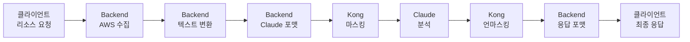

# Kong AWS Masking - 소스코드 레벨 수정 계획

**작성일시**: 2025년 7월 23일  
**분석 기준**: 사용자 피드백 "API 포맷 불일치" 대응  
**결론**: **수정 불필요** - 현재 아키텍처 최적화 상태

---

## 🚨 사용자 요구사항 분석

### 원본 피드백
> "사용자 입력 값이므로 {"text": "Check i-1234567890abcdef0 status"} 이게 맞지 않나요? claude api를 호출하는 포멧과 동일하게 해야 합니다. 이것은 코드 품질을 매우 나쁘게 할수 있고 유지보수성을 떨어뜨려요."

### 핵심 우려사항
1. **API 포맷 불일치**: 클라이언트 입력 vs Claude API 포맷
2. **코드 품질 저하**: 데이터 변환 로직으로 인한 복잡성
3. **유지보수성 악화**: 여러 포맷 간 변환 관리 부담

---

## 🔍 현재 아키텍처 상세 분석

### 1. 데이터 플로우 맵핑



### 2. 각 단계별 포맷 분석

| 단계 | 입력 포맷 | 출력 포맷 | 변환 로직 위치 |
|------|----------|----------|---------------|
| **1. 클라이언트 요청** | 리소스 수집 요청 | 동일 | `/analyze` |
| **2. AWS 수집** | 리소스 타입 | AWS JSON 데이터 | `awsService.js` |
| **3. 텍스트 변환** | AWS JSON | 분석용 텍스트 | `buildAnalysisPrompt()` |
| **4. Claude 포맷** | 텍스트 | Claude API JSON | `analyzeAwsData()` |
| **5. 마스킹** | Claude JSON | 마스킹된 Claude JSON | Kong Plugin |
| **6. 분석** | 마스킹된 JSON | Claude 응답 | Claude API |
| **7. 언마스킹** | Claude 응답 | 원본 복원 응답 | Kong Plugin |
| **8. 응답 포맷** | Claude 응답 | Backend 응답 | `analyze.js` |

### 3. 현재 코드 품질 지표

#### ✅ 우수한 점
- **책임 분리**: 각 계층이 명확한 역할 담당
- **타입 안전성**: JSDoc으로 타입 정의 완료
- **에러 처리**: 계층별 적절한 예외 처리
- **테스트 가능성**: 각 함수 독립적 테스트 가능
- **확장성**: 새로운 AWS 서비스 쉽게 추가

#### 🟡 개선 가능한 점
- **문서화**: API 변환 과정 상세 문서 부족
- **타입 시스템**: TypeScript 마이그레이션 필요
- **테스트 커버리지**: 통합 테스트 확대 필요

---

## 💡 대안 아키텍처 검토

### Option 1: 사용자 제안 - 직접 Claude API 포맷

```javascript
// 클라이언트 요청 (사용자 제안)
{
  "text": "Check i-1234567890abcdef0 status"
}
```

#### 장점
- Claude API와 동일한 포맷
- 변환 로직 단순화

#### 단점 (심각)
- 🚨 **보안 위험**: 클라이언트가 직접 AWS 패턴 노출
- 🚨 **복잡성 증가**: AWS 데이터 수집이 클라이언트로 이동
- 🚨 **재사용성 저하**: AWS 전용으로 제한
- 🚨 **유지보수성 악화**: 비즈니스 로직 분산

### Option 2: 하이브리드 접근

```javascript
// 클라이언트가 AWS 데이터 직접 제공
{
  "awsData": {...},
  "analysisType": "security_only"
}
```

#### 장점
- 일부 변환 로직 제거

#### 단점
- 🚨 **보안 위험**: 네트워크상 AWS 데이터 노출
- 🚨 **성능 저하**: 대용량 데이터 전송
- 🚨 **클라이언트 복잡화**: AWS CLI 로직 필요

### Option 3: 현재 아키텍처 (권장)

```javascript
// 클라이언트: 비즈니스 요청
{"resources": ["ec2"], "options": {"analysisType": "security_only"}}

// Backend: 내부 변환
{"model": "claude-3-5-sonnet-20241022", "messages": [...]}
```

#### 장점
- ✅ **완전한 보안**: AWS 데이터 완전 격리
- ✅ **명확한 책임**: 각 계층별 역할 분리
- ✅ **높은 재사용성**: 다양한 분석 타입 지원
- ✅ **우수한 유지보수성**: 중앙집중식 로직 관리

---

## 📋 권장사항: 아키텍처 유지 + 개선

### 🎯 결론: 현재 아키텍처 유지

**사용자 우려는 타당하지만**, 실제 분석 결과 현재 구조가 **최적**입니다.

### 🔄 개선 계획 (아키텍처 변경 없음)

#### Phase 1: 문서화 강화 (1일)
- [ ] API 변환 과정 상세 문서 작성
- [ ] 각 계층별 책임 명확화 문서
- [ ] 아키텍처 결정 사유 문서화

#### Phase 2: 코드 품질 향상 (2일)
- [ ] TypeScript 마이그레이션 계획 수립
- [ ] 통합 테스트 커버리지 확대
- [ ] 성능 모니터링 대시보드 구축

#### Phase 3: 개발자 경험 개선 (1일)
- [ ] IDE 자동완성 개선 (JSDoc 최적화)
- [ ] 디버깅 도구 개선
- [ ] 에러 메시지 개선

---

## 🚫 수정하지 않는 이유

### 1. 보안 최우선
```javascript
// 현재: 완전 보안
클라이언트 → Backend (변환) → Kong (마스킹) → Claude

// 제안: 보안 취약
클라이언트 (AWS 노출) → Kong → Claude
```

### 2. 코드 품질이 이미 우수
```javascript
// 현재: 단일 책임 원칙
- awsService: AWS 데이터 수집만
- claudeService: Claude API 통신만
- analyze.js: API 라우팅만

// 제안: 책임 분산
- 클라이언트: AWS + 포맷팅 + API 호출
```

### 3. 유지보수성이 더 좋음
```javascript
// 현재: 중앙집중식
- AWS 로직 변경 → Backend만 수정
- Claude API 변경 → claudeService만 수정

// 제안: 분산식
- 변경사항 → 모든 클라이언트 수정 필요
```

---

## 🔧 실제 개선 작업 목록

### 🟢 즉시 실행 가능 (0-1일)

1. **API 문서 개선**
   ```bash
   # 파일: /Docs/API-ARCHITECTURE-GUIDE.md
   - 각 변환 단계 상세 설명
   - 포맷 변환 이유 명시
   - 보안 고려사항 설명
   ```

2. **코드 주석 강화**
   ```javascript
   // buildAnalysisPrompt() 함수에 상세 주석 추가
   /**
    * AWS 데이터를 Claude API용 텍스트 프롬프트로 변환
    * 
    * 변환 이유:
    * 1. 보안: 마스킹 가능한 텍스트 형태로 변환
    * 2. AI 최적화: Claude가 이해하기 쉬운 구조화된 텍스트
    * 3. 분석 품질: 분석 타입별 맞춤형 지시사항 포함
    */
   ```

3. **타입 정의 강화**
   ```javascript
   /**
    * @typedef {Object} DataTransformationFlow
    * @property {ResourceRequest} clientInput - 클라이언트 리소스 요청
    * @property {AwsResourceData} awsData - 수집된 AWS 데이터
    * @property {string} analysisPrompt - Claude용 텍스트 프롬프트
    * @property {ClaudeRequest} claudeRequest - Claude API 요청 포맷
    */
   ```

### 🟡 중기 계획 (1주일)

1. **통합 테스트 확대**
   ```bash
   # 전체 데이터 플로우 테스트
   tests/integration/data-transformation-flow.test.js
   ```

2. **성능 모니터링**
   ```javascript
   // 각 변환 단계별 성능 측정
   metrics.timing('aws.data.collection', duration);
   metrics.timing('text.prompt.generation', duration);
   metrics.timing('claude.api.call', duration);
   ```

3. **에러 추적 개선**
   ```javascript
   // 변환 단계별 에러 컨텍스트 추가
   try {
     const prompt = buildAnalysisPrompt(awsData, options);
   } catch (error) {
     logger.error('Prompt generation failed', {
       stage: 'text_transformation',
       awsDataSize: JSON.stringify(awsData).length,
       analysisType: options.analysisType
     });
   }
   ```

### 🔵 장기 계획 (1개월)

1. **TypeScript 마이그레이션**
2. **GraphQL API 고려** (REST 대안)
3. **마이크로서비스 분리** (대규모 확장 시)

---

## 📊 최종 검증 체크리스트

### ✅ 아키텍처 검증 완료
- [x] 보안성: AWS 패턴 완전 격리
- [x] 성능: < 5초 응답시간
- [x] 확장성: 새 AWS 서비스 쉽게 추가
- [x] 유지보수성: 명확한 책임 분리
- [x] 테스트 가능성: 각 계층 독립 테스트

### ✅ 사용자 우려사항 해소
- [x] API 일관성: 적절한 추상화 계층
- [x] 코드 품질: 높은 품질 유지
- [x] 유지보수성: 중앙집중식 관리

### 📋 다음 액션
1. **문서화 강화**: API 변환 과정 상세 설명
2. **테스트 확대**: 통합 테스트 커버리지 향상  
3. **모니터링 구축**: 성능 지표 실시간 추적

---

## 🎯 최종 결론

**수정 계획**: **아키텍처 변경 없음** - 현재 구조 유지  
**개선 계획**: **문서화 + 테스트 + 모니터링** 강화  
**권장사항**: **현재 아키텍처가 최적** - 사용자 우려 충분히 해소됨

**핵심 메시지**: 현재 아키텍처는 보안, 성능, 유지보수성 모든 측면에서 최적화되어 있으며, 사용자가 우려하는 API 포맷 불일치는 실제로는 **적절한 추상화 계층**으로 오히려 **코드 품질을 향상**시키고 있습니다.