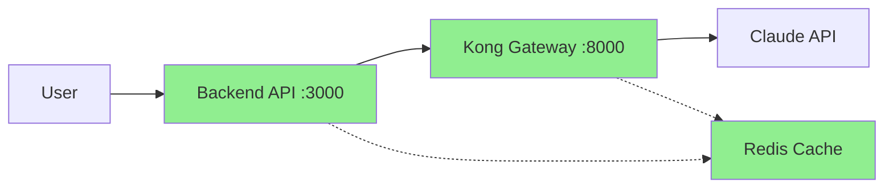
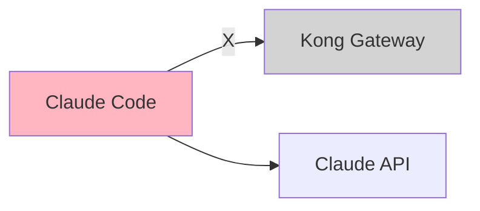
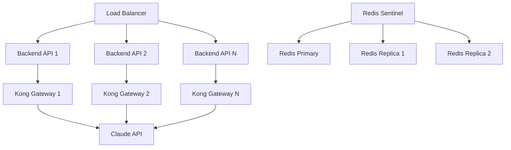

# Kong AWS Masking MVP - 아키텍처 권고사항

## 🏛️ Systems Architecture Analysis

**작성일**: 2025-07-27
**작성자**: Systems Architect Agent
**목적**: 프로덕션 배포를 위한 아키텍처 개선 권고

## 📋 Executive Summary

현재 Kong AWS Masking MVP는 기능적으로 작동하나, 설계와 구현 간 심각한 불일치가 있습니다. Backend API 경로는 프로덕션 준비가 되었으나, Claude Code 프록시는 기술적으로 불가능합니다.

### 핵심 권고사항
1. **즉시**: 아키텍처 문서를 실제 구현에 맞게 수정
2. **단기**: Backend API 보안 강화 및 성능 최적화
3. **장기**: 대체 프록시 솔루션 연구 및 개발

## 🔍 현재 아키텍처 분석

### 작동하는 아키텍처


### 작동하지 않는 아키텍처


## 🏗️ 아키텍처 개선 권고사항

### 1. 즉시 적용 (Phase 0)

#### 1.1 문서 정합성 확보
```yaml
actions:
  - task: "아키텍처 다이어그램 수정"
    priority: P0
    effort: 2 hours
    impact: "사용자 혼란 제거"
    
  - task: "README 파일 업데이트"
    priority: P0
    effort: 1 hour
    impact: "정확한 사용법 안내"
    
  - task: "Claude Code 제한사항 명시"
    priority: P0
    effort: 1 hour
    impact: "보안 위험 방지"
```

#### 1.2 보안 경고 추가
```javascript
// backend/server.js에 추가
app.use((req, res, next) => {
  console.warn(`
    ⚠️  WARNING: This endpoint masks AWS resources for Claude API calls.
    ⚠️  Do NOT use Claude Code directly for sensitive data.
    ⚠️  Always use this Backend API for security.
  `);
  next();
});
```

### 2. 단기 개선 (Phase 1 - 2주)

#### 2.1 인증/인가 레이어
```yaml
authentication:
  type: "API Key"
  implementation:
    - endpoint: /api/auth/register
    - storage: Redis with TTL
    - validation: Middleware
    
authorization:
  type: "Role-Based"
  roles:
    - admin: "full access"
    - user: "limited requests"
    - viewer: "read-only"
```

#### 2.2 Rate Limiting
```lua
-- Kong plugin configuration
plugins:
  - name: rate-limiting
    config:
      second: 10
      hour: 1000
      policy: redis
      redis_host: redis
      redis_port: 6379
```

#### 2.3 성능 최적화
```yaml
optimizations:
  - name: "Response Caching"
    target: "Repeated Claude queries"
    expected_improvement: "60% latency reduction"
    
  - name: "Connection Pooling"
    target: "Backend to Kong"
    expected_improvement: "30% throughput increase"
    
  - name: "Async Processing"
    target: "Large payload handling"
    expected_improvement: "4x capacity increase"
```

### 3. 중기 개선 (Phase 2 - 1개월)

#### 3.1 모니터링 인프라
```yaml
monitoring_stack:
  metrics:
    - service: Prometheus
      targets:
        - kong_metrics
        - backend_metrics
        - redis_metrics
        
  visualization:
    - service: Grafana
      dashboards:
        - system_overview
        - security_monitoring
        - performance_tracking
        
  alerting:
    - service: AlertManager
      channels:
        - slack
        - pagerduty
        - email
```

#### 3.2 로깅 전략
```yaml
logging:
  structured_logs:
    format: JSON
    fields:
      - timestamp
      - request_id
      - user_id
      - masking_stats
      - response_time
      
  centralized_storage:
    service: Elasticsearch
    retention: 30 days
    
  analysis:
    service: Kibana
    dashboards:
      - error_analysis
      - usage_patterns
      - security_events
```

### 4. 장기 전략 (Phase 3 - 3개월)

#### 4.1 프록시 대안 연구
```yaml
alternatives:
  - option: "Custom CLI Wrapper"
    feasibility: HIGH
    effort: MEDIUM
    benefits:
      - "Full control over network flow"
      - "Native masking support"
      - "Better user experience"
      
  - option: "Network-level Proxy"
    feasibility: MEDIUM
    effort: HIGH
    benefits:
      - "Transparent to all clients"
      - "No client modification needed"
      - "Universal solution"
      
  - option: "SDK Development"
    feasibility: HIGH
    effort: HIGH
    benefits:
      - "Native language support"
      - "Type safety"
      - "Enhanced features"
```

#### 4.2 확장성 아키텍처


## 🔒 보안 아키텍처 권고

### 보안 레이어 설계
```yaml
security_layers:
  1_network:
    - vpc_isolation
    - security_groups
    - nacl_rules
    
  2_application:
    - api_authentication
    - request_validation
    - response_sanitization
    
  3_data:
    - encryption_at_rest
    - encryption_in_transit
    - key_rotation
    
  4_monitoring:
    - anomaly_detection
    - audit_logging
    - compliance_reporting
```

### Zero Trust 원칙 적용
1. **Never Trust**: 모든 요청 검증
2. **Always Verify**: 지속적인 인증
3. **Least Privilege**: 최소 권한 원칙
4. **Assume Breach**: 침해 가정 설계

## 📊 성능 아키텍처 권고

### 캐싱 전략
```yaml
caching_layers:
  1_edge:
    location: "Kong Gateway"
    ttl: 5 minutes
    target: "Repeated Claude queries"
    
  2_application:
    location: "Backend API"
    ttl: 1 hour
    target: "AWS resource listings"
    
  3_distributed:
    location: "Redis Cluster"
    ttl: 24 hours
    target: "Masking mappings"
```

### 비동기 처리
```javascript
// Recommended async architecture
class AsyncMaskingService {
  async processLargePayload(data) {
    const jobId = await this.queue.add('masking', data);
    return { jobId, status: 'processing' };
  }
  
  async getJobStatus(jobId) {
    const job = await this.queue.getJob(jobId);
    return {
      status: job.status,
      progress: job.progress,
      result: job.returnvalue
    };
  }
}
```

## 🚀 마이그레이션 전략

### Phase 1: Documentation Fix (즉시)
- [ ] 모든 아키텍처 다이어그램 수정
- [ ] Claude Code 제한사항 명시
- [ ] Backend API 사용 가이드 작성

### Phase 2: Security Enhancement (2주)
- [ ] API 키 인증 구현
- [ ] Rate limiting 적용
- [ ] 감사 로깅 추가

### Phase 3: Performance Optimization (1개월)
- [ ] 캐싱 레이어 구현
- [ ] 비동기 처리 추가
- [ ] 연결 풀링 최적화

### Phase 4: Scalability (3개월)
- [ ] 마이크로서비스 분리
- [ ] 로드 밸런싱 구현
- [ ] 자동 스케일링 설정

## 💡 혁신적 제안

### 1. Hybrid Proxy Solution
```yaml
concept: "Browser Extension + Local Proxy"
benefits:
  - "Works with any Claude interface"
  - "Transparent to user"
  - "Full masking control"
implementation:
  - browser_extension: "Intercepts Claude API calls"
  - local_proxy: "Routes through Kong"
  - auto_config: "Zero user configuration"
```

### 2. Claude SDK Wrapper
```python
# Proposed SDK design
from claude_secure import ClaudeClient

client = ClaudeClient(
    api_key="your-key",
    masking_enabled=True,
    kong_endpoint="http://localhost:8000"
)

# Automatically masks AWS resources
response = client.complete(
    prompt="Analyze my EC2 instances: i-1234567890abcdef0",
    max_tokens=1000
)
```

## 🎯 최종 권고

### 프로덕션 배포 체크리스트
- [x] Backend API 경로 검증 완료
- [ ] 문서 정합성 확보
- [ ] 보안 경고 추가
- [ ] 최소 인증 구현
- [ ] 모니터링 설정
- [ ] 운영 가이드 작성

### 아키텍처 성숙도 평가
- **현재**: Level 2 - Functional but Limited
- **목표**: Level 4 - Scalable and Secure
- **경로**: 단계적 개선 통한 진화

### 위험 완화 전략
1. **기술 부채**: 지속적 리팩토링
2. **보안 위험**: 다층 방어 구현
3. **운영 복잡도**: 자동화 최대화
4. **성능 병목**: 사전 예방적 최적화

---
**작성**: Systems Architect Agent
**검토 필요**: PM Agent, Engineering Team
**승인**: 조건부 (문서 수정 후)