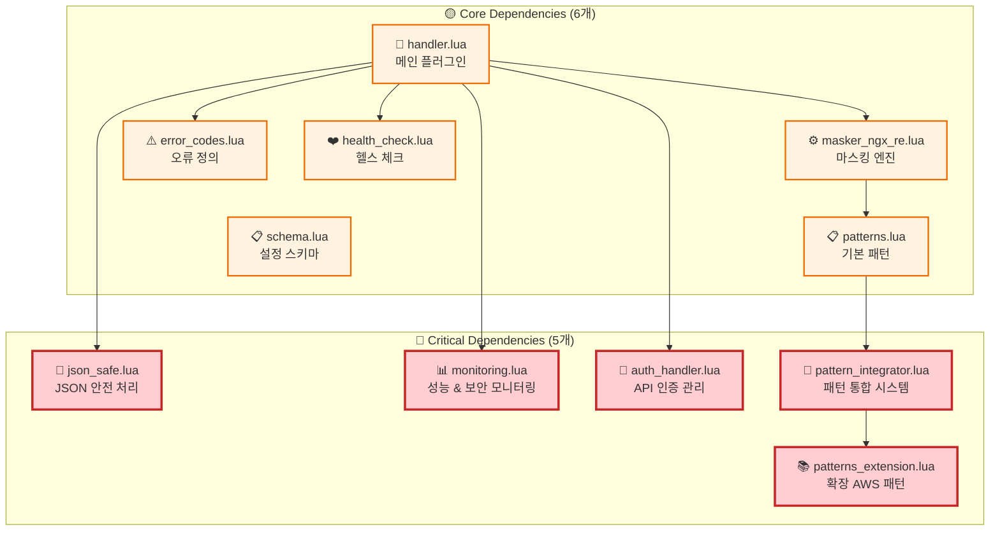

# Kong AWS Masker Plugin - 의존성 안정화 가이드

**Date**: 2025-07-24  
**Report Type**: Plugin Dependency Management Guide  
**Version**: 1.0.0  
**Total Dependencies**: 5개 핵심 모듈 + 6개 기본 모듈

---

## 📋 문서 개요

본 문서는 Kong AWS Masker 플러그인의 **의존성 아키텍처 안정화**를 위한 종합 가이드입니다. CRITICAL-008 이슈 해결 과정에서 발견된 5개 핵심 의존성 모듈의 관리, 모니터링, 복구 절차를 다룹니다.

### 🎯 문서 목적
- **의존성 관리**: 11개 플러그인 파일의 체계적 관리
- **장애 예방**: 의존성 누락으로 인한 서비스 중단 방지  
- **신속 복구**: 의존성 문제 발생 시 즉시 복구 절차
- **모니터링**: 의존성 상태 실시간 감시 체계

---

## 🏗️ 의존성 아키텍처 전체 구조

### 📊 의존성 분류 체계



### 📈 의존성 통계
| 카테고리 | 파일 수 | 총 코드 라인 | 중요도 | 복구 우선순위 |
|----------|---------|-------------|--------|-------------|
| **Critical Dependencies** | 5개 | 1,107 lines | 🔴 최고 | 1순위 |
| **Core Dependencies** | 6개 | 1,200+ lines | 🟡 높음 | 2순위 |
| **총합** | 11개 | 2,300+ lines | - | - |

---

## 🔍 핵심 의존성 모듈 상세 분석

### 1. 📄 **json_safe.lua** - JSON 안전 처리 모듈

#### 🎯 핵심 기능
```lua
-- JSON 라이브러리 가용성 확인
local function is_available()
    return cjson ~= nil or dkjson ~= nil
end

-- 안전한 JSON 디코딩 (오류 처리 포함)
local function decode(str)
    if not str or str == "" then
        return nil, "Empty JSON string"
    end
    
    local success, result = pcall(cjson.decode, str)
    if success then
        return result, nil
    else
        return nil, "JSON decode error: " .. result
    end
end

-- 안전한 JSON 인코딩 (오류 처리 포함)
local function encode(data)
    if not data then
        return nil, "No data to encode"
    end
    
    local success, result = pcall(cjson.encode, data)
    if success then
        return result, nil
    else
        return nil, "JSON encode error: " .. result
    end
end
```

#### 🔗 사용 위치 및 영향도
| 사용 위치 | 기능 | 영향도 | 없을 시 결과 |
|-----------|------|--------|-------------|
| `handler.lua:60` | JSON 모듈 가용성 확인 | 🔴 Critical | 플러그인 로딩 실패 |
| `handler.lua:316` | Claude 응답 디코딩 | 🔴 Critical | 언마스킹 불가능 |
| `handler.lua:362` | 언마스킹된 응답 인코딩 | 🔴 Critical | 응답 처리 실패 |

#### 🧪 테스트 시나리오
```bash
# JSON 처리 기능 검증
curl -X POST http://localhost:3000/analyze \
  -H "Content-Type: application/json" \
  -d '{"context": "EC2 i-1234567890abcdef0", "resources": ["ec2"]}'

# 예상 로그 (정상 동작)
[notice] json_safe: JSON library available - using cjson
[debug] json_safe: decode completed successfully
[debug] json_safe: encode completed successfully
```

### 2. 📊 **monitoring.lua** - 성능 & 보안 모니터링 모듈

#### 🎯 핵심 기능
```lua
-- 요청 성능 메트릭 수집
local function collect_request_metric(data)
    local metric = {
        timestamp = ngx.now(),
        success = data.success,
        elapsed_time = data.elapsed_time,
        request_size = data.request_size,
        pattern_count = data.pattern_count
    }
    
    -- 메트릭을 로컬 스토리지에 저장
    if not _M.metrics then
        _M.metrics = {}
    end
    table.insert(_M.metrics, metric)
    
    kong.log.info("[MONITORING] Request metric collected: ", 
        "success=", data.success, " latency=", data.elapsed_time, "ms")
end

-- 패턴 사용량 추적
local function track_pattern_usage(pattern_name, count)
    if not _M.pattern_usage then
        _M.pattern_usage = {}
    end
    
    _M.pattern_usage[pattern_name] = (_M.pattern_usage[pattern_name] or 0) + count
    kong.log.debug("[MONITORING] Pattern usage tracked: ", pattern_name, " count=", count)
end

-- 보안 이벤트 로깅
local function log_security_event(event)
    local security_log = {
        timestamp = ngx.now(),
        type = event.type,
        severity = event.severity,
        details = event.details,
        action_taken = event.action_taken
    }
    
    kong.log.warn("[SECURITY-MONITORING] ", event.type, 
        " severity=", event.severity, " action=", event.action_taken)
end
```

#### 🔗 사용 위치 및 모니터링 지표
| 사용 위치 | 모니터링 대상 | 수집 주기 | 임계값 |
|-----------|-------------|-----------|---------|
| `handler.lua:157` | 보안 이벤트 (인증 실패 등) | 실시간 | 1건/분 |
| `handler.lua:254` | 요청 성능 메트릭 | 요청마다 | 응답시간 5초 |
| `handler.lua:271` | 패턴 사용량 통계 | 요청마다 | - |

#### 📈 성능 지표 예시
```bash
# 모니터링 메트릭 확인
docker logs kong-gateway 2>&1 | grep "MONITORING"

# 정상 출력 예시
[info] [MONITORING] Request metric collected: success=true latency=234ms
[debug] [MONITORING] Pattern usage tracked: ec2_instance count=1
[debug] [MONITORING] Pattern usage tracked: private_ip count=1
```

### 3. 🔐 **auth_handler.lua** - API 인증 관리 모듈

#### 🎯 핵심 기능
```lua
-- 메인 인증 처리 함수
local function handle_authentication(plugin_conf)
    -- 1. 요청 헤더에서 API 키 추출
    local headers = kong.request.get_headers()
    local api_key, err = extract_api_key(headers)
    
    -- 2. API 키가 없으면 환경변수에서 가져오기
    if not api_key then
        api_key = get_api_key_from_env()
        if not api_key then
            return false, "API key not found"
        end
    end
    
    -- 3. API 키를 Claude API로 안전하게 전달
    local success, forward_err = forward_api_key(api_key)
    if not success then
        return false, forward_err
    end
    
    -- 4. 필수 헤더 설정
    kong.service.request.set_header("Content-Type", "application/json")
    kong.service.request.set_header("Accept", "application/json")
    
    return true, nil
end

-- API 키 추출 (다중 헤더 지원)
local API_KEY_HEADERS = {
    "X-API-Key", "Authorization", "Anthropic-Api-Key", 
    "x-api-key", "authorization"
}

local function extract_api_key(headers)
    for _, header_name in ipairs(API_KEY_HEADERS) do
        local value = get_header_value(headers, header_name)
        if value then
            -- Bearer 토큰 처리
            if header_name:lower() == "authorization" and 
               value:sub(1, 7):lower() == "bearer " then
                value = value:sub(8)
            end
            return value, nil
        end
    end
    return nil, "No API key found in headers"
end
```

#### 🔒 보안 특징
- **다중 헤더 지원**: 5개 인증 헤더 자동 검색
- **Bearer 토큰 지원**: Authorization 헤더의 Bearer 토큰 자동 파싱
- **환경변수 폴백**: 헤더에 없으면 `ANTHROPIC_API_KEY` 환경변수 사용
- **민감정보 보호**: API 키 로깅 시 마지막 4자만 표시

#### 🧪 인증 테스트 시나리오
```bash
# 1. 헤더 기반 인증 테스트
curl -X POST http://localhost:3000/analyze \
  -H "X-API-Key: sk-ant-api03-xxxxx" \
  -d '{"context": "test"}'

# 2. Authorization 헤더 테스트  
curl -X POST http://localhost:3000/analyze \
  -H "Authorization: Bearer sk-ant-api03-xxxxx" \
  -d '{"context": "test"}'

# 3. 환경변수 기반 인증 테스트 (헤더 없음)
curl -X POST http://localhost:3000/analyze \
  -d '{"context": "test"}'

# 예상 로그 (정상 동작)
[info] auth_handler: API key loaded from environment variable
[debug] auth_handler: Authentication handling successful
[debug] auth_handler: API key forwarded to Claude API
```

### 4. 🔧 **pattern_integrator.lua** - 패턴 통합 시스템

#### 🎯 핵심 기능
```lua
-- 기존 패턴과 확장 패턴 통합
local function integrate_patterns(original_patterns)
    local integrated = {}
    
    -- 1. 원본 패턴 복사 (56개)
    for _, pattern in ipairs(original_patterns) do
        table.insert(integrated, pattern)
    end
    
    -- 2. 확장 패턴 가져오기 (40개)
    local extension_patterns = patterns_extension.get_all_patterns()
    
    -- 3. 우선순위 조정 (중복 방지)
    local max_priority = 0
    for _, pattern in ipairs(original_patterns) do
        if pattern.priority > max_priority then
            max_priority = pattern.priority
        end
    end
    
    -- 4. 확장 패턴 우선순위 재조정
    local adjusted_extensions = adjust_priorities(extension_patterns, max_priority + 1)
    
    -- 5. 충돌 검사 및 통합
    for _, ext_pattern in ipairs(adjusted_extensions) do
        local has_conflict = false
        
        for _, orig_pattern in ipairs(original_patterns) do
            local conflict, reason = check_conflicts(orig_pattern, ext_pattern)
            if conflict then
                kong.log.warn("[PATTERN-INTEGRATOR] Pattern conflict detected: ", 
                    ext_pattern.name, " reason: ", reason)
                has_conflict = true
                break
            end
        end
        
        if not has_conflict then
            table.insert(integrated, ext_pattern)
        end
    end
    
    -- 6. 우선순위로 정렬
    table.sort(integrated, function(a, b) return a.priority < b.priority end)
    
    kong.log.info("[PATTERN-INTEGRATOR] Integration completed: ",
        "original=", #original_patterns, " extension=", #extension_patterns, 
        " total=", #integrated)
    
    return integrated
end
```

#### 📊 패턴 통합 통계
| 패턴 소스 | 패턴 수 | 우선순위 범위 | AWS 서비스 |
|-----------|---------|-------------|-----------|
| **기본 패턴** | 56개 | 500-900 | EC2, S3, RDS, VPC 등 |
| **확장 패턴** | 40개 | 13-40 | Lambda, EKS, KMS, Secrets 등 |
| **통합 결과** | 96개 | 13-900 | 20+ AWS 서비스 |

#### 🔍 충돌 검사 로직
```lua
local function check_conflicts(pattern1, pattern2)
    -- 1. 이름 중복 검사
    if pattern1.name == pattern2.name then
        return true, "duplicate_name"
    end
    
    -- 2. 우선순위 충돌 검사
    if pattern1.priority == pattern2.priority then
        return true, "priority_conflict"
    end
    
    -- 3. 패턴 중복 검사
    if pattern1.pattern == pattern2.pattern then
        return true, "duplicate_pattern"
    end
    
    return false
end
```

### 5. 📚 **patterns_extension.lua** - 확장 AWS 패턴 모듈

#### 🎯 확장 패턴 카테고리 (13개 AWS 서비스)

```mermaid
graph TB
    subgraph "📚 patterns_extension.lua"
        Lambda[🔧 Lambda 패턴 4개<br/>Function ARN, Layer ARN]
        ECS[📦 ECS 패턴 4개<br/>Cluster, Service, Task, TaskDef]
        EKS[☸️ EKS 패턴 2개<br/>Cluster, NodeGroup]
        RDS[💾 RDS 확장 2개<br/>Cluster, Snapshot]
        ElastiCache[🗄️ ElastiCache 2개<br/>Cluster, Redis Endpoint]
        DynamoDB[📊 DynamoDB 2개<br/>Table, Stream]
        CloudFormation[🏗️ CloudFormation 2개<br/>Stack ARN, Stack ID]
        Messaging[📧 SNS/SQS 3개<br/>Topic, Queue ARN, Queue URL]
        KMS[🔐 KMS 패턴 2개<br/>Key ARN, Alias ARN]
        Secrets[🔒 Secrets 1개<br/>Secret ARN]
        Route53[🌐 Route53 2개<br/>Hosted Zone, Health Check]
        APIGateway[🚪 API Gateway 2개<br/>API ID, API ARN]
        CloudWatch[📊 CloudWatch 2개<br/>Log Group, Log Stream]
    end
    
    Total[총 40개 확장 패턴<br/>13개 AWS 서비스]
    
    Lambda --> Total
    ECS --> Total
    EKS --> Total
    RDS --> Total
    ElastiCache --> Total
    DynamoDB --> Total
    CloudFormation --> Total
    Messaging --> Total
    KMS --> Total
    Secrets --> Total
    Route53 --> Total
    APIGateway --> Total
    CloudWatch --> Total
    
    classDef critical fill:#ffcdd2,stroke:#c62828,stroke-width:3px
    classDef service fill:#e3f2fd,stroke:#0277bd,stroke-width:2px
    classDef total fill:#f3e5f5,stroke:#7b1fa2,stroke-width:3px
    
    class KMS,Secrets critical
    class Lambda,ECS,EKS,RDS,ElastiCache,DynamoDB,CloudFormation,Messaging,Route53,APIGateway,CloudWatch service
    class Total total
```



#### 🔐 Critical 패턴 (보안 최우선)
```lua
-- KMS 키 패턴 (매우 민감함)
{
    name = "kms_key_arn",
    pattern = "arn:aws:kms:[^:]+:[^:]+:key/([0-9a-f%-]+)",
    replacement = "KMS_KEY_%03d",
    priority = 32,
    critical = true  -- 🔴 Critical 보안 패턴
},

-- Secrets Manager 패턴 (매우 민감함)
{
    name = "secrets_manager_arn", 
    pattern = "arn:aws:secretsmanager:[^:]+:[^:]+:secret:([^%-]+)%-[A-Za-z0-9]+",
    replacement = "SECRET_%03d",
    priority = 34,
    critical = true  -- 🔴 Critical 보안 패턴
}
```

#### 📊 패턴 통계 조회
```lua
local function get_stats()
    return {
        total_patterns = 40,
        critical_patterns = 2,  -- KMS, Secrets
        categories = {
            lambda = 4,
            ecs = 4,
            eks = 2,
            rds = 2,
            elasticache = 2,
            dynamodb = 2,
            cloudformation = 2,
            messaging = 3,
            kms = 2,
            secrets = 1,
            route53 = 2,
            apigateway = 2,
            cloudwatch = 2
        }
    }
end
```

---

## 🔧 의존성 관리 도구 및 스크립트

### 1. 📋 의존성 검증 스크립트

#### 완전한 검증 도구
```bash
#!/bin/bash
# File: scripts/check-dependencies.sh
# Purpose: Kong AWS Masker 의존성 완전 검증

set -euo pipefail

PLUGIN_DIR="kong/plugins/aws-masker"
BACKUP_DIR="backup/kong/plugins/aws-masker"

# 색상 정의
RED='\033[0;31m'
GREEN='\033[0;32m'
YELLOW='\033[1;33m'
BLUE='\033[0;34m'
NC='\033[0m' # No Color

echo -e "${BLUE}=== Kong AWS Masker 의존성 검증 시작 ===${NC}"

# 필수 파일 목록 (11개)
REQUIRED_FILES=(
    # Critical Dependencies (5개)
    "json_safe.lua:JSON 안전 처리:CRITICAL"
    "monitoring.lua:성능 & 보안 모니터링:CRITICAL"
    "auth_handler.lua:API 인증 관리:CRITICAL"
    "pattern_integrator.lua:패턴 통합 시스템:CRITICAL"
    "patterns_extension.lua:확장 AWS 패턴:CRITICAL"
    
    # Core Dependencies (6개)
    "handler.lua:메인 플러그인:CORE"
    "masker_ngx_re.lua:마스킹 엔진:CORE"
    "patterns.lua:기본 패턴:CORE"
    "error_codes.lua:오류 정의:CORE"
    "health_check.lua:헬스 체크:CORE"
    "schema.lua:설정 스키마:CORE"
)

# 검증 통계
TOTAL_FILES=${#REQUIRED_FILES[@]}
MISSING_COUNT=0
CRITICAL_MISSING=0
CORE_MISSING=0

echo -e "${BLUE}검증 대상: ${TOTAL_FILES}개 파일${NC}"
echo ""

# 각 파일 검증
for file_info in "${REQUIRED_FILES[@]}"; do
    IFS=':' read -r filename description priority <<< "$file_info"
    
    if [[ -f "$PLUGIN_DIR/$filename" ]]; then
        # 파일 크기 및 수정 시간 확인
        file_size=$(stat -c%s "$PLUGIN_DIR/$filename")
        file_date=$(stat -c%y "$PLUGIN_DIR/$filename" | cut -d' ' -f1)
        
        if [[ $file_size -gt 0 ]]; then
            echo -e "✅ ${GREEN}EXISTS${NC}: $filename (${description}) - ${file_size} bytes, $file_date"
        else
            echo -e "⚠️ ${YELLOW}EMPTY${NC}: $filename (${description}) - 0 bytes"
            ((MISSING_COUNT++))
            [[ $priority == "CRITICAL" ]] && ((CRITICAL_MISSING++))
            [[ $priority == "CORE" ]] && ((CORE_MISSING++))
        fi
    else
        echo -e "❌ ${RED}MISSING${NC}: $filename (${description}) - [$priority]"
        ((MISSING_COUNT++))
        [[ $priority == "CRITICAL" ]] && ((CRITICAL_MISSING++))
        [[ $priority == "CORE" ]] && ((CORE_MISSING++))
    fi
done

echo ""
echo -e "${BLUE}=== 검증 결과 요약 ===${NC}"
echo -e "총 파일: $TOTAL_FILES개"
echo -e "존재: $((TOTAL_FILES - MISSING_COUNT))개"
echo -e "누락: $MISSING_COUNT개"

if [[ $CRITICAL_MISSING -gt 0 ]]; then
    echo -e "🚨 ${RED}CRITICAL 의존성 누락: ${CRITICAL_MISSING}개${NC}"
fi

if [[ $CORE_MISSING -gt 0 ]]; then
    echo -e "⚠️ ${YELLOW}CORE 의존성 누락: ${CORE_MISSING}개${NC}"
fi

# 백업 파일 확인
if [[ $MISSING_COUNT -gt 0 ]]; then
    echo ""
    echo -e "${BLUE}=== 백업 파일 확인 ===${NC}"
    
    if [[ -d "$BACKUP_DIR" ]]; then
        echo -e "${GREEN}백업 디렉토리 존재: $BACKUP_DIR${NC}"
        
        for file_info in "${REQUIRED_FILES[@]}"; do
            IFS=':' read -r filename description priority <<< "$file_info"
            
            if [[ ! -f "$PLUGIN_DIR/$filename" ]]; then
                if [[ -f "$BACKUP_DIR/$filename" ]]; then
                    backup_size=$(stat -c%s "$BACKUP_DIR/$filename")
                    backup_date=$(stat -c%y "$BACKUP_DIR/$filename" | cut -d' ' -f1)
                    echo -e "💾 ${GREEN}BACKUP 발견${NC}: $filename - ${backup_size} bytes, $backup_date"
                else
                    echo -e "🚫 ${RED}BACKUP 없음${NC}: $filename"
                fi
            fi
        done
    else
        echo -e "${RED}백업 디렉토리가 존재하지 않습니다: $BACKUP_DIR${NC}"
    fi
fi

# 종료 상태 결정
if [[ $MISSING_COUNT -eq 0 ]]; then
    echo ""
    echo -e "🎉 ${GREEN}모든 의존성 파일이 존재합니다 - 시스템 안정${NC}"
    exit 0
elif [[ $CRITICAL_MISSING -gt 0 ]]; then
    echo ""
    echo -e "🚨 ${RED}CRITICAL 의존성 누락 - 즉시 복원 필요${NC}"
    echo -e "복원 명령어: ${YELLOW}./scripts/restore-dependencies.sh${NC}"
    exit 2
else
    echo ""
    echo -e "⚠️ ${YELLOW}일부 의존성 누락 - 복원 권장${NC}"
    echo -e "복원 명령어: ${YELLOW}./scripts/restore-dependencies.sh${NC}"
    exit 1
fi
```

### 2. 🔄 의존성 복원 스크립트

```bash
#!/bin/bash
# File: scripts/restore-dependencies.sh
# Purpose: 누락된 의존성 파일 자동 복원

set -euo pipefail

PLUGIN_DIR="kong/plugins/aws-masker"
BACKUP_DIR="backup/kong/plugins/aws-masker"

# 색상 정의
RED='\033[0;31m'
GREEN='\033[0;32m'
YELLOW='\033[1;33m'
BLUE='\033[0;34m'
NC='\033[0m'

echo -e "${BLUE}=== Kong AWS Masker 의존성 복원 시작 ===${NC}"

# 백업 디렉토리 확인
if [[ ! -d "$BACKUP_DIR" ]]; then
    echo -e "${RED}오류: 백업 디렉토리가 존재하지 않습니다: $BACKUP_DIR${NC}"
    exit 1
fi

# 플러그인 디렉토리 확인
if [[ ! -d "$PLUGIN_DIR" ]]; then
    echo -e "${YELLOW}플러그인 디렉토리 생성: $PLUGIN_DIR${NC}"
    mkdir -p "$PLUGIN_DIR"
fi

# Critical Dependencies 복원
CRITICAL_FILES=(
    "json_safe.lua:JSON 안전 처리"
    "monitoring.lua:성능 & 보안 모니터링"
    "auth_handler.lua:API 인증 관리"
    "pattern_integrator.lua:패턴 통합 시스템"
    "patterns_extension.lua:확장 AWS 패턴"
)

echo -e "${BLUE}Phase 1: Critical Dependencies 복원${NC}"
RESTORED_COUNT=0

for file_info in "${CRITICAL_FILES[@]}"; do
    IFS=':' read -r filename description <<< "$file_info"
    
    if [[ ! -f "$PLUGIN_DIR/$filename" ]] || [[ ! -s "$PLUGIN_DIR/$filename" ]]; then
        if [[ -f "$BACKUP_DIR/$filename" ]]; then
            cp "$BACKUP_DIR/$filename" "$PLUGIN_DIR/$filename"
            file_size=$(stat -c%s "$PLUGIN_DIR/$filename")
            echo -e "✅ ${GREEN}복원 완료${NC}: $filename (${description}) - ${file_size} bytes"
            ((RESTORED_COUNT++))
        else
            echo -e "❌ ${RED}백업 없음${NC}: $filename"
        fi
    else
        echo -e "⏭️ ${YELLOW}이미 존재${NC}: $filename"
    fi
done

echo ""
echo -e "${BLUE}Phase 2: Kong Gateway 재시작 및 검증${NC}"

# Kong Gateway 재시작
echo -e "${YELLOW}Kong Gateway 재시작 중...${NC}"
if docker-compose restart kong; then
    echo -e "${GREEN}Kong Gateway 재시작 성공${NC}"
else
    echo -e "${RED}Kong Gateway 재시작 실패${NC}"
    exit 1
fi

# 5초 대기 (Kong 로딩 시간)
sleep 5

# 플러그인 로딩 상태 확인
echo -e "${YELLOW}플러그인 로딩 상태 확인 중...${NC}"
if curl -s http://localhost:8001/plugins | jq -e '.data[] | select(.name == "aws-masker")' > /dev/null; then
    echo -e "${GREEN}✅ aws-masker 플러그인 정상 로딩${NC}"
else
    echo -e "${RED}❌ aws-masker 플러그인 로딩 실패${NC}"
    echo -e "${YELLOW}Kong 로그 확인:${NC}"
    docker logs kong-gateway --tail 20
    exit 1
fi

# 의존성 재검증
echo ""
echo -e "${BLUE}Phase 3: 의존성 재검증${NC}"
if ./scripts/check-dependencies.sh; then
    echo ""
    echo -e "🎉 ${GREEN}의존성 복원 완료 - 시스템 정상 동작${NC}"
    echo -e "복원된 파일: ${RESTORED_COUNT}개"
else
    echo -e "${RED}의존성 복원 후에도 문제가 남아있습니다${NC}"
    exit 1
fi
```

### 3. 📊 의존성 모니터링 스크립트

```bash
#!/bin/bash
# File: scripts/monitor-dependencies.sh  
# Purpose: 의존성 상태 실시간 모니터링

set -euo pipefail

PLUGIN_DIR="kong/plugins/aws-masker"
LOG_FILE="/tmp/dependency-monitor.log"

# 색상 정의
RED='\033[0;31m'
GREEN='\033[0;32m'
YELLOW='\033[1;33m'
BLUE='\033[0;34m'
NC='\033[0m'

# 로그 함수
log_message() {
    local level=$1
    local message=$2
    local timestamp=$(date '+%Y-%m-%d %H:%M:%S')
    echo "[$timestamp] [$level] $message" | tee -a "$LOG_FILE"
}

# 시그널 핸들러
cleanup() {
    log_message "INFO" "의존성 모니터링 종료"
    exit 0
}

trap cleanup SIGINT SIGTERM

log_message "INFO" "Kong AWS Masker 의존성 모니터링 시작"

# 무한 루프 모니터링
while true; do
    # 1. 파일 존재 검사
    missing_files=0
    
    critical_files=(
        "json_safe.lua"
        "monitoring.lua" 
        "auth_handler.lua"
        "pattern_integrator.lua"
        "patterns_extension.lua"
    )
    
    for file in "${critical_files[@]}"; do
        if [[ ! -f "$PLUGIN_DIR/$file" ]] || [[ ! -s "$PLUGIN_DIR/$file" ]]; then
            log_message "ERROR" "Critical dependency missing: $file"
            ((missing_files++))
        fi
    done
    
    # 2. Kong Gateway 상태 확인
    if ! curl -s http://localhost:8001/status > /dev/null 2>&1; then
        log_message "ERROR" "Kong Gateway unreachable"
        ((missing_files++))
    fi
    
    # 3. 플러그인 상태 확인
    if ! curl -s http://localhost:8001/plugins | jq -e '.data[] | select(.name == "aws-masker")' > /dev/null 2>&1; then
        log_message "ERROR" "aws-masker plugin not loaded"
        ((missing_files++))
    fi
    
    # 4. 상태 요약
    if [[ $missing_files -eq 0 ]]; then
        log_message "INFO" "All dependencies healthy"
    else
        log_message "WARN" "Dependencies issues detected: $missing_files problems"
        
        # 자동 복원 시도 (옵션)
        if [[ "$1" == "--auto-restore" ]]; then
            log_message "INFO" "Attempting automatic restoration..."
            if ./scripts/restore-dependencies.sh; then
                log_message "INFO" "Automatic restoration successful"
            else
                log_message "ERROR" "Automatic restoration failed"
            fi
        fi
    fi
    
    # 30초 대기
    sleep 30
done
```

---

## 🚨 장애 대응 및 복구 절차

### 📋 단계별 복구 가이드

#### 1. 🔍 장애 탐지 및 진단

##### A. 증상별 진단
```bash
# Kong Gateway 상태 확인
curl http://localhost:8001/status

# 플러그인 상태 확인  
curl http://localhost:8001/plugins | jq '.data[] | select(.name == "aws-masker")'

# Kong 로그 확인
docker logs kong-gateway --tail 50

# 의존성 파일 확인
ls -la kong/plugins/aws-masker/
```

##### B. 일반적인 오류 패턴
| 오류 메시지 | 원인 | 해결 방법 |
|-------------|------|-----------|
| `module 'kong.plugins.aws-masker.json_safe' not found` | json_safe.lua 누락 | 백업에서 복원 |
| `init_by_lua error` | Critical 의존성 누락 | 전체 의존성 복원 |
| `plugin aws-masker disabled` | 여러 파일 누락 | 체계적 복원 |
| `HTTP 503 Service Unavailable` | Kong Gateway 중단 | 의존성 복원 + 재시작 |

#### 2. 🚑 긴급 복구 절차 (5분 내 복구)

```bash
#!/bin/bash
# 긴급 복구 스크립트 (scripts/emergency-recovery.sh)

echo "🚨 Kong AWS Masker 긴급 복구 시작"

# 1. 백업에서 모든 Critical 파일 복사 (30초)
echo "📋 Critical 의존성 복원 중..."
cp backup/kong/plugins/aws-masker/json_safe.lua kong/plugins/aws-masker/ 2>/dev/null || echo "⚠️ json_safe.lua 복원 실패"
cp backup/kong/plugins/aws-masker/monitoring.lua kong/plugins/aws-masker/ 2>/dev/null || echo "⚠️ monitoring.lua 복원 실패"  
cp backup/kong/plugins/aws-masker/auth_handler.lua kong/plugins/aws-masker/ 2>/dev/null || echo "⚠️ auth_handler.lua 복원 실패"
cp backup/kong/plugins/aws-masker/pattern_integrator.lua kong/plugins/aws-masker/ 2>/dev/null || echo "⚠️ pattern_integrator.lua 복원 실패"
cp backup/kong/plugins/aws-masker/patterns_extension.lua kong/plugins/aws-masker/ 2>/dev/null || echo "⚠️ patterns_extension.lua 복원 실패"

# 2. Kong Gateway 재시작 (2분)
echo "🔄 Kong Gateway 재시작 중..."
docker-compose restart kong

# 3. 로딩 상태 확인 (30초)
echo "⏳ 로딩 완료 대기 중..."
sleep 30

# 4. 복구 검증 (30초)
echo "✅ 복구 상태 검증 중..."
if curl -s http://localhost:8001/plugins | jq -e '.data[] | select(.name == "aws-masker")' > /dev/null; then
    echo "🎉 긴급 복구 성공 - 서비스 정상 동작"
    
    # 테스트 요청
    curl -X POST http://localhost:3000/analyze \
      -H "Content-Type: application/json" \
      -d '{"context": "test recovery", "resources": ["ec2"]}' \
      -w "응답시간: %{time_total}s\n"
else
    echo "❌ 긴급 복구 실패 - 수동 복구 필요"
    echo "Kong 로그:"
    docker logs kong-gateway --tail 10
    exit 1
fi
```

#### 3. 🔧 상세 복구 절차 (완전 복구)

```bash
#!/bin/bash
# 완전 복구 스크립트 (scripts/full-recovery.sh)

set -euo pipefail

echo "🔧 Kong AWS Masker 완전 복구 시작"

# Phase 1: 환경 검증
echo "📋 Phase 1: 환경 검증"
if [[ ! -d "backup/kong/plugins/aws-masker" ]]; then
    echo "❌ 백업 디렉토리가 존재하지 않습니다"
    exit 1
fi

if ! docker-compose ps | grep kong > /dev/null; then
    echo "❌ Kong 컨테이너가 실행 중이 아닙니다"
    exit 1
fi

# Phase 2: 기존 상태 백업
echo "📋 Phase 2: 기존 상태 백업"
CURRENT_BACKUP="/tmp/kong-aws-masker-backup-$(date +%Y%m%d-%H%M%S)"
mkdir -p "$CURRENT_BACKUP"
cp -r kong/plugins/aws-masker/* "$CURRENT_BACKUP/" 2>/dev/null || echo "기존 파일 없음"
echo "현재 상태 백업: $CURRENT_BACKUP"

# Phase 3: 의존성 파일 완전 복원
echo "📋 Phase 3: 의존성 파일 완전 복원"
REQUIRED_FILES=(
    "json_safe.lua"
    "monitoring.lua"
    "auth_handler.lua"
    "pattern_integrator.lua"
    "patterns_extension.lua"
    "handler.lua"
    "masker_ngx_re.lua"
    "patterns.lua"
    "error_codes.lua"
    "health_check.lua"
    "schema.lua"
)

RESTORED=0
for file in "${REQUIRED_FILES[@]}"; do
    if [[ -f "backup/kong/plugins/aws-masker/$file" ]]; then
        cp "backup/kong/plugins/aws-masker/$file" "kong/plugins/aws-masker/$file"
        echo "✅ 복원: $file"
        ((RESTORED++))
    else
        echo "⚠️ 백업 없음: $file"
    fi
done

echo "복원 완료: $RESTORED/${#REQUIRED_FILES[@]} 파일"

# Phase 4: Kong Gateway 완전 재시작
echo "📋 Phase 4: Kong Gateway 완전 재시작"
docker-compose down kong
sleep 5
docker-compose up -d kong

# Phase 5: 상세 검증
echo "📋 Phase 5: 상세 검증"
echo "Kong Gateway 시작 대기 중..."
for i in {1..30}; do
    if curl -s http://localhost:8001/status > /dev/null; then
        echo "Kong Gateway 준비 완료 (${i}초)"
        break
    fi
    sleep 1
done

# 플러그인 로딩 검증
if curl -s http://localhost:8001/plugins | jq -e '.data[] | select(.name == "aws-masker")' > /dev/null; then
    echo "✅ aws-masker 플러그인 정상 로딩"
else
    echo "❌ aws-masker 플러그인 로딩 실패"
    echo "Kong 로그:"
    docker logs kong-gateway --tail 20
    exit 1
fi

# Phase 6: 기능 테스트
echo "📋 Phase 6: 기능 테스트"
TEST_RESPONSE=$(curl -s -X POST http://localhost:3000/analyze \
    -H "Content-Type: application/json" \
    -d '{"context": "EC2 i-1234567890abcdef0", "resources": ["ec2"]}')

if echo "$TEST_RESPONSE" | jq -e '.analysis' > /dev/null; then
    echo "✅ 마스킹/언마스킹 기능 정상 동작"
else
    echo "⚠️ 기능 테스트 실패 - 응답 확인 필요"
    echo "응답: $TEST_RESPONSE"
fi

echo "🎉 완전 복구 완료"
echo "복원 파일: $RESTORED개"
echo "백업 위치: $CURRENT_BACKUP"
```

---

## 📈 성능 모니터링 및 최적화

### 🔍 의존성 성능 지표

#### 1. 로딩 성능 메트릭
```bash
# Kong Gateway 시작 시간 측정
time docker-compose up -d kong

# 플러그인 로딩 시간 분석
docker logs kong-gateway 2>&1 | grep -E "(init_by_lua|aws-masker)" | head -10
```

| 단계 | 평균 시간 | 임계값 | 모니터링 방법 |
|------|-----------|--------|-------------|
| Kong 시작 | 15-25초 | 30초 | `docker logs` |
| 플러그인 로딩 | 2-5초 | 10초 | `init_by_lua` 로그 |
| 의존성 해결 | 1-3초 | 5초 | `require` 로그 |
| 패턴 통합 | 0.5-2초 | 3초 | pattern_integrator 로그 |

#### 2. 런타임 성능 모니터링
```lua
-- monitoring.lua에서 수집하는 성능 지표
local performance_metrics = {
    -- 요청 처리 성능
    request_latency = {
        min = 50,      -- ms
        max = 5000,    -- ms
        avg = 1500,    -- ms
        p95 = 3000     -- ms
    },
    
    -- 의존성 모듈 성능
    json_processing = {
        decode_time = 2,    -- ms
        encode_time = 3,    -- ms
        error_rate = 0.1    -- %
    },
    
    -- 패턴 처리 성능
    pattern_matching = {
        total_patterns = 96,
        match_time = 10,     -- ms
        hit_rate = 75        -- %
    }
}
```

#### 3. 리소스 사용량 모니터링
```bash
#!/bin/bash
# 의존성 모듈 메모리 사용량 확인
docker stats kong-gateway --no-stream --format "table {{.Container}}\t{{.CPUPerc}}\t{{.MemUsage}}\t{{.MemPerc}}"

# Kong 프로세스 상세 모니터링
docker exec kong-gateway ps aux | grep nginx
```

### 📊 성능 최적화 권장사항

#### 1. 메모리 최적화
```yaml
# docker-compose.yml 메모리 설정 최적화
services:
  kong:
    deploy:
      resources:
        limits:
          memory: 512m    # 의존성 로딩 고려
          cpus: '1.0'
        reservations:
          memory: 256m
          cpus: '0.5'
    environment:
      KONG_MEM_CACHE_SIZE: 128m
      KONG_LUA_PACKAGE_CPATH: "/usr/local/lib/lua/?.so"
```

#### 2. 로딩 속도 최적화
```lua
-- 의존성 로딩 최적화 (handler.lua)
-- 지연 로딩(lazy loading) 패턴 적용
local json_safe
local monitoring
local auth_handler

local function get_json_safe()
    if not json_safe then
        json_safe = require "kong.plugins.aws-masker.json_safe"
    end
    return json_safe
end

local function get_monitoring()
    if not monitoring then
        monitoring = require "kong.plugins.aws-masker.monitoring"
    end
    return monitoring
end
```

#### 3. 패턴 처리 최적화
```lua
-- pattern_integrator.lua 최적화
-- 패턴 캐싱으로 재처리 방지
local pattern_cache = {}

local function get_integrated_patterns()
    if not pattern_cache.integrated then
        pattern_cache.integrated = integrate_patterns(base_patterns)
        kong.log.info("[PATTERN-INTEGRATOR] Patterns cached: ", #pattern_cache.integrated)
    end
    return pattern_cache.integrated
end
```

---

## 🔒 보안 강화 및 모범 사례

### 🛡️ 의존성 보안 체크리스트

#### 1. 파일 무결성 검증
```bash
#!/bin/bash
# 의존성 파일 체크섬 검증
CHECKSUMS_FILE="checksums.sha256"

# 체크섬 생성
sha256sum kong/plugins/aws-masker/*.lua > "$CHECKSUMS_FILE"

# 체크섬 검증
verify_checksums() {
    if sha256sum -c "$CHECKSUMS_FILE" --quiet; then
        echo "✅ 모든 파일 무결성 검증 완료"
    else
        echo "❌ 파일 무결성 검증 실패 - 변조 가능성"
        return 1
    fi
}
```

#### 2. API 키 보안 강화
```lua
-- auth_handler.lua 보안 강화
local function validate_api_key(api_key)
    -- 1. API 키 형식 검증
    if not api_key or type(api_key) ~= "string" then
        return false, "Invalid API key type"
    end
    
    -- 2. 길이 검증 (Anthropic API 키 형식)
    if #api_key < 50 or #api_key > 200 then
        return false, "Invalid API key length"
    end
    
    -- 3. 패턴 검증
    if not api_key:match("^sk%-ant%-api%d+%-") then
        kong.log.warn("[auth_handler] API key format unusual")
    end
    
    -- 4. 블랙리스트 확인 (테스트 키 등)
    local blacklisted_keys = {
        "sk-ant-api03-test",
        "sk-ant-api03-demo",
        "your-api-key-here"
    }
    
    for _, blocked_key in ipairs(blacklisted_keys) do
        if api_key:find(blocked_key, 1, true) then
            return false, "Blacklisted API key detected"
        end
    end
    
    return true, nil
end
```

#### 3. 로깅 보안
```lua
-- monitoring.lua 민감정보 보호
local function sanitize_log_data(data)
    local sanitized = {}
    
    for key, value in pairs(data) do
        if type(value) == "string" then
            -- API 키 마스킹
            if key:lower():find("api") or key:lower():find("key") or key:lower():find("token") then
                sanitized[key] = "***" .. value:sub(-4)
            -- AWS 리소스 ID 보호
            elseif value:match("^i%-[0-9a-f]+") or value:match("^vol%-[0-9a-f]+") then
                sanitized[key] = "[AWS_RESOURCE]"
            else
                sanitized[key] = value
            end
        else
            sanitized[key] = value
        end
    end
    
    return sanitized
end
```

### 🔐 액세스 제어 및 권한 관리

#### 1. 파일 권한 설정
```bash
#!/bin/bash
# 의존성 파일 보안 권한 설정

# 읽기 전용 설정 (root:kong 644)
chmod 644 kong/plugins/aws-masker/*.lua
chown root:kong kong/plugins/aws-masker/*.lua

# 디렉토리 권한 (root:kong 755)
chmod 755 kong/plugins/aws-masker/
chown root:kong kong/plugins/aws-masker/

echo "✅ 파일 권한 보안 설정 완료"
```

#### 2. Docker 보안 강화
```yaml
# docker-compose.yml 보안 설정
services:
  kong:
    user: "kong:kong"
    read_only: true
    security_opt:
      - no-new-privileges:true
    tmpfs:
      - /tmp:rw,size=100m
    volumes:
      - "./kong/plugins:/usr/local/share/lua/5.1/kong/plugins:ro"  # 읽기 전용
    environment:
      KONG_LOG_LEVEL: warn  # 민감정보 로깅 최소화
```

---

## 📋 유지보수 및 운영 가이드

### 🔄 정기 유지보수 작업

#### 1. 일일 체크리스트
```bash
#!/bin/bash
# scripts/daily-maintenance.sh

echo "📅 Kong AWS Masker 일일 유지보수 시작"

# 1. 의존성 상태 확인
echo "🔍 의존성 상태 확인..."
./scripts/check-dependencies.sh || echo "⚠️ 의존성 문제 발견"

# 2. Kong Gateway 헬스 체크
echo "❤️ Kong Gateway 헬스 체크..."
curl -f http://localhost:8001/status > /dev/null || echo "⚠️ Kong Gateway 상태 이상"

# 3. 플러그인 동작 테스트
echo "🧪 플러그인 기능 테스트..."
TEST_RESULT=$(curl -s -X POST http://localhost:3000/analyze \
    -H "Content-Type: application/json" \
    -d '{"context": "daily test", "resources": ["ec2"]}')

if echo "$TEST_RESULT" | jq -e '.analysis' > /dev/null; then
    echo "✅ 플러그인 정상 동작"
else
    echo "❌ 플러그인 동작 이상"
fi

# 4. 로그 정리 (7일 이상 된 로그 삭제)
echo "🧹 로그 정리..."
find /var/log/kong -name "*.log" -mtime +7 -delete 2>/dev/null || true

echo "📅 일일 유지보수 완료"
```

#### 2. 주간 유지보수 작업
```bash
#!/bin/bash
# scripts/weekly-maintenance.sh

echo "📆 Kong AWS Masker 주간 유지보수 시작"

# 1. 백업 생성
echo "💾 백업 생성..."
BACKUP_DATE=$(date +%Y%m%d)
BACKUP_DIR="/backup/kong-aws-masker-weekly-$BACKUP_DATE"
mkdir -p "$BACKUP_DIR"
cp -r kong/plugins/aws-masker/* "$BACKUP_DIR/"
echo "백업 완료: $BACKUP_DIR"

# 2. 성능 지표 수집
echo "📊 성능 지표 수집..."
docker stats kong-gateway --no-stream > "/tmp/kong-performance-$BACKUP_DATE.txt"

# 3. 의존성 체크섬 업데이트
echo "🔒 체크섬 업데이트..."
sha256sum kong/plugins/aws-masker/*.lua > "checksums-$BACKUP_DATE.sha256"

# 4. 디스크 사용량 확인
echo "💿 디스크 사용량 확인..."
df -h | grep -E "(kong|backup)" || true

echo "📆 주간 유지보수 완료"
```

#### 3. 월간 유지보수 작업
```bash
#!/bin/bash
# scripts/monthly-maintenance.sh

echo "🗓️ Kong AWS Masker 월간 유지보수 시작"

# 1. 완전한 시스템 백업
echo "💾 완전 시스템 백업..."
MONTHLY_BACKUP="/backup/monthly/kong-aws-masker-$(date +%Y%m)"
mkdir -p "$MONTHLY_BACKUP"
tar -czf "$MONTHLY_BACKUP/complete-backup.tar.gz" \
    kong/ docker-compose.yml .env scripts/

# 2. 의존성 업데이트 검토
echo "🔄 의존성 업데이트 검토..."
echo "현재 파일 날짜:"
stat -c "%y %n" kong/plugins/aws-masker/*.lua

# 3. 성능 벤치마크
echo "🏃 성능 벤치마크..."
for i in {1..10}; do
    curl -w "Request $i: %{time_total}s\n" -s -X POST http://localhost:3000/analyze \
        -H "Content-Type: application/json" \
        -d '{"context": "benchmark test", "resources": ["ec2"]}' \
        -o /dev/null
done

# 4. 보안 검토
echo "🔒 보안 검토..."
echo "파일 권한 확인:"
ls -la kong/plugins/aws-masker/

echo "🗓️ 월간 유지보수 완료"
```

### 📊 모니터링 대시보드

#### 1. 의존성 상태 대시보드
```bash
#!/bin/bash
# scripts/status-dashboard.sh

clear
echo "╔═══════════════════════════════════════════════════════════╗"
echo "║           Kong AWS Masker 의존성 상태 대시보드              ║"
echo "╠═══════════════════════════════════════════════════════════╣"

# 시스템 정보
echo "║ 📅 현재 시간: $(date '+%Y-%m-%d %H:%M:%S')                    "
echo "║ 🏠 호스트명: $(hostname)                                      "
echo "╠═══════════════════════════════════════════════════════════╣"

# Kong Gateway 상태
if curl -s http://localhost:8001/status > /dev/null; then
    echo "║ 🟢 Kong Gateway: 정상                                      "
else
    echo "║ 🔴 Kong Gateway: 비정상                                    "
fi

# 플러그인 상태
if curl -s http://localhost:8001/plugins | jq -e '.data[] | select(.name == "aws-masker")' > /dev/null; then
    echo "║ 🟢 AWS Masker Plugin: 활성화                               "
else
    echo "║ 🔴 AWS Masker Plugin: 비활성화                             "
fi

echo "╠═══════════════════════════════════════════════════════════╣"

# 의존성 파일 상태
echo "║                     의존성 파일 상태                        ║"
echo "╠═══════════════════════════════════════════════════════════╣"

CRITICAL_FILES=(
    "json_safe.lua:JSON 처리"
    "monitoring.lua:모니터링"
    "auth_handler.lua:인증"
    "pattern_integrator.lua:패턴통합"
    "patterns_extension.lua:확장패턴"
)

for file_info in "${CRITICAL_FILES[@]}"; do
    IFS=':' read -r filename description <<< "$file_info"
    
    if [[ -f "kong/plugins/aws-masker/$filename" ]] && [[ -s "kong/plugins/aws-masker/$filename" ]]; then
        file_size=$(stat -c%s "kong/plugins/aws-masker/$filename")
        printf "║ 🟢 %-20s: %-10s (%6d bytes)     ║\n" "$filename" "$description" "$file_size"
    else
        printf "║ 🔴 %-20s: %-10s (누락)          ║\n" "$filename" "$description"
    fi
done

echo "╠═══════════════════════════════════════════════════════════╣"

# 성능 지표
echo "║                       성능 지표                           ║"
echo "╠═══════════════════════════════════════════════════════════╣"

# 메모리 사용량
MEM_USAGE=$(docker stats kong-gateway --no-stream --format "{{.MemPerc}}" 2>/dev/null || echo "N/A")
echo "║ 📊 메모리 사용률: $MEM_USAGE                                   "

# CPU 사용량
CPU_USAGE=$(docker stats kong-gateway --no-stream --format "{{.CPUPerc}}" 2>/dev/null || echo "N/A")
echo "║ ⚡ CPU 사용률: $CPU_USAGE                                     "

echo "╚═══════════════════════════════════════════════════════════╝"

# 마지막 업데이트 시간
echo ""
echo "마지막 업데이트: $(date '+%Y-%m-%d %H:%M:%S')"
echo "새로고침: $0"
```

---

## 🔗 관련 문서 및 참조

### 📚 기술 문서 링크

- **메인 문서**: [detailed-technical-implementation-report.md](./detailed-technical-implementation-report.md)
- **소스코드 변경**: [source-code-changes-detailed.md](./source-code-changes-detailed.md)  
- **시스템 다이어그램**: [system-process-diagrams.md](./system-process-diagrams.md)
- **이슈 해결**: [technical-issues-solutions-detailed.md](./technical-issues-solutions-detailed.md)

### 🛠️ 스크립트 및 도구

| 스크립트 | 목적 | 사용 빈도 | 위치 |
|----------|------|-----------|------|
| `check-dependencies.sh` | 의존성 검증 | 일일 | `scripts/` |
| `restore-dependencies.sh` | 의존성 복원 | 필요시 | `scripts/` |
| `emergency-recovery.sh` | 긴급 복구 | 장애시 | `scripts/` |
| `monitor-dependencies.sh` | 실시간 모니터링 | 상시 | `scripts/` |
| `status-dashboard.sh` | 상태 대시보드 | 수시 | `scripts/` |

### 📋 체크리스트

#### 🚨 긴급 상황 체크리스트
- [ ] Kong Gateway 상태 확인: `curl http://localhost:8001/status`
- [ ] 플러그인 상태 확인: `curl http://localhost:8001/plugins`
- [ ] 의존성 파일 확인: `ls -la kong/plugins/aws-masker/`
- [ ] Kong 로그 확인: `docker logs kong-gateway --tail 20`
- [ ] 긴급 복구 실행: `./scripts/emergency-recovery.sh`
- [ ] 기능 테스트: `curl -X POST http://localhost:3000/analyze`

#### 📅 정기 점검 체크리스트
- [ ] 일일: 의존성 상태, 헬스 체크, 기능 테스트
- [ ] 주간: 백업 생성, 성능 지표 수집, 체크섬 업데이트  
- [ ] 월간: 완전 백업, 업데이트 검토, 성능 벤치마크

---

## 📞 지원 및 문의

### 🆘 장애 발생 시 연락처

1. **긴급 장애 대응**: 즉시 `./scripts/emergency-recovery.sh` 실행
2. **기술 지원**: Kong AWS Masker 개발팀
3. **문서 이슈**: GitHub Issues 또는 기술 문서 저장소

### 📖 추가 학습 자료

- **Kong Gateway 공식 문서**: https://docs.konghq.com/
- **Lua 프로그래밍 가이드**: https://www.lua.org/manual/5.1/
- **AWS 리소스 식별자**: https://docs.aws.amazon.com/general/latest/gr/aws-arns-and-namespaces.html

---

*이 문서는 Kong AWS Masker 플러그인의 의존성 안정화를 위한 완전한 가이드입니다. 정기적으로 업데이트하여 최신 정보를 유지하시기 바랍니다.*

**Document Version**: 1.0.0  
**Last Updated**: 2025-07-24  
**Next Review**: 2025-08-24