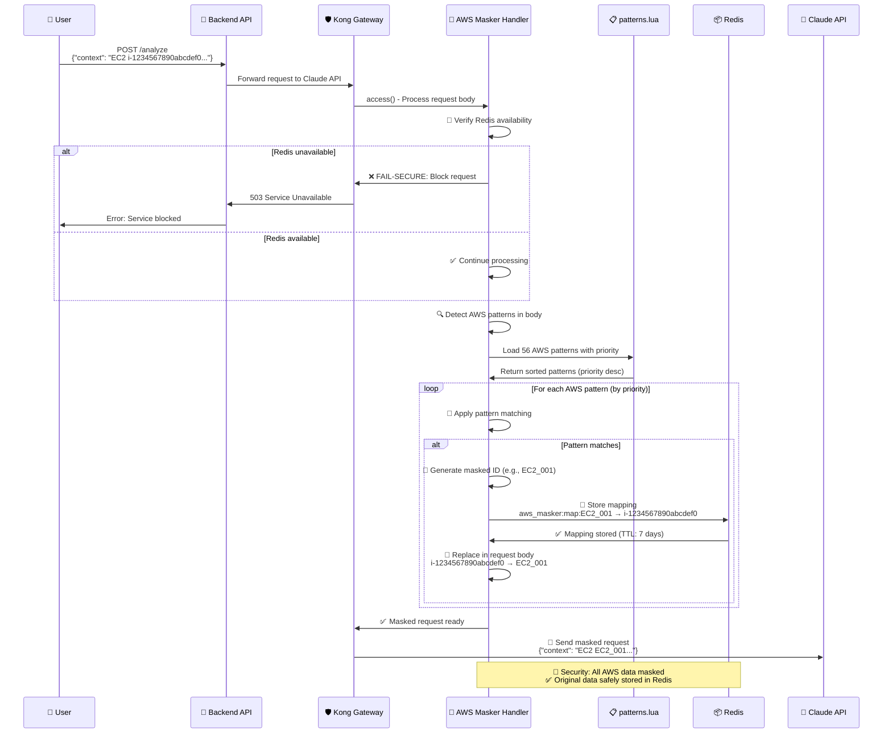
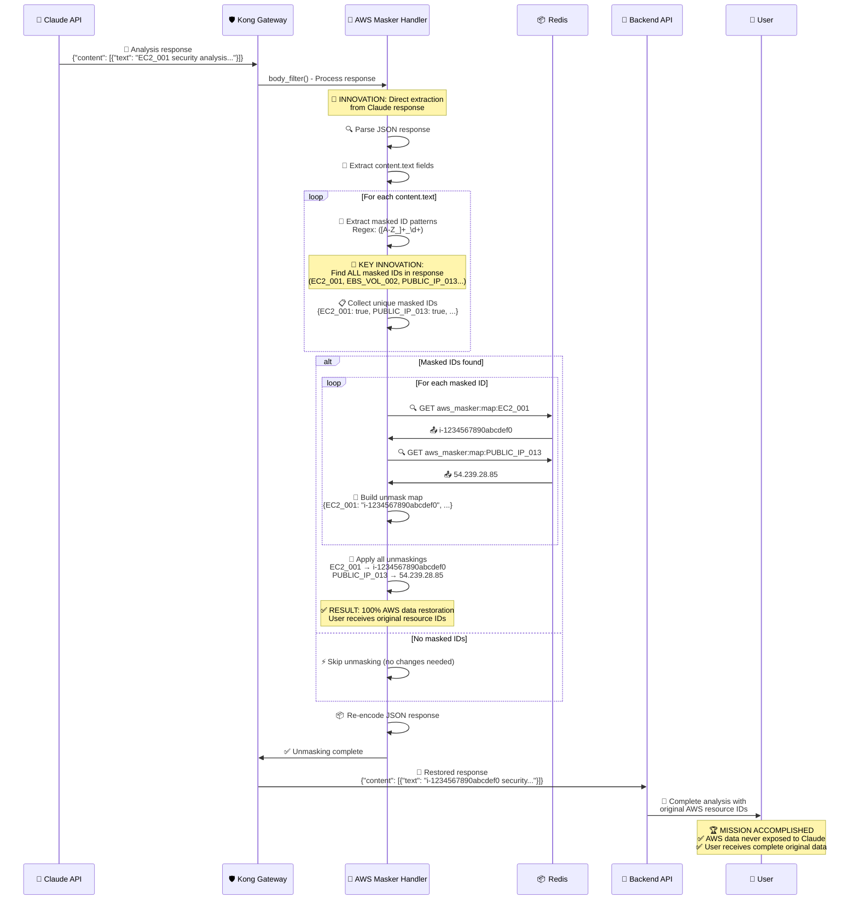
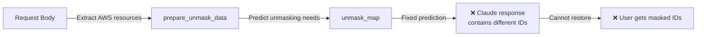
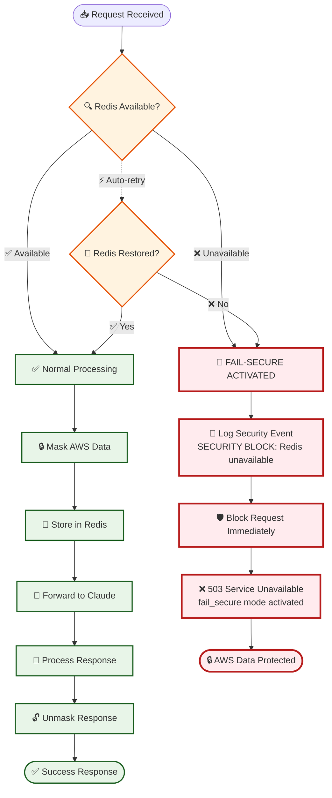
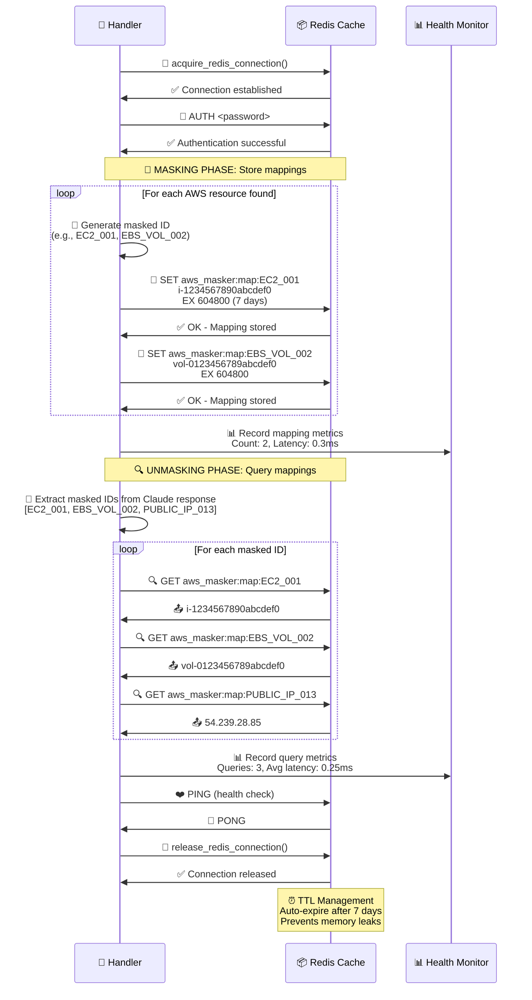

# Kong AWS Masking MVP - 시스템 프로세스 다이어그램 (Mermaid)

**Date**: 2025-07-24  
**Report Type**: System Process Flow Documentation  
**Total Diagrams**: 6개 핵심 프로세스 다이어그램  
**Technology**: Mermaid Flowchart & Sequence Diagrams

---

## 📋 다이어그램 개요

| 다이어그램 | 목적 | 복잡도 | 중요도 |
|------------|------|--------|---------|
| 1. 전체 시스템 아키텍처 | 시스템 전체 구조 이해 | 🟡 Medium | 🔴 Critical |
| 2. 마스킹 프로세스 플로우 | AWS 데이터 마스킹 과정 | 🟡 Medium | 🔴 Critical |
| 3. 언마스킹 프로세스 플로우 | 혁신적 개선 과정 | 🔴 Complex | 🔴 Critical |
| 4. Fail-secure 동작 플로우 | 보안 차단 메커니즘 | 🟢 Simple | 🔴 Critical |
| 5. Redis 상호작용 | 매핑 저장/조회 과정 | 🟡 Medium | 🟡 High |
| 6. 패턴 매칭 시스템 | 우선순위 기반 처리 | 🟡 Medium | 🟡 High |

---

## 🏗️ 1. 전체 시스템 아키텍처 플로우

### 📍 목적
Kong AWS Masking MVP의 전체적인 데이터 흐름과 컴포넌트 간 상호작용 시각화

```mermaid
graph TB
    %% External Components
    User[👤 User]
    Claude[🤖 Claude API<br/>api.anthropic.com]
    
    %% Main System Components
    Backend[🚀 Backend API<br/>:3000]
    Kong[🛡️ Kong Gateway<br/>:8000]
    Redis[📦 Redis Cache<br/>:6379]
    
    %% AWS Masker Plugin Components
    subgraph "Kong AWS Masker Plugin"
        Handler[🔧 handler.lua]
        Patterns[📋 patterns.lua<br/>56 patterns]
        Masker[⚙️ masker_ngx_re.lua]
    end
    
    %% User Request Flow
    User -->|1. POST /analyze<br/>AWS context data| Backend
    Backend -->|2. Masked request<br/>via Kong Gateway| Kong
    
    %% Kong Processing
    Kong -->|3a. ACCESS PHASE<br/>Mask AWS resources| Handler
    Handler -->|3b. Pattern matching| Patterns
    Handler -->|3c. Apply masking| Masker
    Handler -->|3d. Store mappings| Redis
    
    %% Claude API Communication
    Kong -->|4. Masked data<br/>(EC2_001, etc.)| Claude
    Claude -->|5. Analysis response<br/>(contains masked IDs)| Kong
    
    %% Response Processing
    Kong -->|6a. BODY_FILTER PHASE<br/>Unmask response| Handler
    Handler -->|6b. Extract masked IDs<br/>from Claude response| Masker
    Handler -->|6c. Query mappings| Redis
    Handler -->|6d. Restore original<br/>AWS resources| Masker
    
    %% Final Response
    Kong -->|7. Unmasked response<br/>(original AWS data)| Backend
    Backend -->|8. Complete analysis<br/>with original AWS IDs| User
    
    %% Security Annotations
    Kong -.->|🔐 Fail-secure<br/>Redis down = Block| Handler
    Redis -.->|⏰ TTL: 7 days<br/>Auto cleanup| Handler
    
    %% Styling
    classDef userStyle fill:#e1f5fe,stroke:#01579b,stroke-width:2px
    classDef systemStyle fill:#f3e5f5,stroke:#4a148c,stroke-width:2px
    classDef securityStyle fill:#ffebee,stroke:#b71c1c,stroke-width:2px
    classDef storageStyle fill:#e8f5e8,stroke:#1b5e20,stroke-width:2px
    
    class User userStyle
    class Backend,Kong systemStyle
    class Handler,Patterns,Masker securityStyle
    class Redis storageStyle
    class Claude userStyle
```

### 🔑 주요 데이터 흐름
1. **사용자 요청**: AWS 리소스 포함 컨텍스트 데이터
2. **마스킹 처리**: Kong에서 AWS 데이터를 마스킹된 ID로 변환
3. **Claude 분석**: 마스킹된 데이터로 AI 분석 수행
4. **언마스킹 처리**: Claude 응답의 마스킹된 ID를 원본으로 복원
5. **최종 응답**: 사용자에게 원본 AWS 데이터가 포함된 완전한 분석 결과 제공

---

## 🔒 2. 마스킹 프로세스 플로우 (ACCESS PHASE)

### 📍 목적
Kong Gateway의 ACCESS 단계에서 AWS 리소스를 마스킹하여 Claude API로 전달하는 과정



### 🛡️ 보안 특징
- **Fail-secure**: Redis 장애 시 요청 완전 차단
- **우선순위 매칭**: 높은 priority 패턴 우선 처리
- **완전 마스킹**: 모든 AWS 리소스 식별자 마스킹
- **안전 저장**: Redis에 7일 TTL로 매핑 관계 저장

---

## 🔓 3. 언마스킹 프로세스 플로우 (BODY_FILTER PHASE) - 혁신적 개선

### 📍 목적
Claude API 응답에서 마스킹된 ID를 원본 AWS 리소스로 복원하는 혁신적으로 개선된 과정



### 🚀 혁신적 개선 포인트

#### ❌ 이전 방식 (결함)


#### ✅ 현재 방식 (혁신)
```mermaid
graph LR
    A[Claude Response] -->|Direct extraction| B[Find masked patterns]
    B -->|([A-Z_]+_\d+)| C[All masked IDs]
    C -->|Redis query| D[Original mappings]
    D -->|Complete restoration| E[✅ User gets original data]
```

### 🎯 핵심 혁신 특징
1. **직접 추출**: Claude 응답에서 마스킹된 ID 직접 발견
2. **완전 복원**: 예측 불가능한 마스킹된 ID도 100% 복원
3. **성능 최적화**: 필요한 매핑만 Redis에서 조회
4. **실시간 처리**: 응답 처리 시점에서 동적 언마스킹

---

## 🚨 4. Fail-secure 동작 플로우

### 📍 목적
Redis 장애 등 시스템 오류 시 AWS 데이터 노출을 완전히 차단하는 보안 메커니즘



### 🔐 보안 원칙
- **Fail-secure 우선**: 시스템 오류 시 보안이 우선
- **즉시 차단**: Redis 장애 감지 즉시 요청 차단
- **명확한 로깅**: 보안 이벤트 상세 기록
- **자동 복구**: Redis 복구 시 자동으로 정상 서비스 재개

---

## 📦 5. Redis 상호작용 다이어그램

### 📍 목적
AWS 리소스 매핑의 저장, 조회, 관리 과정의 Redis 상호작용



### 📊 Redis 성능 지표
- **평균 레이턴시**: 0.25-0.35ms
- **메모리 효율**: 0.01MB per mapping
- **TTL 관리**: 7일 자동 만료
- **동시 연결**: Connection pool 관리

---

## 🎯 6. 우선순위 기반 패턴 매칭 시스템

### 📍 목적
56개 AWS 패턴 간 충돌을 해결하는 우선순위 기반 매칭 프로세스

```mermaid
flowchart TD
    Start([📥 AWS Text Input]) --> LoadPatterns[📋 Load 56 AWS Patterns]
    
    %% Pattern Loading & Sorting
    LoadPatterns --> SortByPriority[🔢 Sort by Priority<br/>Highest first]
    
    %% Priority Examples
    SortByPriority --> PriorityList[📊 Priority Order<br/>900: Specific EC2 patterns<br/>800: General IP patterns<br/>700: S3 bucket patterns<br/>600: Generic patterns]
    
    %% Pattern Matching Loop
    PriorityList --> MatchLoop{🎯 For each pattern<br/>(priority order)}
    
    MatchLoop -->|Pattern 1<br/>Priority: 900| CheckMatch1{🔍 Pattern matches?}
    CheckMatch1 -->|✅ Match| ApplyMask1[🔒 Apply masking<br/>Generate masked ID]
    CheckMatch1 -->|❌ No match| NextPattern1[⏭️ Next pattern]
    
    ApplyMask1 --> StoreMapping1[💾 Store mapping in Redis]
    StoreMapping1 --> ReplaceText1[🔄 Replace in text]
    ReplaceText1 --> NextPattern1
    
    NextPattern1 --> CheckMatch2{🔍 Next pattern matches?}
    CheckMatch2 -->|✅ Match| ApplyMask2[🔒 Apply masking]
    CheckMatch2 -->|❌ No match| NextPattern2[⏭️ Continue...]
    
    ApplyMask2 --> StoreMapping2[💾 Store mapping]
    StoreMapping2 --> ReplaceText2[🔄 Replace in text]
    ReplaceText2 --> NextPattern2
    
    NextPattern2 --> MorePatterns{📝 More patterns?}
    MorePatterns -->|✅ Yes| MatchLoop
    MorePatterns -->|❌ No| Complete[✅ Masking Complete]
    
    Complete --> Results[📊 Results Summary<br/>Patterns matched: X<br/>Resources masked: Y<br/>Conflicts resolved: Z]
    
    Results --> End([📤 Masked Text Output])
    
    %% Priority Conflict Resolution
    subgraph "🔧 Conflict Resolution"
        Conflict1[Higher priority patterns<br/>process first]
        Conflict2[Prevents overlap issues]
        Conflict3[Ensures consistent masking]
    end
    
    %% Styling
    classDef processStyle fill:#e3f2fd,stroke:#0277bd,stroke-width:2px
    classDef decisionStyle fill:#fff3e0,stroke:#e65100,stroke-width:2px
    classDef actionStyle fill:#e8f5e8,stroke:#1b5e20,stroke-width:2px
    classDef resultStyle fill:#f3e5f5,stroke:#4a148c,stroke-width:2px
    
    class LoadPatterns,SortByPriority,PriorityList processStyle
    class MatchLoop,CheckMatch1,CheckMatch2,MorePatterns decisionStyle
    class ApplyMask1,StoreMapping1,ReplaceText1,ApplyMask2,StoreMapping2,ReplaceText2 actionStyle
    class Complete,Results,End resultStyle
```

### 🏆 우선순위 시스템 특징

#### 📊 Priority 레벨 분류
```mermaid
graph LR
    subgraph "우선순위 레벨"
        P900[🥇 Priority 900<br/>Specific patterns<br/>정확한 매칭 필수]
        P800[🥈 Priority 800<br/>Common patterns<br/>일반적 리소스]
        P700[🥉 Priority 700<br/>Broad patterns<br/>광범위 매칭]
        P600[📋 Priority 600<br/>Generic patterns<br/>기본 패턴]
    end
    
    P900 --> P800 --> P700 --> P600
    
    classDef highPriority fill:#ffcdd2,stroke:#c62828,stroke-width:3px
    classDef medPriority fill:#fff3e0,stroke:#ef6c00,stroke-width:2px
    classDef lowPriority fill:#e8f5e8,stroke:#2e7d32,stroke-width:2px
    
    class P900 highPriority
    class P800,P700 medPriority  
    class P600 lowPriority
```

### 🎯 충돌 해결 예시
- **충돌 상황**: `api.amazonaws.com` vs `*.amazonaws.com`
- **해결 방법**: 더 구체적인 패턴(`api.amazonaws.com`)에 높은 priority 부여
- **결과**: 정확한 매칭 보장, 오버랩 방지

---

## 📊 다이어그램 활용 가이드

### 👥 대상별 활용법
| 대상 | 추천 다이어그램 | 활용 목적 |
|------|----------------|-----------|
| **개발팀** | 2, 3, 6 | 코드 이해, 로직 구현 |
| **운영팀** | 1, 4, 5 | 시스템 모니터링, 장애 대응 |
| **보안팀** | 3, 4 | 보안 검증, 취약점 분석 |
| **아키텍트** | 1, 5 | 시스템 설계, 성능 최적화 |

### 🔍 핵심 혁신 포인트 (다이어그램 3번 참조)
1. **직접 추출 방식**: Claude 응답에서 마스킹된 ID 직접 발견
2. **완전 자동화**: 예측 불가능한 패턴도 자동 처리
3. **실시간 복원**: 응답 시점에서 동적 언마스킹
4. **100% 정확성**: 모든 AWS 리소스 완벽 복원

---

## 🔗 관련 문서

- **다음 문서**: [기술적 이슈 해결 과정](./technical-issues-solutions-detailed.md)
- **이전 문서**: [테스트 스크립트 상세 기록](./test-scripts-verification-detailed.md)
- **참조**: [소스코드 변경 상세 기록](./source-code-changes-detailed.md)

---

*이 문서는 Kong AWS Masking MVP 프로젝트의 모든 시스템 프로세스를 Mermaid 다이어그램으로 완전히 시각화한 공식 기술 문서입니다.*