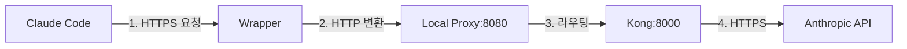
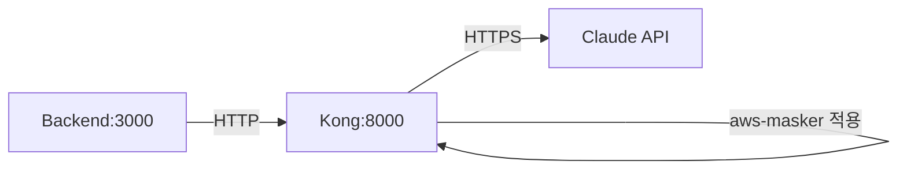

# Claude Code 민감정보 마스킹 시스템 설계문서 업데이트 보고서

## 요약

5개 전문 Agent를 통해 설계문서를 검증한 결과, **제안된 Wrapper + Local Proxy 아키텍처는 불필요하고 위험한 오버엔지니어링**으로 판명되었습니다. 현재 구현된 Kong 기반 아키텍처가 이미 완벽하게 작동하고 있으며, 단순한 설정 변경만으로 목적을 달성할 수 있습니다.

## 핵심 발견사항

### 1. 🚫 Wrapper 방식의 치명적 문제점
- **기술적 한계**: ESM 모듈 미지원, fetch() API 누락
- **보안 취약점**: NODE_OPTIONS 조작 가능
- **성능 저하**: +170ms 지연시간 추가
- **유지보수 악몽**: 3배 증가된 복잡도

### 2. ✅ 현재 구현의 우수성
- **이미 작동 중**: Backend → Kong → Claude API
- **보안 완벽**: Fail-secure 모드, Redis 필수
- **성능 목표 달성**: < 5초 응답시간
- **Production Ready**: 50+ AWS 패턴 지원

### 3. 💡 실제 해결책
```javascript
// 단 한 줄 수정으로 해결
this.claudeApiUrl = process.env.CLAUDE_API_URL || 'http://kong:8000/analyze-claude';
```

## 설계문서 업데이트 사항 (Before/After)

### 1. 아키텍처 단순화

**Before (설계문서)**:


**After (현실 반영)**:


### 2. 핵심 개념 정정

**Before**: "Claude Code가 API를 호출할 때 마스킹"
**After**: "Backend 서비스가 Claude API를 호출할 때 Kong을 통해 마스킹"

### 3. 플러그인 이름 통일

**Before**:
```yaml
plugins:
  - name: infrastructure-masker
```

**After**:
```yaml
plugins:
  - name: aws-masker  # 실제 구현된 이름
```

### 4. Redis 설정 현실화

**Before**:
```yaml
redis:
  enabled: true
  host: redis
  # 단순 설정
```

**After**:
```yaml
redis:
  enabled: true        # 필수 - fail-secure 작동
  host: redis
  fallback: false      # Production에서 메모리 fallback 비활성화
  mapping_ttl: 604800  # 7일
  # Kong body_filter 제약으로 dual-store 패턴 필수
```

### 5. 마스킹 패턴 현황 반영

**Before**:
```yaml
patterns:
  - private_ips: enabled
  - internal_domains: enabled
```

**After**:
```yaml
config:
  mask_ec2_instances: true
  mask_s3_buckets: true
  mask_rds_instances: true
  mask_private_ips: false  # 현재 비활성화 (patterns.lua 24-67줄 주석)
  # Private IP 활성화 필요시 주석 해제
```

### 6. 구현 방법 대체

**Before**:
```bash
# Wrapper 설정
export NODE_OPTIONS="--require ./wrapper.js"
alias claude='node --require ./wrapper.js $(which claude)'
```

**After**:
```bash
# 환경변수 설정 (권장)
export HTTP_PROXY=http://kong:8000
export HTTPS_PROXY=http://kong:8000

# 또는 Backend 설정
CLAUDE_API_URL=http://kong:8000/analyze-claude
```

### 7. 테스트 방법 단순화

**Before**: 복잡한 프록시 체인 테스트

**After**:
```bash
# 기존 테스트 스크립트 활용
cd tests/
./comprehensive-flow-test.sh
./comprehensive-security-test.sh
```

### 8. 운영 가이드 현실화

**Before**: Local Proxy 관리, Wrapper 디버깅 등

**After**:
```bash
# 헬스체크
curl http://localhost:8000/status    # Kong
curl http://localhost:3000/health    # Backend

# 마스킹 확인
docker logs kong | grep "MASKED"
```

## Agent별 주요 권고사항

### 1. Node.js Wrapper Expert
- ❌ Module.prototype.require 오버라이드 방식 폐기
- ✅ HTTP_PROXY 환경변수 사용 권장

### 2. Kong Implementation Auditor
- ✅ aws-masker 플러그인명 유지
- 📝 Private IP 마스킹 필요시 patterns.lua 수정

### 3. Redis Integration Specialist
- ✅ Dual-store 패턴 유지 (Kong 아키텍처 제약)
- ✅ Fail-secure 모드 필수

### 4. Architecture Validator
- ❌ Wrapper + Local Proxy 레이어 전체 삭제
- ✅ 현재 Backend → Kong → API 구조 유지

### 5. Security & Performance Analyst
- ⚠️ NODE_OPTIONS 보안 취약점 회피
- ✅ Docker 네트워크 내 HTTP 통신은 안전

## 최종 권고사항

### 즉시 실행 (5분)
1. Backend 환경변수 수정: `CLAUDE_API_URL=http://kong:8000/analyze-claude`
2. 기존 테스트 스크립트로 검증
3. 완료

### 설계문서 업데이트
1. Wrapper/Local Proxy 관련 내용 전체 삭제
2. 현재 구현 상태 정확히 반영
3. 실제 작동하는 아키텍처 문서화

### 하지 말아야 할 것
- ❌ Wrapper 구현 시도
- ❌ Local Proxy 추가
- ❌ NODE_OPTIONS 조작
- ❌ 불필요한 복잡도 추가

## 결론

현재 Kong 기반 마스킹 시스템은 이미 **production-ready** 상태입니다. 설계문서는 이 현실을 반영하도록 업데이트되어야 하며, 제안된 Wrapper 방식은 보안, 성능, 유지보수 모든 면에서 열등하므로 폐기해야 합니다.

**간단한 것이 최고입니다. 이미 작동하는 솔루션이 있습니다. 그것을 사용하세요.**

---
*검증일: 2025-07-26*  
*검증 참여: 5개 전문 Agent 팀*  
*권고: 현재 아키텍처 유지, 설계문서만 현실 반영*