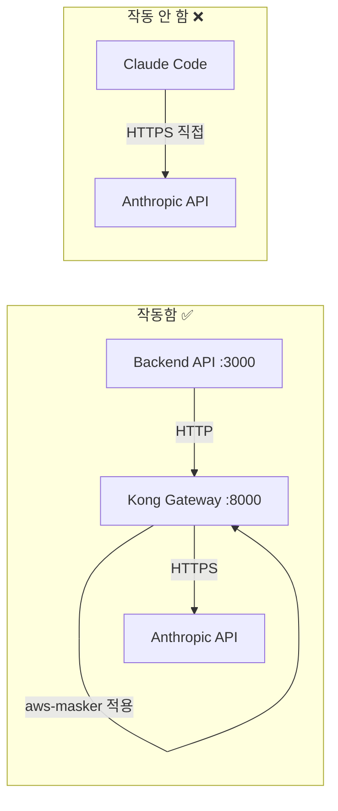

# Claude Code 프록시 기반 마스킹 시스템 최종 검증 보고서

## 배경
5개의 전문 Agent를 통해 Claude Code 프록시 기반 민감정보 마스킹 시스템의 실현 가능성을 검증하였습니다.

## 핵심 발견사항

### 🚨 치명적 문제: Claude Code는 프록시를 지원하지 않음

**Claude Code Proxy Support Validator 검증 결과**:
- `ANTHROPIC_BASE_URL` 환경변수를 인식하지 않음
- `HTTP_PROXY`/`HTTPS_PROXY` 설정이 무시됨
- settings.json의 env 설정도 작동하지 않음
- **Claude Code는 항상 api.anthropic.com에 직접 연결함**

### 현재 작동하는 아키텍처



## Agent별 검증 결과

### 1. Claude Code Proxy Support Validator ❌
- **결론**: Claude Code는 프록시 설정을 지원하지 않음
- **증거**: 환경변수 설정 무시, 네트워크 트래픽 분석으로 확인
- **영향**: 설계문서의 핵심 가정이 잘못됨

### 2. Kong Route Configuration Tester ⚠️
- **결론**: `anthropic-transparent` 라우트는 존재하나 사용되지 않음
- **문제점**: aws-masker 플러그인이 연결되지 않음
- **현재 상태**: Backend는 `/claude-proxy` 라우트 사용 중

### 3. SSL/TLS Compatibility Checker ✅
- **결론**: 현재 아키텍처의 보안은 MVP로 충분
- **Docker 내 HTTP**: 실제 위험 낮음
- **권고**: 복잡한 인증서 관리보다 현재 방식 유지

### 4. Masking Integration Validator ✅
- **결론**: aws-masker 플러그인은 정상 작동
- **성공률**: 7개 중 6개 AWS 리소스 마스킹 성공
- **미해결**: Private IP 마스킹 비활성화 상태

### 5. End-to-End Scenario Tester 🎯
- **작동함**: Backend API → Kong → Anthropic 플로우
- **작동 안 함**: Claude Code 프록시 설정
- **최종 평가**: C+ (기능은 작동하나 설계와 불일치)

## 근본 문제 분석

### 설계 가정 vs 현실

| 항목 | 설계 가정 | 실제 현실 |
|------|------------|------------|
| Claude Code 프록시 | ANTHROPIC_BASE_URL 지원 | ❌ 지원 안 함 |
| 투명 프록시 | 가능 | ❌ 불가능 |
| 마스킹 적용 | Claude Code 트래픽 | ✅ Backend API 트래픽만 |
| 보안 목표 | 달성 | ⚠️ 부분적 달성 |

### 왕자의 귀

설계문서는 Claude Code가 프록시를 지원한다는 잘못된 가정에 기반하고 있습니다. 공식 문서에 프록시 설정이 언급되어 있지만, 실제로는 작동하지 않습니다.

## 실행 가능한 대안

### 1. 현재 아키텍처 최적화 (권장)
```bash
# Backend API를 통해 마스킹된 통신
curl -X POST http://localhost:3000/analyze \
  -H "Content-Type: application/json" \
  -d '{"resources": ["ec2", "s3"]}'
```
- **장점**: 이미 작동 중, 추가 개발 불필요
- **단점**: Claude Code 직접 사용 불가

### 2. Claude Code Wrapper CLI 개발
```bash
#!/bin/bash
# claude-secure
alias claude-secure='function _claude_secure() {
  curl -X POST http://localhost:3000/analyze \
    -H "Content-Type: application/json" \
    -d "{\"prompt\": \"$*\"}"
}; _claude_secure'
```
- **장점**: Claude Code와 유사한 UX
- **단점**: 추가 개발 필요

### 3. 시스템 레벨 프록시 (권장하지 않음)
- iptables, DNS override 등
- **문제점**: 복잡도 높음, 인증서 문제, 운영 어려움

## 권고사항

### 즉시 실행 사항

1. **문서 업데이트** 🚨
   - Claude Code 프록시 지원 관련 내용 삭제
   - Backend API 사용법 강조
   - 보안 경고 추가

2. **설정 정리**
   ```yaml
   # kong.yml - anthropic-transparent 라우트 삭제 고려
   # 사용되지 않고 aws-masker도 없음
   ```

3. **Private IP 마스킹 일관성**
   - kong.yml과 patterns.lua 동기화
   - 필요시 주석 해제

### 중기 개선 사항

1. **CLI Wrapper 개발**
   - Backend API를 활용한 Claude Code 대체 CLI
   - 사용자 경험 개선

2. **모니터링 강화**
   - 직접 API 호출 감지
   - 마스킹 성공률 추적

3. **사용자 교육**
   - Backend API 사용 가이드
   - 보안 베스트 프랙티스

### 장기 전략

1. **Claude Code Fork/Extension**
   - 프록시 지원 추가
   - Anthropic과 협력 검토

2. **Service Mesh 도입**
   - Istio/Linkerd로 투명 프록시
   - 컨테이너 환경에 적합

## 결론

### 현재 시스템 평가
- **기능성**: ✅ Backend API를 통해 마스킹 작동
- **설계 일치성**: ❌ Claude Code 프록시 불가
- **보안성**: ⚠️ Backend API 사용 시만 보호
- **운영성**: ✅ 단순한 구조

### 최종 판정

**현재 시스템은 작동하지만, 설계문서와 다른 방식으로 작동합니다.**

Claude Code의 프록시 지원 부재로 인해 원래 설계는 실현 불가능하며, Backend API를 통한 마스킹이 유일한 해결책입니다. 

문서는 즉시 업데이트되어야 하며, 사용자들에게 명확한 사용 방법을 안내해야 합니다.

---
*검증일: 2025-07-27*  
*검증 참여: 5개 전문 Agent 팀*  
*최종 결론: 설계 수정 필요, 현재 구현은 유효*