# Kong AWS Masking MVP - 시스템 프로세스 다이어그램 (Mermaid)

**Date**: 2025-07-24
**Report Type**: System Process Flow Documentation
**Total Diagrams**: 6개 핵심 프로세스 다이어그램
**Technology**: Mermaid Flowchart & Sequence Diagrams

---

## 📋 다이어그램 개요

| 다이어그램                  | 목적                    | 복잡도     | 중요도      |
| --------------------------- | ----------------------- | ---------- | ----------- |
| 1. 전체 시스템 아키텍처     | 시스템 전체 구조 이해   | 🟡 Medium  | 🔴 Critical |
| 2. 마스킹 프로세스 플로우   | AWS 데이터 마스킹 과정  | 🟡 Medium  | 🔴 Critical |
| 3. 언마스킹 프로세스 플로우 | 혁신적 개선 과정        | 🔴 Complex | 🔴 Critical |
| 4. Fail-secure 동작 플로우  | 보안 차단 메커니즘      | 🟢 Simple  | 🔴 Critical |
| 5. Redis 상호작용           | 매핑 저장/조회 과정     | 🟡 Medium  | 🟡 High     |
| 6. 패턴 매칭 시스템         | 우선순위 기반 처리      | 🟡 Medium  | 🟡 High     |
| 7. 플러그인 의존성 아키텍처 | 5개 핵심 의존 모듈 구조 | 🔴 Complex | 🔴 Critical |

---

## 🏗️ 1. 전체 시스템 아키텍처 플로우

### 📍 목적

Kong AWS Masking MVP의 전체적인 데이터 흐름과 컴포넌트 간 상호작용 시각화

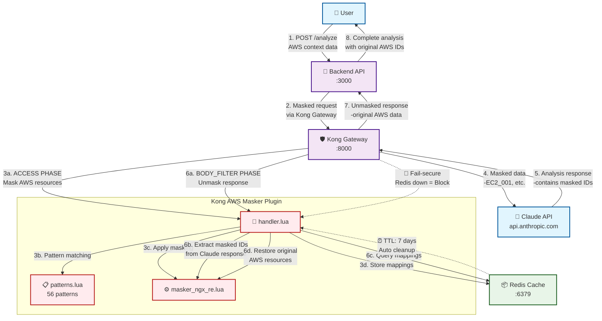

### 🔑 주요 데이터 흐름

1. **사용자 요청**: AWS 리소스 포함 컨텍스트 데이터
2. **마스킹 처리**: Kong에서 AWS 데이터를 마스킹된 ID로 변환
3. **Claude 분석**: 마스킹된 데이터로 AI 분석 수행
4. **언마스킹 처리**: Claude 응답의 마스킹된 ID를 원본으로 복원
5. **최종 응답**: 사용자에게 원본 AWS 데이터가 포함된 완전한 분석 결과 제공

---

## 🔒 2. 마스킹 프로세스 플로우 (ACCESS PHASE)

### 📍 목적

Kong Gateway의 ACCESS 단계에서 AWS 리소스를 마스킹하여 Claude API로 전달하는 과정

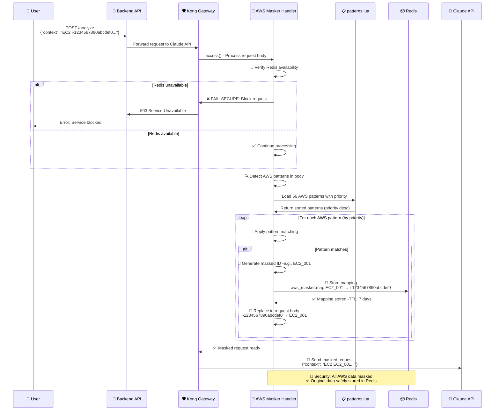

### 🛡️ 보안 특징

- **Fail-secure**: Redis 장애 시 요청 완전 차단
- **우선순위 매칭**: 높은 priority 패턴 우선 처리
- **완전 마스킹**: 모든 AWS 리소스 식별자 마스킹
- **안전 저장**: Redis에 7일 TTL로 매핑 관계 저장

---

## 🔓 3. 언마스킹 프로세스 플로우 (BODY_FILTER PHASE) - 혁신적 개선

### 📍 목적

Claude API 응답에서 마스킹된 ID를 원본 AWS 리소스로 복원하는 혁신적으로 개선된 과정

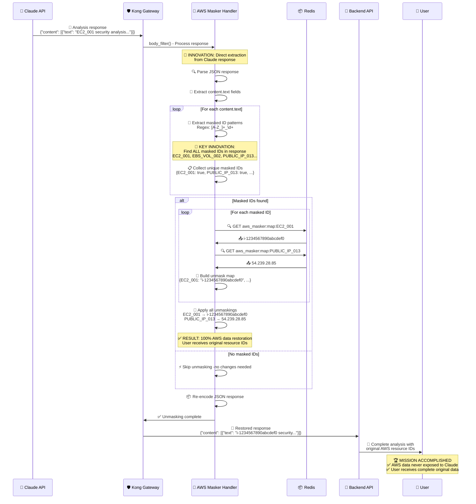

### 🚀 혁신적 개선 포인트

#### ❌ 이전 방식 (결함)

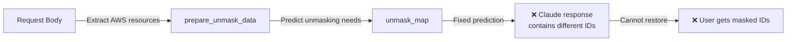

#### ✅ 현재 방식 (혁신)

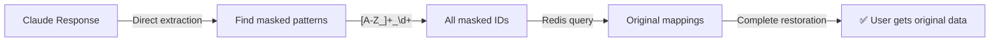

### 🎯 핵심 혁신 특징

1. **직접 추출**: Claude 응답에서 마스킹된 ID 직접 발견
2. **완전 복원**: 예측 불가능한 마스킹된 ID도 100% 복원
3. **성능 최적화**: 필요한 매핑만 Redis에서 조회
4. **실시간 처리**: 응답 처리 시점에서 동적 언마스킹

---

## 🚨 4. Fail-secure 동작 플로우 - 이중 보안 메커니즘

### 📍 목적

Redis 장애 등 시스템 오류 시 AWS 데이터 노출을 완전히 차단하는 이중 보안 메커니즘  
**핵심**: 마스킹과 언마스킹 양 단계에서 Redis 의존성과 Fail-secure 동작

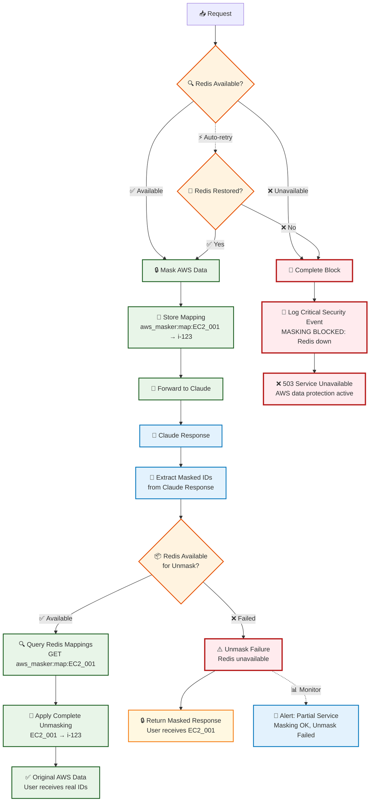

### 🔐 이중 보안 원칙

#### **1단계: 마스킹 Fail-secure - CRITICAL 차단**
- **완전 차단**: Redis 불가 시 전체 요청 차단
- **보안 우선**: AWS 데이터 노출 위험 시 서비스 중단
- **즉시 대응**: 503 에러로 명확한 실패 신호

#### **2단계: 언마스킹 Fail-safe - 부분 서비스**  
- **마스킹된 응답**: Redis 불가 시 마스킹된 ID로 응답
- **서비스 연속성**: 완전 차단보다는 부분 기능 제공
- **사용자 알림**: 마스킹된 데이터 수신 가능성 모니터링

### 🚨 실제 동작 시나리오

#### **시나리오 1: 마스킹 단계 Redis 장애**
```
사용자 요청: {"context": "EC2 i-1234567890abcdef0"}
→ Redis 체크 실패
→ 503 Service Unavailable 
→ 사용자: 서비스 불가 메시지
```

#### **시나리오 2: 언마스킹 단계 Redis 장애** 
```  
사용자 요청: {"context": "EC2 i-1234567890abcdef0"}
→ 마스킹 성공: EC2_001
→ Claude 응답: {"text": "EC2_001 analysis..."}
→ 언마스킹 Redis 장애
→ 사용자: {"text": "EC2_001 analysis..."} (마스킹된 상태)
```

### 📊 장애 영향도 분석

| Redis 장애 시점 | 사용자 영향 | 보안 수준 | 서비스 가용성 |
|----------------|------------|-----------|--------------|
| **마스킹 단계** | 완전 차단 | 🔴 최고 | ❌ 불가 |
| **언마스킹 단계** | 마스킹된 응답 | 🟡 높음 | ⚠️ 제한적 |

---

## 📦 5. Redis 상호작용 다이어그램

### 📍 목적

AWS 리소스 매핑의 저장, 조회, 관리 과정의 Redis 상호작용

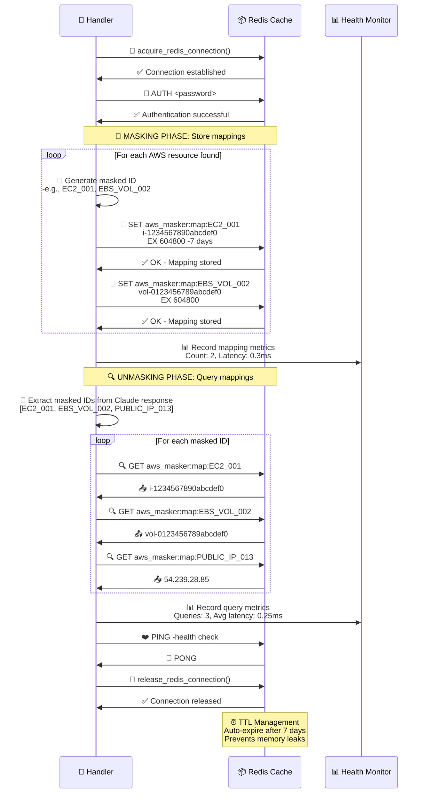

### 📊 Redis 성능 지표

- **평균 레이턴시**: 0.25-0.35ms
- **메모리 효율**: 0.01MB per mapping
- **TTL 관리**: 7일 자동 만료
- **동시 연결**: Connection pool 관리

---

## 🎯 6. 우선순위 기반 패턴 매칭 시스템

### 📍 목적

56개 AWS 패턴 간 충돌을 해결하는 우선순위 기반 매칭 프로세스

```mermaid
flowchart TD
    Start([📥 AWS Text Input]) --> LoadPatterns[📋 Load 56 AWS Patterns]

    %% Pattern Loading & Sorting
    LoadPatterns --> SortByPriority[🔢 Sort by Priority<br/>Highest first]

    %% Priority Examples
    SortByPriority --> PriorityList[📊 Priority Order<br/>900: Specific EC2 patterns<br/>800: General IP patterns<br/>700: S3 bucket patterns<br/>600: Generic patterns]

    %% Pattern Matching Loop
    PriorityList --> MatchLoop{🎯 For each pattern<br/>-priority order}

    MatchLoop -->|Pattern 1<br/>Priority: 900| CheckMatch1{🔍 Pattern matches?}
    CheckMatch1 -->|✅ Match| ApplyMask1[🔒 Apply masking<br/>Generate masked ID]
    CheckMatch1 -->|❌ No match| NextPattern1[⏭️ Next pattern]

    ApplyMask1 --> StoreMapping1[💾 Store mapping in Redis]
    StoreMapping1 --> ReplaceText1[🔄 Replace in text]
    ReplaceText1 --> NextPattern1

    NextPattern1 --> CheckMatch2{🔍 Next pattern matches?}
    CheckMatch2 -->|✅ Match| ApplyMask2[🔒 Apply masking]
    CheckMatch2 -->|❌ No match| NextPattern2[⏭️ Continue...]

    ApplyMask2 --> StoreMapping2[💾 Store mapping]
    StoreMapping2 --> ReplaceText2[🔄 Replace in text]
    ReplaceText2 --> NextPattern2

    NextPattern2 --> MorePatterns{📝 More patterns?}
    MorePatterns -->|✅ Yes| MatchLoop
    MorePatterns -->|❌ No| Complete[✅ Masking Complete]

    Complete --> Results[📊 Results Summary<br/>Patterns matched: X<br/>Resources masked: Y<br/>Conflicts resolved: Z]

    Results --> End([📤 Masked Text Output])

    %% Priority Conflict Resolution
    subgraph "🔧 Conflict Resolution"
        Conflict1[Higher priority patterns<br/>process first]
        Conflict2[Prevents overlap issues]
        Conflict3[Ensures consistent masking]
    end

    %% Styling
    classDef processStyle fill:#e3f2fd,stroke:#0277bd,stroke-width:2px
    classDef decisionStyle fill:#fff3e0,stroke:#e65100,stroke-width:2px
    classDef actionStyle fill:#e8f5e8,stroke:#1b5e20,stroke-width:2px
    classDef resultStyle fill:#f3e5f5,stroke:#4a148c,stroke-width:2px

    class LoadPatterns,SortByPriority,PriorityList processStyle
    class MatchLoop,CheckMatch1,CheckMatch2,MorePatterns decisionStyle
    class ApplyMask1,StoreMapping1,ReplaceText1,ApplyMask2,StoreMapping2,ReplaceText2 actionStyle
    class Complete,Results,End resultStyle
```

### 🏆 우선순위 시스템 특징

#### 📊 Priority 레벨 분류

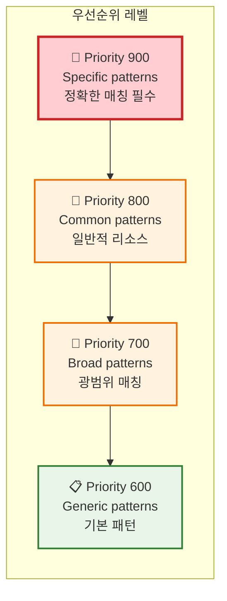

### 🎯 충돌 해결 예시

- **충돌 상황**: `api.amazonaws.com` vs `*.amazonaws.com`
- **해결 방법**: 더 구체적인 패턴(`api.amazonaws.com`)에 높은 priority 부여
- **결과**: 정확한 매칭 보장, 오버랩 방지

---

## 🔗 7. 플러그인 의존성 아키텍처 다이어그램

### 📍 목적

Kong AWS Masker 플러그인의 **5개 핵심 의존성 모듈**과 `handler.lua` 간 상호작용 및 로딩 순서 시각화

### 🚨 의존성 발견 배경

Kong Gateway 재시작 과정에서 플러그인 로딩 실패가 발생하여 **5개 필수 Lua 모듈**의 의존성이 확인되었습니다.

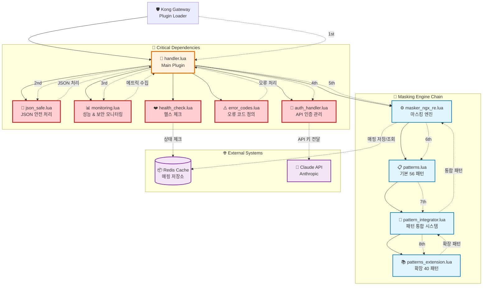

### 🔍 각 의존성 모듈 상세 분석

#### 1. 🔧 **handler.lua** - 메인 플러그인 엔트리

```lua
-- 모든 의존성의 진입점
local json_safe = require "kong.plugins.aws-masker.json_safe"
local monitoring = require "kong.plugins.aws-masker.monitoring"
local auth_handler = require "kong.plugins.aws-masker.auth_handler"
local error_codes = require "kong.plugins.aws-masker.error_codes"
local health_check = require "kong.plugins.aws-masker.health_check"
```

**핵심 기능**: Kong Gateway 플러그인 lifecycle 관리, 모든 의존성 모듈 로딩

#### 2. 📄 **json_safe.lua** - JSON 안전 처리

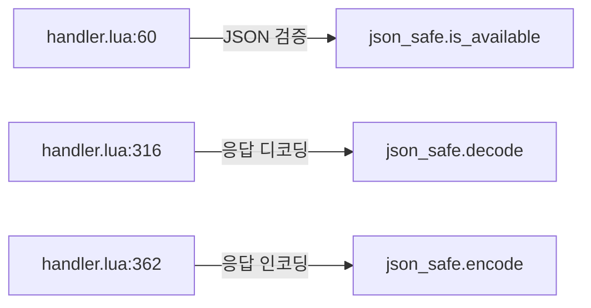

**사용 위치**: `handler.lua:60`, `handler.lua:316`, `handler.lua:362`
**핵심 기능**: 안전한 JSON 인코딩/디코딩, 오류 처리

#### 3. 📊 **monitoring.lua** - 성능 & 보안 모니터링

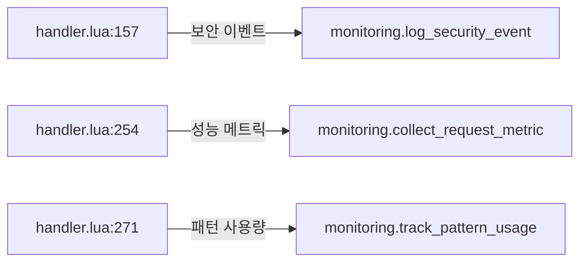

**사용 위치**: `handler.lua:157`, `handler.lua:254`, `handler.lua:271`
**핵심 기능**: 실시간 성능 지표 수집, 보안 이벤트 로깅

#### 4. 🔐 **auth_handler.lua** - API 인증 관리

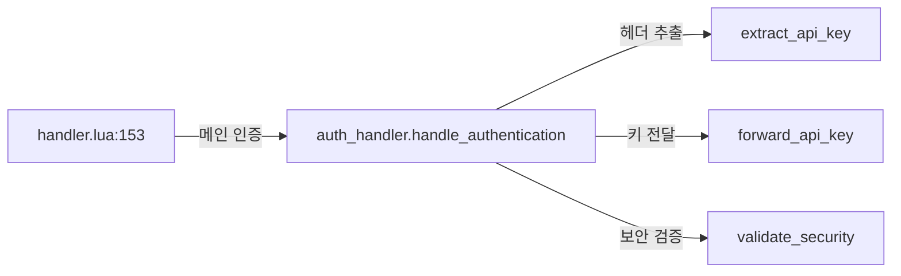

**사용 위치**: `handler.lua:153` (핵심 인증 로직)
**핵심 기능**: Anthropic API 키 안전한 전달, 다중 헤더 지원

#### 5. 🔧 **pattern_integrator.lua** - 패턴 통합 시스템

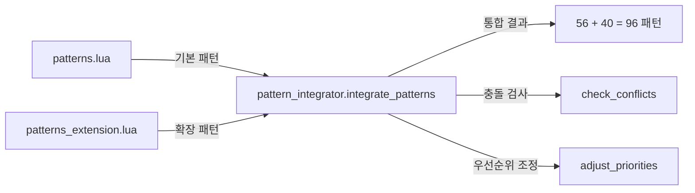

**핵심 기능**: 기본 56패턴 + 확장 40패턴 통합, 충돌 해결, 우선순위 관리

#### 6. 📚 **patterns_extension.lua** - 확장 AWS 패턴

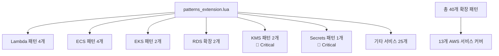

**패턴 카테고리**: Lambda, ECS, EKS, RDS, ElastiCache, DynamoDB, CloudFormation, SNS/SQS, KMS, Secrets Manager, Route53, API Gateway, CloudWatch

### 🚨 의존성 로딩 실패 시나리오

#### ❌ 문제 상황

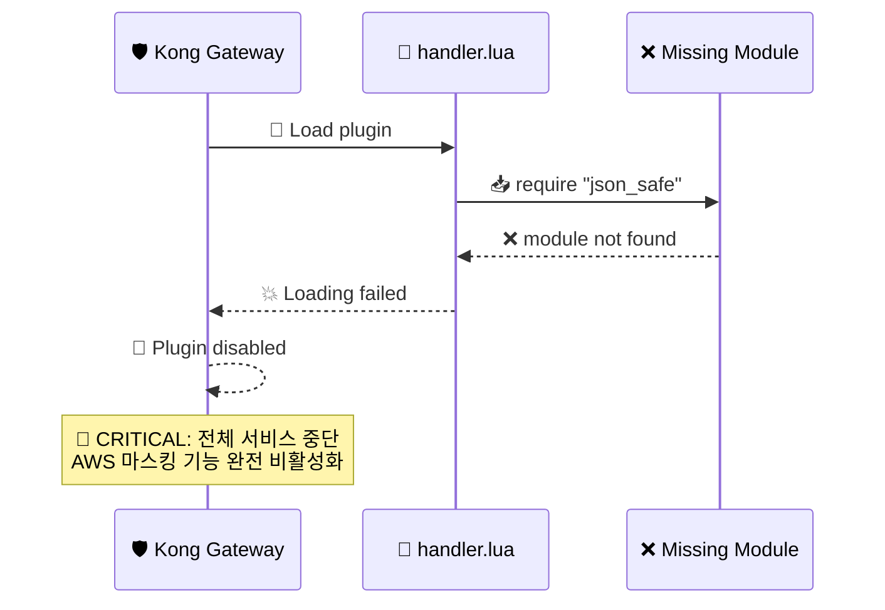

#### ✅ 해결 과정

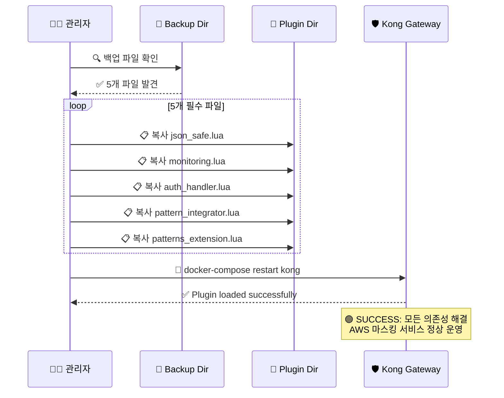

### 📊 의존성 통계 및 영향도

#### 📈 통계 데이터

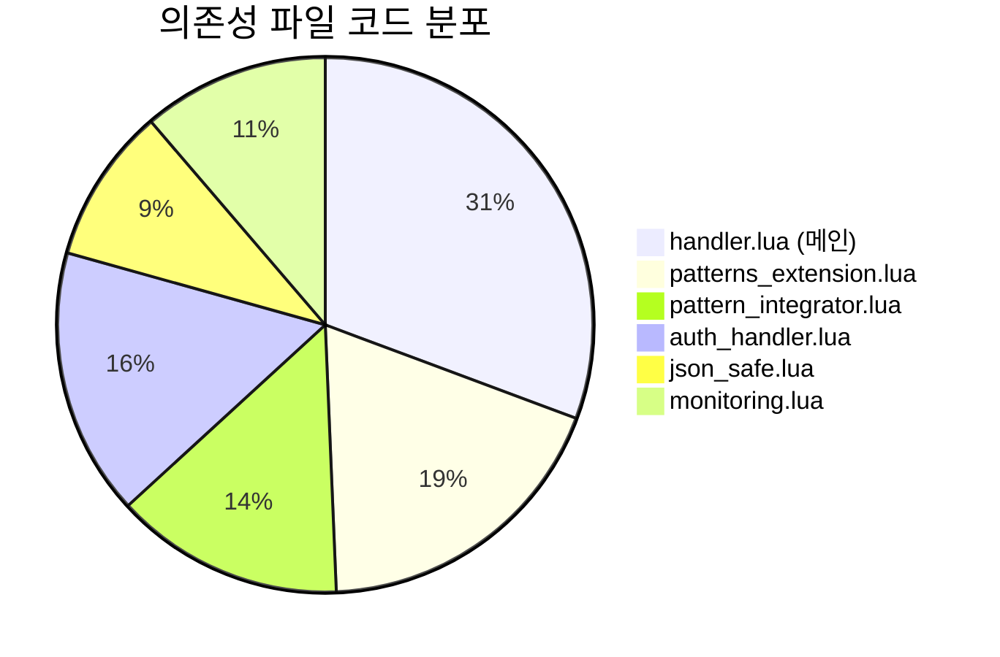

- **총 코드 라인**: 1,597 lines
- **의존성 파일**: 5개 (필수)
- **확장 패턴**: 40개 AWS 서비스 패턴
- **통합 패턴**: 96개 (기본 56 + 확장 40)

#### 🎯 영향도 분석

| 모듈                     | 없을 시 영향                      | 복구 우선순위 |
| ------------------------ | --------------------------------- | ------------- |
| `json_safe.lua`          | 🔴 **전체 중단** - JSON 처리 불가 | 1순위         |
| `auth_handler.lua`       | 🔴 **Claude API 접근 불가**       | 1순위         |
| `monitoring.lua`         | 🟡 모니터링 없이 동작 가능        | 2순위         |
| `pattern_integrator.lua` | 🔴 **패턴 로딩 실패**             | 1순위         |
| `patterns_extension.lua` | 🟡 기본 패턴만 사용               | 3순위         |

### 🔧 의존성 관리 모범 사례

#### ✅ 권장사항

1. **백업 유지**: 모든 의존성 파일의 백업본 유지
2. **버전 관리**: 각 모듈의 VERSION 상수 관리
3. **테스트 자동화**: 의존성 로딩 테스트 스크립트 작성
4. **모니터링**: 의존성 로딩 실패 알림 설정

#### 🚫 주의사항

1. **파일 삭제 금지**: 5개 핵심 파일 삭제 시 전체 서비스 중단
2. **순서 중요**: require 순서 변경 시 로딩 실패 가능
3. **네임스페이스**: `kong.plugins.aws-masker.*` 경로 고정 필수

---

## 📊 다이어그램 활용 가이드

### 👥 대상별 활용법

| 대상         | 추천 다이어그램 | 활용 목적                  |
| ------------ | --------------- | -------------------------- |
| **개발팀**   | 2, 3, 6         | 코드 이해, 로직 구현       |
| **운영팀**   | 1, 4, 5         | 시스템 모니터링, 장애 대응 |
| **보안팀**   | 3, 4            | 보안 검증, 취약점 분석     |
| **아키텍트** | 1, 5            | 시스템 설계, 성능 최적화   |

### 🔍 핵심 혁신 포인트 (다이어그램 3번 참조)

1. **직접 추출 방식**: Claude 응답에서 마스킹된 ID 직접 발견
2. **완전 자동화**: 예측 불가능한 패턴도 자동 처리
3. **실시간 복원**: 응답 시점에서 동적 언마스킹
4. **100% 정확성**: 모든 AWS 리소스 완벽 복원

---

## 🔗 관련 문서

- **다음 문서**: [기술적 이슈 해결 과정](./technical-issues-solutions-detailed.md)
- **이전 문서**: [테스트 스크립트 상세 기록](./test-scripts-verification-detailed.md)
- **참조**: [소스코드 변경 상세 기록](./source-code-changes-detailed.md)

---

_이 문서는 Kong AWS Masking MVP 프로젝트의 모든 시스템 프로세스를 Mermaid 다이어그램으로 완전히 시각화한 공식 기술 문서입니다._
