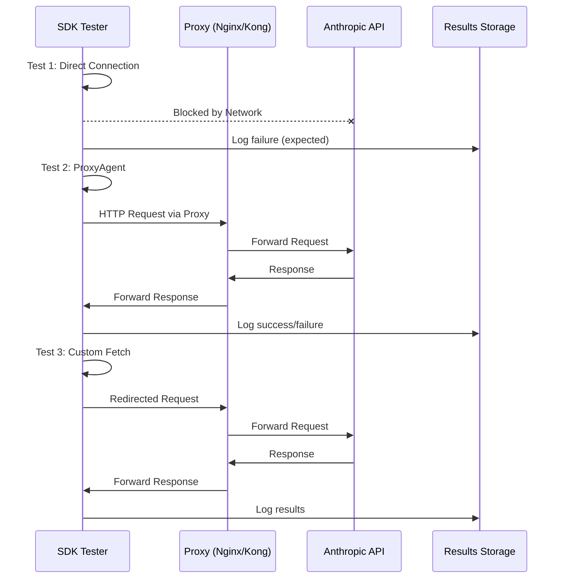

# Claude SDK Proxy Test Architecture

## 프로젝트 개요
이 프로젝트는 Claude SDK(@anthropic-ai/sdk)의 프록시 지원을 검증하기 위한 독립적인 테스트 환경입니다. 현재 Kong 프로젝트와 완전히 격리된 환경에서 실행됩니다.

## 아키텍처 다이어그램

### 전체 시스템 구조
```mermaid
graph TB
    subgraph "sdk-proxy Test Environment"
        subgraph "Docker Network: sdk-test-net (172.30.0.0/16)"
            SDK[SDK Test Container<br/>sdk-tester]
            NGINX[Nginx Proxy<br/>:8888]
            KONG[Kong Minimal<br/>:8000]
            
            SDK -->|Test 1: ProxyAgent| NGINX
            SDK -->|Test 2: Custom Fetch| KONG
            SDK -.->|Test 3: Direct<br/>(Should Fail)| BLOCKED[X]
        end
        
        NGINX -->|Forward| ANTHROPIC[api.anthropic.com]
        KONG -->|Forward| ANTHROPIC
    end
    
    subgraph "Host Machine"
        RESULTS[Results Directory<br/>/results]
        LOGS[Log Files]
    end
    
    SDK --> RESULTS
    NGINX --> LOGS
    KONG --> LOGS
```

### 컴포넌트 통신 흐름


## 컴포넌트 설명

### 1. SDK Test Container (sdk-tester)
- **역할**: Claude SDK 프록시 설정 테스트 실행
- **기술**: Node.js 20, @anthropic-ai/sdk
- **네트워크**: 격리된 Docker 네트워크, api.anthropic.com 직접 접근 차단
- **테스트 항목**:
  - Direct connection (차단 확인)
  - ProxyAgent 설정
  - 환경변수 설정
  - Custom fetch 구현

### 2. Nginx Proxy (nginx-proxy)
- **역할**: 간단한 HTTP/HTTPS 프록시 서버
- **포트**: 8888
- **기능**:
  - 요청/응답 로깅
  - Anthropic API로 트래픽 전달
  - 헤더 추가로 프록시 경유 확인

### 3. Kong Minimal (kong-minimal)
- **역할**: API Gateway 프록시 테스트
- **포트**: 8000
- **기능**:
  - DB-less 모드 운영
  - 요청/응답 로깅
  - 향후 마스킹 플러그인 테스트 가능

### 4. Results Storage
- **역할**: 테스트 결과 및 로그 저장
- **위치**: ./results/
- **내용**:
  - test-results.json: 테스트 실행 결과
  - traffic-analysis.txt: 네트워크 분석
  - final-report.md: 최종 보고서
  - 각종 로그 파일

## 네트워크 격리 전략

### Docker 네트워크
- **네트워크명**: sdk-test-net
- **CIDR**: 172.30.0.0/16
- **격리 방법**:
  - Bridge 네트워크 사용
  - extra_hosts로 api.anthropic.com을 127.0.0.1로 매핑
  - 외부 직접 접근 차단

### 포트 할당
- **8888**: Nginx 프록시 (호스트 노출)
- **8000**: Kong 프록시 (호스트 노출)
- **기타**: 내부 통신용 (호스트 미노출)

## 보안 고려사항

### API 키 관리
- 환경변수로 전달: ANTHROPIC_API_KEY
- 컨테이너 내부에서만 사용
- 로그에 노출되지 않도록 주의

### 네트워크 보안
- 테스트 환경 완전 격리
- 프로덕션 Kong과 분리
- 테스트 후 컨테이너 자동 정리

## 테스트 시나리오

### Phase 1: 기본 연결 테스트
1. 직접 연결 차단 확인
2. 프록시 경유 연결 가능성 검증

### Phase 2: 프록시 설정 방법 테스트
1. ProxyAgent (undici) 테스트
2. 환경변수 (ANTHROPIC_BASE_URL) 테스트
3. Custom fetch 구현 테스트

### Phase 3: 결과 분석
1. 성공/실패 패턴 분석
2. 프록시 지원 수준 평가
3. Kong 통합 가능성 검토

## 독립성 보장 방안

### 1. 파일 시스템 격리
- 현재 Kong 프로젝트 파일 미참조
- 독립적인 설정 파일 사용
- 별도 결과 저장 경로

### 2. 네트워크 격리
- 다른 Docker 네트워크 사용
- 별도 포트 범위 사용
- 프로덕션 서비스와 분리

### 3. 코드 격리
- 마스킹 로직 독립 구현
- 프로젝트 의존성 없음
- 자체 완결적 테스트 코드

## 확장 가능성

### 향후 추가 가능한 기능
1. 마스킹 플러그인 통합 테스트
2. 성능 벤치마크
3. 다양한 SDK 버전 테스트
4. 실제 Kong 플러그인 연동

### 모듈화 설계
- 각 테스트 독립 실행 가능
- 프록시 서버 교체 가능
- 테스트 시나리오 추가 용이

## 성공 지표

### 필수 달성 목표
1. ✅ SDK 프록시 지원 여부 명확히 확인
2. ✅ 각 프록시 설정 방법의 동작 검증
3. ✅ 테스트 결과 문서화
4. ✅ 현재 프로젝트와 완전 독립

### 선택적 목표
1. ⚡ 성능 영향 측정
2. 🔧 Kong 플러그인 통합 가능성 검증
3. 📊 다양한 시나리오 테스트

---
*작성일: 2025-07-27*  
*작성자: Systems Architect*  
*버전: 1.0*