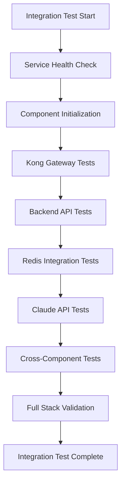

# Integration Test Directory

**Purpose**: Integration test scripts for Kong AWS Masking MVP  
**Location**: `/tests/integration/`  
**Category**: System Integration Testing

---

## 📁 Directory Overview

This directory contains **integration test scripts** that validate the interaction between different components of the Kong AWS Masking MVP system, ensuring seamless operation across the entire stack.

### 🎯 **Primary Functions**
- **Component Integration**: Test interactions between Kong, Backend API, Redis, and Claude API
- **End-to-End Flows**: Validate complete request/response cycles
- **Service Dependencies**: Verify proper service communication
- **Data Flow Validation**: Ensure correct data transformation across components

---

## 🏗️ **Integration Test Categories**

### **Kong Gateway Integration**
- Kong plugin loading and initialization
- Route and service configuration validation
- Plugin pipeline execution testing
- Gateway health and status verification

### **Backend API Integration**
- Kong ↔ Backend API communication
- Request forwarding and processing
- Error handling and timeouts
- Health check integration

### **Redis Integration**
- Kong plugin ↔ Redis connectivity
- Mapping storage and retrieval
- TTL management and expiration
- Connection pooling and failover

### **Claude API Integration**
- External API communication through Kong
- Request/response transformation
- Timeout handling and retries
- Authentication and authorization

---

## 🧪 **Test Scenarios**

### **Core Integration Flows**
```bash
# Full system integration validation
1. Client Request → Kong → Backend → Claude API
2. Claude Response → Kong → Data Unmasking → Client
3. Redis Storage → Pattern Mapping → Data Restoration
4. Error Handling → Circuit Breaker → Graceful Degradation
```

### **Component Interaction Tests**
- **Kong ↔ Backend**: API routing and processing
- **Kong ↔ Redis**: Mapping storage and retrieval
- **Kong ↔ Claude**: External API integration
- **Backend ↔ Claude**: Direct API communication

---

## 📊 **Integration Test Scripts**

### **Expected Test Files** (To be implemented)
```bash
# Core Integration Tests
kong-gateway-integration.sh      # Kong Gateway component testing
backend-api-integration.sh       # Backend API service integration
redis-mapping-integration.sh     # Redis storage integration
claude-api-integration.sh        # External API integration

# Cross-Component Tests
full-stack-integration.sh        # Complete system integration
service-dependency-test.sh       # Service dependency validation
error-handling-integration.sh    # Error scenario integration
performance-integration.sh       # Performance across components
```

### **Test Execution Flow**


---

## 🔧 **Test Implementation Strategy**

### **Test Isolation**
- Each integration test runs independently
- Clean environment setup before each test
- Service state reset between test runs
- Isolated test data and fixtures

### **Service Dependencies**
```bash
# Required Services for Integration Testing
- Kong Gateway (ports 8000, 8001)
- Backend API (port 3000)
- Redis Cache (port 6379)
- Docker Compose Environment
```

### **Test Data Management**
- Uses fixtures from `../fixtures/` directory
- Generates synthetic test data for integration scenarios
- Validates data transformation across service boundaries
- Cleans up test data after execution

---

## 🛡️ **Security Integration Testing**

### **Security Validation**
- AWS data masking across service boundaries
- Redis secure storage validation
- Fail-secure behavior testing
- Authentication and authorization flows

### **Security Test Scenarios**
```bash
# Security Integration Tests
1. End-to-end AWS data protection
2. Redis authentication and encryption
3. External API secure communication
4. Error handling without data exposure
```

---

## ⚡ **Performance Integration Testing**

### **Performance Metrics**
- **End-to-End Response Time**: Complete request cycle timing
- **Component Latency**: Individual service response times
- **Throughput Testing**: Concurrent request handling
- **Resource Utilization**: Memory and CPU usage across services

### **Performance Targets**
| Metric | Target | Integration Test Validation |
|--------|--------|---------------------------|
| E2E Response Time | < 30s | Full stack timing |
| Kong Processing | < 1s | Gateway-specific timing |
| Redis Operations | < 1ms | Storage operation timing |
| API Communication | < 10s | External API timing |

---

## 📋 **Integration with Main Test Suite**

### **Called by Active Tests**
The integration tests are referenced and called by main test scripts:

```bash
# Main tests that use integration validation
./comprehensive-flow-test.sh          # Calls integration components
./production-comprehensive-test.sh     # Full integration validation
./comprehensive-security-test.sh       # Security integration testing
```

### **Integration Test Dependencies**
- **Unit Tests**: Must pass before integration testing
- **Fixtures**: Requires test data from fixtures directory
- **Services**: All system services must be running
- **Configuration**: Proper environment setup required

---

## 🔍 **Troubleshooting Integration Issues**

### **Common Integration Problems**
1. **Service Connectivity**: Network configuration issues
2. **Authentication**: Redis password or API key problems
3. **Timeouts**: Service response time issues
4. **Data Consistency**: Cross-service data synchronization

### **Debugging Integration Tests**
```bash
# Service Health Checks
curl http://localhost:8001/status    # Kong Gateway
curl http://localhost:3000/health    # Backend API
redis-cli -a PASSWORD ping           # Redis Cache

# Integration Test Debugging
docker logs kong-gateway --tail 50   # Kong logs
docker logs backend-api --tail 50    # Backend logs
docker logs redis-cache --tail 50    # Redis logs
```

---

## 📈 **Integration Test Metrics**

### **Test Coverage**
- **Component Coverage**: All major system components
- **Flow Coverage**: All critical data flows
- **Error Coverage**: All error handling scenarios
- **Performance Coverage**: All performance-critical paths

### **Success Criteria**
- ✅ All services communicate correctly
- ✅ Data transformation works end-to-end
- ✅ Error handling functions properly
- ✅ Performance meets targets
- ✅ Security is maintained across components

---

## 🔗 **Related Test Directories**

### **Test Suite Integration**
- **`../unit/`**: Unit tests validate individual components
- **`../fixtures/`**: Provides test data for integration scenarios
- **`../security/`**: Security-specific integration tests
- **`../performance/`**: Performance integration benchmarks

### **Main Test Scripts**
- **Active Tests**: 10 production-ready test scripts
- **Archive Tests**: Development integration test history
- **Backup Tests**: Unused integration test references

---

*This integration directory ensures that all Kong AWS Masking MVP components work together seamlessly, providing comprehensive validation of system-wide functionality.*